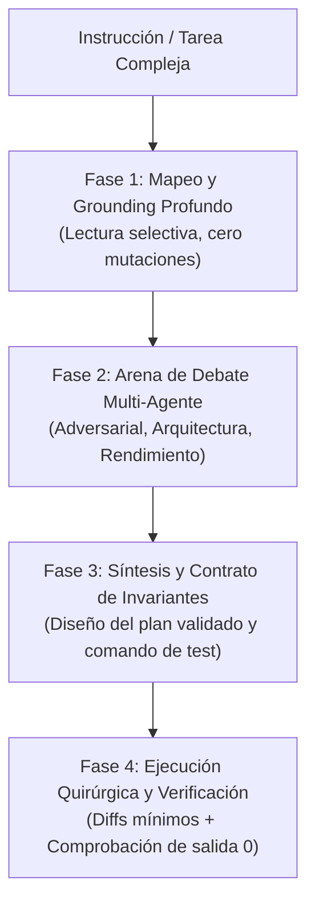

# 🚀 Boost — Motor Cognitivo de Pensamiento Profundo y Debate Multi-Agente

> **Axioma Fundamental**: **Queda terminantemente prohibido escribir código o aplicar cambios en el primer turno.** Toda tarea compleja bajo `/boost` debe someterse a un ciclo dialéctico de pensamiento extendido, debate adversarial entre roles especializados y formulación de contratos de verificación previa antes de tocar el sistema de archivos.

---

## 📑 ÍNDICE DE PROTOCOLOS
1. [El Ciclo Cognitivo Boost (Freno al Código Impulsivo)](#1-el-ciclo-cognitivo-boost)
2. [La Arena de Debate Multi-Agente (Dialéctica de Roles)](#2-la-arena-de-debate-multi-agente)
3. [Protocolo de Debate Paso a Paso (Tesis → Antítesis → Síntesis)](#3-protocolo-de-debate-paso-a-paso)
4. [Árbol de Hipótesis y Ponderación de Riesgos](#4-árbol-de-hipótesis-y-ponderación-de-riesgos)
5. [Contratos de Invariantes y Verificación Previa](#5-contratos-de-invariantes-y-verificación-previa)
6. [Ejecución Quirúrgica y Validación Empírica](#6-ejecución-quirúrgica-y-validación-empírica)
7. [Gestión de Memoria y Continuidad en Sesiones Largas](#7-gestión-de-memoria-y-continuidad-en-sesiones-largas)

---

## 🧠 1. EL CICLO COGNITIVO BOOST

En tareas de programación compleja, los errores nacen de actuar sobre la primera hipótesis superficial. Boost impone un **freno deliberado** que distribuye el esfuerzo cognitivo en 4 fases secuenciales:



---

## 🏛️ 2. LA ARENA DE DEBATE MULTI-AGENTE

Cuando Boost se activa, el agente debe orquestar o simular internamente el debate entre **cuatro personas cognitivas especializadas**:

```
┌────────────────────────────────────────────────────────────────────────┐
│                   ARENA DE DEBATE MULTI-AGENTE (BOOST)                 │
├────────────────────────────────────────────────────────────────────────┤
│ 🛡️ 1. ARCHITECT / BUILDER (Tesis)                                      │
│    • Diseña la solución más limpia, elegante y desacoplada.            │
│    • Aplica minimalismo radical (YAGNI, stdlib sobre dependencias).    │
│    • Propone la estructura de tipos y módulos.                         │
├────────────────────────────────────────────────────────────────────────┤
│ ⚔️ 2. CHAOS / ADVERSARIAL AUDITOR (Antítesis)                          │
│    • Intenta activamente romper la solución propuesta.                 │
│    • Busca condiciones de carrera, desreferencias nulas y permisos.    │
│    • Cuestiona asunciones ocultas y vulnerabilidades de seguridad.     │
├────────────────────────────────────────────────────────────────────────┤
│ 🔬 3. EMPIRICAL VERIFIER / FACT-CHECKER (Evidencia)                    │
│    • Exige pruebas comprobables: "¿Existe ese método en esa versión?". │
│    • Define el comando exacto de compilación o test que debe pasar.   │
│    • Rechaza cualquier afirmación no demostrada en el código real.     │
├────────────────────────────────────────────────────────────────────────┤
│ ⚖️ 4. LEAD ARBITER / SYNTHESIZER (Síntesis)                           │
│    • Resuelve discrepancias entre el Arquitecto y el Auditor.         │
│    • Formula el plan final unificado y los contratos invariantes.      │
│    • Autoriza la ejecución quirúrgica.                                 │
└────────────────────────────────────────────────────────────────────────┘
```

---

## 🔄 3. PROTOCOLO DE DEBATE PASO A PASO

Antes de emitir diffs o editar archivos, el agente debe plasmar en su razonamiento (o en su plan de subagentes) el siguiente esquema dialéctico:

### Paso 1: Tesis (Propuesta del Arquitecto)
- **Hipótesis Central**: ¿Cuál es el cambio estructural propuesto?
- **Justificación**: ¿Por qué esta solución resuelve la causa raíz y no solo el síntoma?
- **Alcance**: ¿Qué archivos mínimos deben ser modificados?

### Paso 2: Antítesis (Ataque del Auditor Adversarial)
- **Vectores de Fallo**: ¿Qué pasará si la red se corta, un puntero es nulo o el proceso se reinicia?
- **Casos Borde no contemplados**: Concurrencia, límites de memoria, tipos de datos no válidos.
- **Riesgo de Regresión**: ¿Qué partes del sistema que no estamos mirando podrían romperse?

### Paso 3: Evidencia (Interrogatorio del Verificador)
- **Verificación de Símbolos**: ¿Se verificó en `web/src/types/` o `desktop-app/src/` que las funciones existen?
- **Criterio de Aceptación**: ¿Cuál es el comando exacto (`pnpm test <archivo>` / `cargo test <test>`) que demostrará el éxito antes de dar por cerrada la tarea?

### Paso 4: Síntesis (Decisión del Árbitro)
- **Consenso Final**: Selección del camino óptimo integrando las defensas planteadas por el Auditor.
- **Compromiso Invariante**: Lista de cosas que **no** deben cambiar bajo ninguna circunstancia.

---

## 🌲 4. ÁRBOL DE HIPÓTESIS Y PONDERACIÓN DE RIESGOS

Para problemas complejos o bugs difíciles, no te limites a una única explicación. Genera un **Árbol de 3 Hipótesis Competidoras**:

| Hipótesis | Causa Raíz Propuesta | Experimento / Prueba de Descarte | Veredicto |
| :--- | :--- | :--- | :--- |
| **Hipótesis A** | Error de estado o sincronización asíncrona. | Inspeccionar ciclo de vida del hook/canal Tokio. | [Validada / Descartada] |
| **Hipótesis B** | Desfase de tipos o serialización JSON inválida. | Verificar payloads de red con tipos de TS/Rust. | [Validada / Descartada] |
| **Hipótesis C** | Bloqueo de entorno o archivo retenido en Windows. | Chequear handles y conexiones TCP con PowerShell. | [Validada / Descartada] |

> **Regla de Descarte**: La primera hipótesis en descartarse mediante un comando real ahorra horas de código inútil.

---

## 📜 5. CONTRATOS DE INVARIANTES Y VERIFICACIÓN PREVIA

Antes de tocar código, define formalmente el **Contrato Invariante**:

1. **Pre-Condición**: Estado del sistema antes del cambio (e.g. puertos libres, versión de dependencias verificada).
2. **Invariante de Seguridad**: Reglas que no pueden romperse (e.g. cero contraseñas en logs, comandos shell con codificación Base64 segura).
3. **Invariante de Compatibilidad**: Interfaces públicas preexistentes deben mantenerse intactas (principios de extensión aditiva).
4. **Post-Condición**: Salida exacta que el compilador y los tests deben arrojar.

---

## ⚡ 6. EJECUCIÓN QUIRÚRGICA Y VALIDACIÓN EMPÍRICA

Una vez concluido el debate y aprobado el plan:

1. **Diffs Quirúrgicos (Ponytail Strict)**:
   - Usar `replace_file_content` para sustituir únicamente las líneas afectadas.
   - Prohibido reescribir archivos enteros si solo se cambian 10 líneas.
   - Preservar comentarios, tipos existentes y estilo del repositorio.
2. **Ejecución del Comando de Prueba**:
   - Compilación estática: `pnpm test`, `pnpm run build`, `cargo check` o `node -c`.
   - Si el comando falla: **No parches a ciegas.** Vuelve a convocar al Auditor Adversarial para entender por qué falló la predicción y ajusta el plan.

---

## 💾 7. GESTIÓN DE MEMORIA Y CONTINUIDAD EN SESIONES LARGAS

Para mantener la coherencia a lo largo de 50+ turnos sin perder el contexto del debate:

1. **Registro de Decisiones en Disco**:
   - Guardar las decisiones clave del debate en `~/.agents/SESSION_CHECKPOINT.json` tras cada hito.
2. **Circuit Breaker Activo**:
   - Si una estrategia falla 2 veces consecutivas, el Árbitro detiene la ejecución, invalida la hipótesis activa y obliga a explorar la siguiente hipótesis del árbol.
3. **Telemetría Concisa**:
   - Registrar una única línea de resumen en `~/.agents/skills/boost/RUNLOG.md` (rotación automática a 25 líneas).
