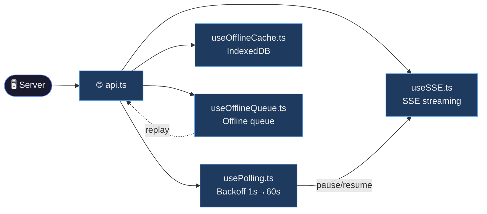
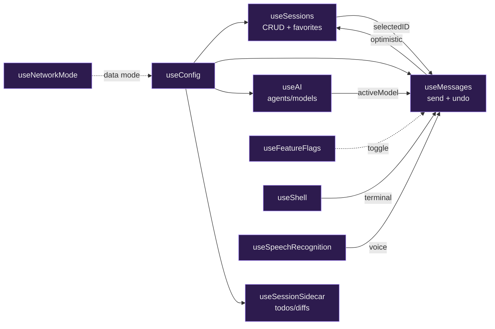
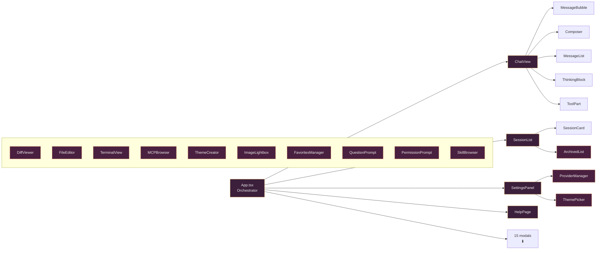
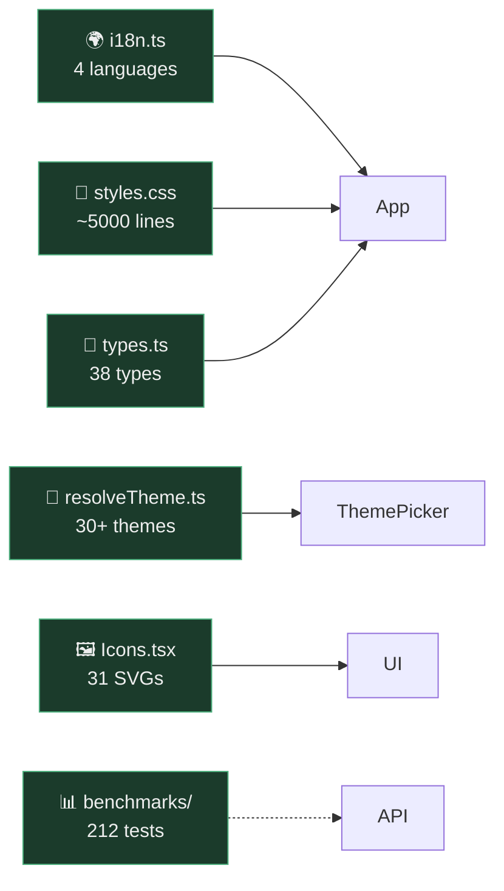

<div align="center">

  

# OpenCode Mobile

**Android/iOS client for [OpenCode](https://opencode.ai) — your AI coding assistant from your phone**

<p align="center">
  
  
  
  
  
  <br/>
  
  
  
  
</p>

**[Español](README.es.md)** · **English**

</div>

> # ⚠️ BETA — App in active development
>
> **OpenCode Mobile is in BETA and under active development.** It may contain bugs,
> unannounced changes, and incomplete features. It is not recommended for critical
> or production use. Use it at your own risk.
>
> Found an issue? Report it in [Issues](https://github.com/Owning01/Opencode-Mobile/issues).

---

## ✨ Features

<div class="features-grid">

| | |
|---|---|
| **⚡ Real-time streaming** | SSE events via `/event` — typing indicators, instant delivery |
| **🔄 Adaptive polling** | 4 modes: Full (3.5s), Balance (15s), Reduced (30s), Miser (60s). Auto-switches on mobile data |
| **📦 Offline cache** | IndexedDB — browse sessions and messages without a connection |
| **💬 Full chat** | Send prompts, commands, shell. Abort, revert, undo/redo |
| **📋 Diff viewer** | Per-file expandable diffs with inline content loading |
| **📁 Session management** | Create, rename, delete, favorites, archive, export snapshots |
| **🤖 AI agent control** | Select and switch between agents/models per session |
| **🧠 Thinking level** | Choose reasoning effort (None/High/Medium/Low) per model — variants are created on the server via `PATCH /config` |
| **🎨 Theme creator** | Visual color editor with JSON export |
| **🔌 Multi-provider** | Connect external providers (OpenAI, Anthropic, etc.) via API key |
| **📂 File browser** | Browse the remote project's files |
| **🌿 Git toolbar** | Stage, commit, branch state (ahead/behind) |
| **🎤 Voice input** | Speech-to-text with Web Speech API + native Capacitor plugin |
| **🔐 Permissions & Questions** | Automatic modals for AI questions and tool permissions |
| **🎨 30+ themes** | Dark, light, system and scheduled modes; variant picker with preview |
| **🌍 i18n** | Español, English, Italiano, 繁體中文 |
| **📉 Auto-summarize** | Automatic compaction when the context grows |
| **📋 Plan breakdown** | Task visualization for AI orchestration flows |
| **⌨️ Keyboard shortcuts** | Tab + actions for power users |
| **🚀 Quick deploy** | 1-command scripts for LAN (same WiFi) or remote via Tailscale |
| **🌐 Remote access (Tailscale)** | Free private mesh VPN — connect from any network without opening ports |
| **📝 File editor** | Read, edit and save project files |
| **🔗 Deep links** | `opencode://connect` and `opencode://session/<id>` |
| **📤 Share to OpenCode** | Android share sheet → text/image becomes a prompt |
| **⬇️ Export chat** | Copy as Markdown or share a `.md` file via the system share sheet |
| **🔧 Edit from diff** | Open any changed file directly in the editor from the diff view |
| **🖼️ Image lightbox** | Full view with zoom and drag |
| **🧩 MCP Browser** | Explore connected MCP resources |
| **📦 Offline queue** | Actions are queued and resent on reconnect |
| **🎨 Theme creator** | Visual color editor with JSON export |
| **⭐ Reorderable favorites** | Drag and drop to sort |
| **🗄️ Saved servers** | Multiple server profiles (host/port/user/password) with edit modal — tap a profile to edit before applying |

</div>

---

## 🕸️ Dependency graphs

<details>
<summary><b>📡 Transport</b> — SSE, polling, cache and offline queue</summary>


</details>

<details>
<summary><b>🧠 State</b> — main hooks and their relationships</summary>


</details>

<details>
<summary><b>🖥️ UI</b> — App, main views and modals</summary>


</details>

<details>
<summary><b>🔧 Cross-cutting</b> — shared services</summary>


</details>

## 🚀 Get started in 2 steps

### 📲 1 — Install the app on your phone

[⬇️ **Download OpenCodeMobile.apk**](https://github.com/Owning01/Opencode-Mobile/releases/latest)

Or build it yourself (see [development](#-development)).

**iOS** (requires macOS + Xcode 16+): clone the repo and open `web/ios/App/App.xcworkspace` in Xcode, select your development team and Build & Run.

---

### 🖥️ 2 — Install Tailscale on your PC (for remote access)

OpenCode Mobile connects to your OpenCode server over plain HTTP. For **remote access from any network** (not just your WiFi), use [**Tailscale**](https://tailscale.com) — a free, zero-config private mesh VPN.

#### Step A — Install Tailscale on the PC (server)

1. Install Tailscale from https://tailscale.com/download (Windows/macOS/Linux).
2. Log in with your account and let the PC join your tailnet:
   ```
   tailscale up
   ```
3. Find the PC's Tailscale IP:
   ```
   tailscale ip -4
   ```
   → e.g. `100.101.102.103`. Write it down — it never changes.

#### Step B — Start OpenCode bound to the Tailscale interface

OpenCode listens on **0.0.0.0** by default, so the Tailscale IP is already reachable — no extra flag needed:

```
npx -y opencode-ai serve --hostname 0.0.0.0 --port 4096
```

> 🔒 **Security tip**: run the server with auth so the tailnet is not the only protection:
> ```
> set OPENCODE_SERVER_USERNAME=opencode
> set OPENCODE_SERVER_PASSWORD=<a strong password>
> npx -y opencode-ai serve --hostname 0.0.0.0 --port 4096
> ```

#### Step C — Install Tailscale on your phone

1. Install **Tailscale** from the Play Store / App Store.
2. Log in with the **same account** as the PC.
3. Your phone is now on the same private network as the PC — even over 4G/5G.

#### Step D — Connect the app

In OpenCode Mobile: **Settings → Server**:

| Field | Value |
|-------|-------|
| Host | The PC's Tailscale IP, e.g. `100.101.102.103` |
| Port | `4096` (or the port you started the server on) |
| Username / Password | Only if you enabled auth in Step B |

Tap **Test connection**, then **Save**. ✓ Done — you can use OpenCode from anywhere, with no open ports on your router.

---

### 🏠 Alternative: local WiFi (no Tailscale)

If you're always on the same network:
1. On PC: `npx -y opencode-ai serve --hostname 0.0.0.0 --port 4096`
2. In the app: **Settings → Server**, enter your PC's local IP (e.g. `192.168.1.20`)

---

### ❓ Tailscale FAQ

- **Is it free?** Yes — up to 100 devices and 3 users on the free plan.
- **Does it need an open port on my router?** No. Tailscale uses NAT traversal (and a relay as fallback) — your router needs nothing.
- **Why not a QR/WebRTC tunnel?** Tailscale is more reliable (relay fallback), already battle-tested, and gives your PC a stable private IP.
- **The phone shows "offline"?** Check the phone has Tailscale **connected** (green) and the PC's `tailscale status` shows both devices.

---

## 📱 Mobile Data

<details>
<summary><b>Mobile data — usage modes</b> (click to expand)</summary>

The app automatically adjusts the mode when it detects mobile data (cellular → Reduced, WiFi → Full).
You can also change it manually in **Settings**.

| Mode | Polling | KB/min (idle) | ~30 min | Best for |
|------|---------|---------------|---------|----------|
| **Full** | 3.5s | ~35 KB | ~1 MB | Unlimited WiFi · real-time SSE streaming with audio |
| **Balance** | 15s | ~10 KB | ~300 KB | WiFi or generous data · full payload + notifications |
| **Reduced** | 30s | ~3.6 KB | ~108 KB | 4G/LTE · no audio or tool parts · polls only when active |
| **Miser** | 60s | ~1.8 KB | ~54 KB | Limited data or roaming · text only, no notifications |

During active generation, consumption can spike 2-3× for seconds (response with tool calls).
Estimates over compressed HTTP/2 with ~10 server sessions.

</details>

---

> 📖 **Full catalog**: [`CATALOGO.md`](CATALOGO.md) — 57 components, 32 hooks, 36 endpoints, graphs, LLM guide.

## 📁 Project structure

<details>
<summary><b>Project structure</b> (click to expand)</summary>

```
web/
├── src/
│   ├── components/       # 57 UI components
│   ├── hooks/            # 32 React hooks
│   ├── api.ts            # HTTP client (36 endpoints)
│   ├── App.tsx           # Main orchestrator
│   ├── types.ts          # TypeScript types
│   ├── i18n.ts           # 4 languages
│   └── styles.css        # Complete design system
├── android/              # Native Android project
├── ios/                  # Native iOS project (Xcode)
```

</details>

---

## 🏗️ Architecture

<details>
<summary><b>Architecture — core principles</b> (click to expand)</summary>

| Principle | Description |
|-----------|-------------|
| **🔄 SSE + Polling handoff** | While SSE is active, polling runs at 5s instead of the full interval. On disconnect, backoff kicks in immediately |
| **📈 Exponential backoff** | Polling starts at 1s, doubles per failure up to 60s, with 30% jitter. SSE similar but capped at 30s |
| **📦 Offline-first** | IndexedDB caches sessions + messages. Browsing old data works offline; writes require connectivity |
| **⚡ Optimistic updates** | User messages render immediately before the server round-trip |
| **🛡️ Stale request rejection** | `loadSelected` uses a request ID to discard outdated polling responses |
| **🎨 Dynamic themes** | 30+ themes with CSS variables applied at runtime via `resolveTheme.ts` |

</details>

---

<div align="center">

**OpenCode Mobile** is a client for [**OpenCode**](https://opencode.ai) — the open-source AI coding assistant.

Developed by [@Owning01](https://github.com/Owning01) · [Report issue](https://github.com/Owning01/Opencode-Mobile/issues) · [Contribute](https://github.com/Owning01/Opencode-Mobile)

</div>
