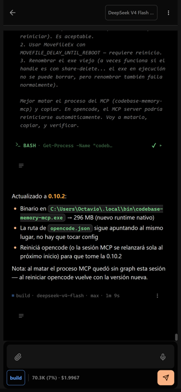
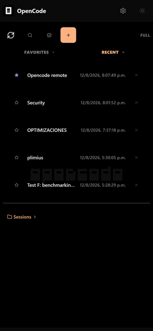
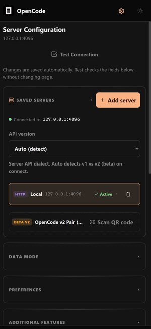
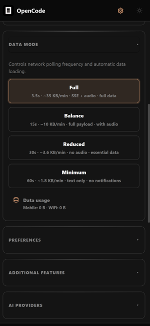
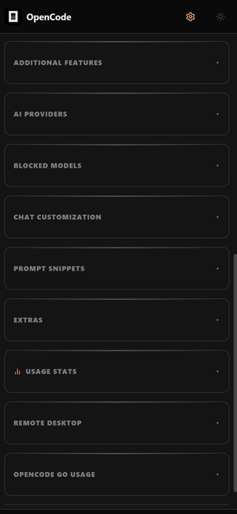
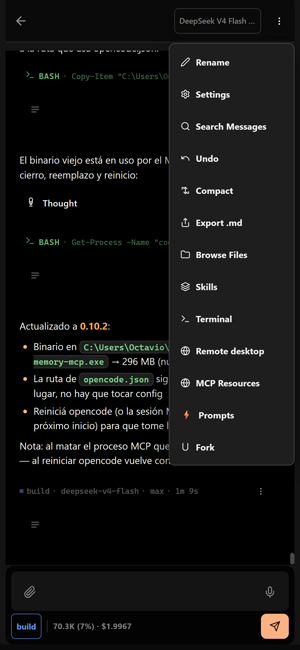

<div align="center">

  

# OpenCode Mobile + Desktop

**Android/iOS + Windows client for [OpenCode](https://opencode.ai) — your AI coding assistant on phone and desktop**

<p align="center">
  
  
  
  
  
  
  
  <br/>
  
  
  
  
</p>

**[Español](README.es.md)** · **English**

</div>

---

<div align="center">

**Your AI coding assistant, everywhere** — streaming responses, real-time tools, terminal, file explorer, git (SCM), remote desktop, kanban, stats and OpenCode Hub.

</div>

| Live chat | Sessions | Connect server |
| :---: | :---: | :---: |
| [](./screenshots/chat+thinking.png) | [](./screenshots/home-1.png) | [](./screenshots/settings-1.png) |
| **Data modes** | **Full control** | **Chat settings and more** |
| [](./screenshots/settings-4.png) | [](./screenshots/Settings-3.png) | [](./screenshots/Settingsdentrodelchat.png) |

```
┌──────────────────────────────────────────────┐
│              📱 YOUR PHONE                    │
│          OpenCode Mobile (the app)           │
└──────────────────────┬───────────────────────┘
                       │
                       │  ① Tailscale — private VPN
                       │     no open ports on your router
                       ▼
┌──────────────────────────────────────────────┐
│                🖥️ YOUR PC                     │
│           Tailscale node                      │
│  opencode serve v1  → 0.0.0.0:4096            │
│  opencode2        → 0.0.0.0:4097              │
│  desktop-app.exe  → 127.0.0.1:4848 + WS 4849  │
│  opencode-stats   → 127.0.0.1:8765            │
└──────────────────────────────────────────────┘
```

---

## 🚀 Get started in 2 steps

### 📲 1 — Install the app on your phone

[⬇️ **Download OpenCodeMobile.apk**](https://github.com/Owning01/Opencode-Mobile/releases/latest)

Or build it yourself (see [development](#-development)).

**iOS** (requires macOS + Xcode 16+): clone the repo and open `web/ios/App/App.xcworkspace` in Xcode, select your development team and Build & Run.

**Desktop (Windows)**: `.\build-desktop.ps1` (builds `web` with `G:\Dev\nodejs-24\pnpm.cmd` + `cargo build --release` → `desktop-app/opencode-desktop.exe` portable, `data/` next to exe). Requires **Node ~24** (`G:\Dev\nodejs-24\node.exe` v24.20) and **pnpm 12.0.0** Rust binary + **Rust 1.98** (`CARGO_HOME=G:\Dev\cargo`). No Tauri, wry+WebView2.

---

### 🖥️ 2 — Install Tailscale on your PC (for remote access)

OpenCode Mobile connects to your OpenCode server over plain HTTP. For **remote access from any network** (not just your WiFi), use [**Tailscale**](https://tailscale.com) — a free, zero-config private mesh VPN.

#### Step A — Install Tailscale on the PC (server)

1. Install Tailscale from https://tailscale.com/download (Windows/macOS/Linux).
2. Log in with your account and let the PC join your tailnet:
   ```
   tailscale up
   ```
3. Find the PC's Tailscale IP:
   ```
   tailscale ip -4
   ```
   → e.g. `100.101.102.103`. Write it down — it never changes.

#### Step B — Start OpenCode bound to the Tailscale interface

OpenCode listens on **0.0.0.0** by default, so the Tailscale IP is already reachable — no extra flag needed:

```
npx -y opencode-ai serve --hostname 0.0.0.0 --port 4096
```

> 🔒 **Security tip**: run the server with auth so the tailnet is not the only protection:
> ```
> set OPENCODE_SERVER_USERNAME=opencode
> set OPENCODE_SERVER_PASSWORD=<a strong password>
> npx -y opencode-ai serve --hostname 0.0.0.0 --port 4096
> ```

#### Step C — Install Tailscale on your phone

1. Install **Tailscale** from the Play Store / App Store.
2. Log in with the **same account** as the PC.
3. Your phone is now on the same private network as the PC — even over 4G/5G.

#### Step D — Connect the app

In OpenCode Mobile: **Settings → Server**:

| Field | Value |
|-------|-------|
| Host | The PC's Tailscale IP, e.g. `100.101.102.103` |
| Port | `4096` (or the port you started the server on) |
| Username / Password | Only if you enabled auth in Step B |

Tap **Test connection**, then **Save**. ✓ Done — you can use OpenCode from anywhere, with no open ports on your router.

---

### 🏠 Alternative: local WiFi (no Tailscale)

If you're always on the same network:
1. On PC: `npx -y opencode-ai serve --hostname 0.0.0.0 --port 4096`
2. In the app: **Settings → Server**, enter your PC's local IP (e.g. `192.168.1.20`)

---

### ❓ Tailscale FAQ

- **Is it free?** Yes — up to 100 devices and 3 users on the free plan.
- **Does it need an open port on my router?** No. Tailscale uses NAT traversal (and a relay as fallback) — your router needs nothing.
- **Why not a QR/WebRTC tunnel?** Tailscale is more reliable (relay fallback), already battle-tested, and gives your PC a stable private IP.
- **The phone shows "offline"?** Check the phone has Tailscale **connected** (green) and the PC's `tailscale status` shows both devices.

---

## 🖥️ Desktop hybrid (Windows)

One frontend (`web/`) served by a Rust shell (`desktop-app/`) on `127.0.0.1:4848` + `4850` hyper static (mmap+br) + `4849` WS PTY. Portable — `data/` next to exe: `config.json`, `kanban.json`, `window-geometry.json`, `web-dist/`, `webview/`.

- **External plugins** (`/shell/external/*`): `opendesign` 3000 + daemon 3456 (`G:\Dev\nodejs-24\node_hidden.exe "…\tools-dev.mjs" start web`), `screenshots` 3002 (Next `next start`), `vioeditor` 1420 embed, `informes` 5174 embed (mmap + `<base href="/shell/external/<name>/embed/">` for Vite `/assets/*`), `widgetnotas`. Probe TCP 250ms + `cached_probe` 1500ms, auto `409` if port taken. Tabs keep iframes mounted `visibility:hidden` (no reload on switch). `CloseRequested/Quit` kills all childs `taskkill /F /T`.
- **Files**: double-pane (`PCFilesPanel` `SplitIcon`), drag&drop `shell.fs.move`, hidden dotfiles visible (`.git` etc.), HTML preview `HtmlPreview` via `/shell/preview/{token}/{file}` mmap.
- **Build**: `.\build-desktop.ps1` fixes PATH (`G:\Dev\nodejs-24` first, `corepack disable`), `G:\Dev\nodejs-24\pnpm.cmd run build` (~14s) + `G:\Dev\Python311\python.exe scripts/copy-dist.py` (`failures: none`, `vite emptyOutDir:false`) + `cargo build --release` (~4m `G:\cache\cargo-target\release\opencode-desktop.exe`).

## 🧠 OpenCode Hub

`Settings → OpenCode Hub` — inspects live config, agents, skills and file locations.

- **Agents** tab: official agents with system prompts (copy/expand).
- **Skills** tab: scans `~/.agents/skills`, `~/.claude/skills`, `~/.opencode/skills`, `~/.gemini/*`, `~/.config/skills`, `./skills`, `APPDATA\opencode\skills` — `scannedRoots` always visible full path in soft gray `rgba(161,161,170,0.95)` on `rgba(161,161,170,0.10)` pill with `title`+ellipsis (backend `api.rs:840` robust `USERPROFILE||HOME||HOMEDRIVE+HOMEPATH||APPDATA`).
- **Config** tab: all `opencode.json` found (`~/.config/opencode/opencode.json` primary, `~/.config/opencode3`, `APPDATA\opencode\config.json`, etc.) — file switcher pills + **Ruta:** soft gray pill + JSON editor (format/save). Fixed `better-sqlite3@13.0.3` for Node 24 (12.10 crashes `RemoveEnvironmentCleanupHook`).

---

## 📱 Mobile Data

<details>
<summary><b>Mobile data — usage modes</b> (click to expand)</summary>

The app automatically adjusts the mode when it detects mobile data (cellular → Reduced, WiFi → Full).
You can also change it manually in **Settings**.

| Mode | Polling | KB/min (idle) | ~30 min | Best for |
|------|---------|---------------|---------|----------|
| **Full** | 3.5s | ~35 KB | ~1 MB | Unlimited WiFi · real-time SSE streaming with audio |
| **Balance** | 15s | ~10 KB | ~300 KB | WiFi or generous data · full payload + notifications |
| **Reduced** | 30s | ~3.6 KB | ~108 KB | 4G/LTE · no audio or tool parts · polls only when active |
| **Miser** | 60s | ~1.8 KB | ~54 KB | Limited data or roaming · text only, no notifications |

During active generation, consumption can spike 2-3× for seconds (response with tool calls).
Estimates over compressed HTTP/2 with ~10 server sessions.

</details>

---

> 🏗️ **Architecture**: [`architecture.md`](architecture.md) — monorepo map, critical flows, decisions and pitfalls.

## 📁 Project structure

<details>
<summary><b>Project structure</b> (click to expand)</summary>

```
web/                           # THE PRODUCT (one frontend for APK/iPA/desktop)
├── src/
│   ├── app/                   # composition root (placeholder)
│   ├── pages/ widgets/ features/ entities/ shared/  # FSD hexagonal (migrating)
│   ├── components/            # ~80 UI components (ChatView, TabBar, OpenCodeHubModal…)
│   ├── features/pc-files/     # double-pane explorer + HtmlPreview
│   ├── features/external-plugins/  # ExternalIframePanel (keep-mounted)
│   ├── shell.ts               # /shell/* typed client + fileIcon
│   ├── hooks/                 # 41 hooks (useMessages, useSSE, usePolling…)
│   ├── styles/                # 17 css files (tokens, shell, pc-files…)
│   ├── App.tsx                # ~3600L God Component (debt)
│   └── api.ts / types.ts      # 36 endpoints facade
├── android/ ios/              # Capacitor native projects (com.gbro.opencode)
├── dist/                      # Vite output (web/data/web-dist on desktop)
└── scripts/copy-dist.py       # workaround EPERM cap copy

desktop-app/                   # Windows Rust shell (wry + tiny_http + hyper)
├── src/
│   ├── main.rs                # wry child WebView2, prewarm external, kill_all_external
│   ├── api.rs                 # /shell/* + /shell/opencode/global + mmap
│   ├── infrastructure/http/   # external_router.rs (+ fs/scm/pty/kanban/doc)
│   ├── common.rs              # mmap+br, simd-json, probe
│   ├── fsx.rs / gitx.rs / ptyx.rs / kanban.rs / state.rs
│   └── browser_view.rs / plugins.rs

opencode-stats/                # Rust crate read-only opencode.db → :8765

(externo) G:/proyectos/open-design  # nexu-io/open-design on-demand

Cargo.toml                     # workspace ["desktop-app","opencode-stats"]
build-desktop.ps1/.bat · deploy-apk.ps1 · codemagic.yaml
```

</details>

---

## 🏗️ Architecture

<details>
<summary><b>Architecture — core principles</b> (click to expand)</summary>

| Principle | Description |
|-----------|-------------|
| **🔄 SSE + Polling handoff** | While SSE is active, polling runs at 5s instead of the full interval. On disconnect, backoff kicks in immediately |
| **📈 Exponential backoff** | Polling starts at 1s, doubles per failure up to 60s, with 30% jitter. SSE similar but capped at 30s |
| **📦 Offline-first** | IndexedDB caches sessions + messages. Browsing old data works offline; writes require connectivity |
| **⚡ Optimistic updates** | User messages render immediately before the server round-trip |
| **🛡️ Stale request rejection** | `loadSelected` uses a request ID to discard outdated polling responses |
| **🎨 Dynamic themes** | 30+ themes with CSS variables applied at runtime via `resolveTheme.ts` |
| **🧩 External plugins** | 5 projects via `external_router.rs` — mmap embed + `<base href>` + node_hidden, keep-mounted iframes |
| **🧠 OpenCode Hub** | Live global config + skills + scannedRoots (always visible soft gray) via `/shell/opencode/global` |

</details>

---

## 🛠️ Development

```bash
# web (Node 24 + pnpm 12)
G:\Dev\nodejs-24\pnpm.cmd install
G:\Dev\nodejs-24\pnpm.cmd run dev       # Vite :5173
G:\Dev\nodejs-24\pnpm.cmd run build    # tsc -b && vite build (~14s)
G:\Dev\Python311\python.exe scripts/copy-dist.py  # → desktop-app/data/web-dist

# desktop (Rust 1.98, CARGO_HOME=G:\Dev\cargo)
cargo check && cargo build --release   # → G:\cache\cargo-target\release\opencode-desktop.exe
.\build-desktop.ps1 [-SkipWeb] [-Run]  # web build + cargo + package

# apk
.\deploy-apk.ps1                       # build + upload tmpfiles.org + LINK
```

<details>
<summary><b>Stack</b></summary>

React 19.2 + react-compiler, TS 7.0, Vite 8, Vitest 4, pnpm 12 (Rust binary), Capacitor 8, Node 24.20, Rust 1.98 (tokio+hyper, memmap2, simd-json, notify), WebView2 via wry/winit, portable-pty (pwsh7), opencode-stats crate.

</details>

---

<div align="center">

**OpenCode Mobile** is a client for [**OpenCode**](https://opencode.ai) — the open-source AI coding assistant.

Developed by [@Owning01](https://github.com/Owning01) · [Report issue](https://github.com/Owning01/Opencode-Mobile/issues) · [Contribute](https://github.com/Owning01/Opencode-Mobile)

</div>
