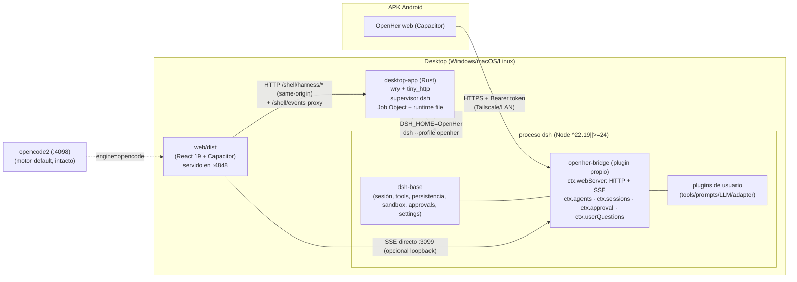
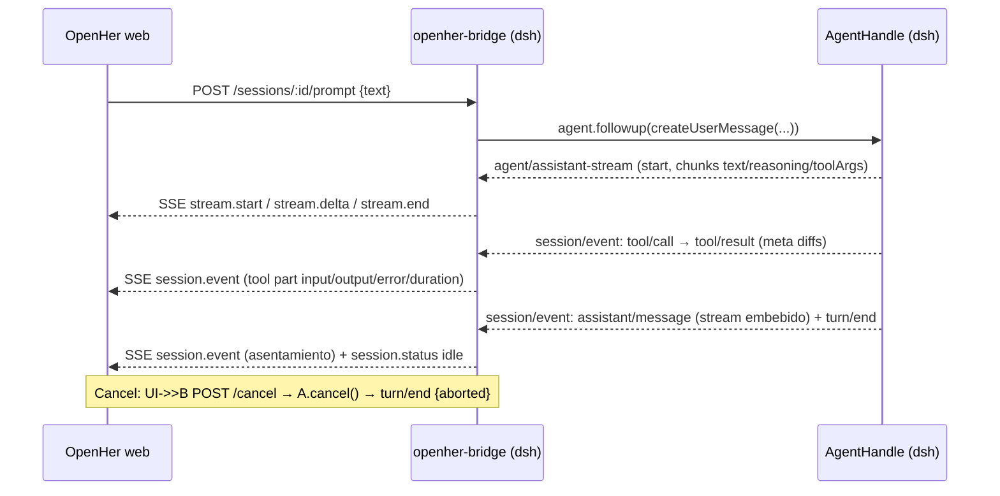

# Investigación profunda: Integración de DeepSeek Harness (`dsh`) como motor alternativo en OpenHer

- **Fecha:** 2026-09-11 · **Modo:** boost adversarial (fact-check + diseños rivales) · **Alcance:** `G:\Proyectos\opencode-remote-android` (OpenHer) + `deepseek-ai/deepseek-harness` (dsh).
- **Reglas de ejecución:** cero ediciones de código, cero builds/installs/spawns. Única escritura: este documento. Verificación vía `websearch`/`webfetch` contra docs oficiales (raw.githubusercontent.com/deepseek-ai/deepseek-harness/master/… y https://deepseek-harness.github.io/deepseek-harness/) + lectura read-only del repo OpenHer.
- **Nota de panel (obligatoria y honesta):** se intentó delegar en subagentes `@fact-checker` y `@solution-architect` en paralelo; el entorno devolvió `Subagent depth limit reached (1)` (esta sesión ya es un subagente y `experimental.subagent_depth=1` prohíbe anidar). En consecuencia, **el panel se ejecutó inline**: un pase de fact-check adversarial (Anexo A) y un pase de arquitectura con 3 diseños rivales puntuados (§4). Si se habilita profundidad de subagentes, el Anexo C lista exactamente qué debería re-atacar un fact-checker externo.

---

## 1) Resumen ejecutivo y recomendación

**Recomendación primaria: Opción D — plugin propio de dsh (`openher-bridge`) que expone HTTP + SSE dentro del proceso dsh**, montado en un perfil propio `openher` (template de perfil + bundle out-of-tree), con:

1. **Bridge en TypeScript** dentro del proceso dsh (no en la web, no en Rust): usa los seams documentados `ctx.agents` (create/resume, `followup()`, `cancel()`, `dispose()`), `ctx.sessions` (log durable, resume, fork), `agent/assistant-stream` (deltas token-level en vivo), `session/event` (hechos durables), `ctx.approval` (permisos one-shot), `ctx.userQuestions` (preguntas estructuradas), `ctx.tools`/`ctx.llm` (extensibilidad del usuario). Expone HTTP loopback + SSE con token bearer emitido por el propio bridge.
2. **Ciclo de vida en `desktop-app/` (Rust)**: detecta/instala Node ^22.19 ‖ >=24, lanza `dsh --profile openher` en un **Job Object** de Windows (cero huérfanos), single-flight sin TOCTOU, health check por identidad (archivo runtime con puerto+token+pid, no solo puerto), `DSH_HOME` dedicado de OpenHer, secretos fuera de argv.
3. **Web (`web/`)** conserva su UI: se implementan adapters hexagonales detrás de `ports.ts` (`IMessageRepository`, `ISessionRepository`, `IEventStream`) + un `CapabilityProfile` que degrada lo no soportado; switch `engine: opencode2 | dsh` por perfil de servidor, default `opencode2` intacto, flag `engineDsh` (default `false`).
4. **Mobile (APK)**: no puede lanzar Node → perfil de servidor remoto `dsh` (host desktop/Tailscale) con bearer token + TLS de Tailscale; nunca `0.0.0.0` sin token.
5. **Personalización del harness (“a mi conveniencia”)**: el usuario modifica `$DSH_HOME/profiles/openher/cordis.patch.yml`, instala plugins con `dsh plugin --profile openher add <pkg>`, escribe tools (`defineTool`), adaptadores LLM (`ctx.llm.registerAdapter` / rutas custom OpenAI-compatible para Groq/Cerebras), prompt sections, approvals y política; **fork MIT solo como último recurso**.

**Fallback recomendado: Opción E (híbrido)** — ACP para plano de control (prompt/cancel/permisos/list/resume) + plugin propio sólo para deltas en vivo, preguntas, títulos y todos. **Segundo fallback: Opción B (ACP puro)** con streaming degradado (render al asentar + replay animado del `stream` embebido). **No recomendadas** como primaria: C (BFF web interno: protocolo propietario acoplado a versión y auth por cookie), A (SDK: sin cancel, sin permisos, sin deltas), F (fork: coste de mantenimiento bajo churn dev-preview).

**Esfuerzo MVP (F0–F3): ~16–25 días-dev** (1 desarrollador), con valor usable desde F2 (chat + streaming + tools + permisos en desktop).

### Corrección material nº1 (auditoría al doc previo del repo)
`docs/research-multi-harness.md` (2026-08-23) asume que **dsh es “OpenAI-compat”** (líneas 15, 18, 434–436, F2-B línea 700, D20 línea 675). **Es incorrecto**: dsh **no expone** `/v1/chat/completions` ni ninguna fachada HTTP de chat para terceros. Lo “OpenAI-compatible” es la dirección **saliente** (adaptadores de dsh hacia proveedores) y el `dsh-llm-mock-server` de test. Las superficies de integración reales son: **stdio JSON-RPC (SDK)**, **stdio ACP** y el **BFF web interno** (RMI Typert por POST `/api` + WS `/api/remote.mux`, cookie firmada, acoplado a la versión del cliente). Ver §3 y Anexo A.

### Corrección material nº2 (deltas token-level)
El orquestador asumió que ni SDK ni ACP exponen deltas; es **correcto** (verificado), pero matizado: en master actual **ya no existen eventos durables `assistant/chunk`**; el stream en vivo es el evento transitorio `agent/assistant-stream` (process-local; su **único consumidor remoto** es el adaptador “Web Session-follow”), y el asentamiento `assistant/message` **embebe el stream exacto** (`stream: AssistantStreamRecord[]`, con timing; `assistant/attempt` para intentos fallidos). Consecuencia: (a) un plugin in-process **sí** puede capturar deltas y reenviarlos; (b) sin plugin, la degradación es “render al asentar + replay animado del stream embebido”, aceptable pero inferior.

### Corrección material nº3 (plugins HTTP in-process)
**Sí es viable** que un plugin de dsh levante su propio HTTP/SSE dentro del proceso: existe el host oficial `@deepseek-ai/dsh-host-webserver` (registro de rutas/upgrades para plugins) y hay precedente comunitario probado (`dsh-harness-mcp-server` levanta StreamableHTTP en `:8090` con `authToken`; `dsh-tui`, `@mem0/dsh-mem0`, `dsh-plugin-manager`). Es la base de la Opción D.

---

## 2) Hechos verificados de dsh (con URL)

> Convención: **[V]** = verificado contra fuente oficial raw del repo; **[V-local]** = verificado en el repo OpenHer (read-only); **[NV]** = no verificado / ambiguo. Referencias completas en §11.

### 2.1 Producto, licencia, plataforma
| Hecho | Estado | Evidencia |
|---|---|---|
| dsh = DeepSeek Harness, MIT, TS ESM, Cordis “everything is a plugin”; developer preview con “THERE WILL BE COMPATIBILITY-BREAKING CHANGES” | **[V]** | `README.md` raw; repo GitHub (`license: MIT`) |
| Engines Node: `^22.19.0 || >=24.0.0`; `packageManager: pnpm@11.7.0`; versión master `0.1.5-rc.2` | **[V]** | `package.json` root raw |
| Windows soportado: shell `pwsh` + sandbox ACL restricted-token (`workspace-write` confina a workspace + temp por sesión); bash no corre en Windows (fila deshabilitada por plataforma) | **[V]** | `packages/bundle/base/README.md` |
| `$DSH_HOME` por defecto `~/.dsh` (o env `DSH_HOME`); perfiles en `$DSH_HOME/profiles/<name>` | **[V]** | `packages/util/home-paths` + `apps/cli/reference/README.md` |
| Sesiones: log append-only `SessionEvent` (JSONL `.jsonl.zstd` versionado con migraciones), proyecciones, fork/resume/search, títulos log-backed | **[V]** | `docs/architecture.md`, `docs/subsystems/session.md` |

### 2.2 Superficies de ejecución (lo que SÍ existe)
| Superficie | Contrato | Límites duros | Estado |
|---|---|---|---|
| `dsh web` (= `--profile web`) | :3080, token de lanzamiento en URL → cookie firmada HttpOnly SameSite=Strict; RPC por POST `/api` + WS `/api/remote.mux`; fence Host/Origin/trustedHosts; `--host 0.0.0.0` **rechazado** por la app web | Protocolo interno Typert, acoplado a la versión del cliente; cookie sin `Secure` (solo loopback); sin logout | **[V]** (`packages/bundle/web-app/README.md`, `packages/client/connection/README.md`, `packages/host/webserver/README.md`) |
| `dsh --profile sdk` | JSON-RPC 2.0 1-línea por mensaje: `initialize`, `session/prompt` (receipt `messageId`), `shutdown`; notif `session.event` (todos los eventos durables de todas las sesiones, sin filtro), `session.status` (running/idle), `subagent.started/finished` | **Sin cancelación** (se abandona matando el proceso); sin negociación de versión; sin approvals (server→client requests “dead capability”); sin resultado por prompt | **[V]** (`packages/sdk/protocol/README.md`, `packages/sdk/server/README.md`) |
| `dsh --profile acp` | ACP v1 + `session/list|resume|close`, `session/set_config_option`, `session/prompt` (1 en vuelo), `session/cancel`, `session/request_permission` (one-shot allow/reject), `session/update` (solo comprometido) | Sin deltas crudos; sin planes/todos/títulos/terminals/elicitation; sin delete/fork/load; sin directorios adicionales; 1 workspace; sin auth (clientes locales confiables) | **[V]** (`packages/acp/acp/README.md`) |
| `dsh --profile headless "task"` | One-shot, una sesión persistida, imprime respuesta y sale | — | **[V]** (`apps/cli/README.md`) |

### 2.3 Streaming y eventos (el punto decisivo)
- **[V]** `agent/assistant-stream` publica frames process-local `start` / **chunks transitorios** / `end`; “the Web Session-follow adapter is the live event's only remote consumer” (`docs/architecture.md`). Un plugin in-process **sí** puede escucharlo (`ctx.on('agent/assistant-stream', ({ frame }) => …)` con `frame.chunk.type === 'text-delta'`; vocabulario `StreamChunk`: text-delta, reasoning-delta, tool `argumentsDelta`, block-start/end, usage, finish) — `docs/cookbook/extension-cookbook.md`, `docs/subsystems/llm-streaming.md`.
- **[V]** Eventos durables: `turn/start|end`, `step/start|end`, `system/message`, `user/message`, `assistant/message` (con `stream` embebido y `usage`), `assistant/attempt`, `tool/call` (arguments raw JSON), `tool/result` (`message`, `error?`, `meta?` — p.ej. diff contextual de `dsh-tool-fs`), `request/header`, `request/context`, `session/end-seed` (`docs/subsystems/session.md`).
- **[V]** `assistant/message` guarda el stream exacto “compacted without joining delta boundaries”; un turno cancelado a mitad finaliza su prefijo con `interrupted: true`.
- **[NV/nota]** Fragmentos de documentación antigua en mirrors/forks mencionan `assistant/chunk` como evento durable; en master actual fue reemplazado por el stream embebido (decisiones `.agents/notes/.../2026-09-01-v2-embedded-assistant-streams.md` y `2026-09-06-v3-canonical-session-envelopes.md`). No confiar en mirrors; usar raw master.

### 2.4 Extensiones (todo es plugin)
- **[V]** Perfiles/bundles: `package.json` con `dsh.bundle.patch`; `dsh plugin --profile <n> add <pkg>` (forward a pnpm); capas: bundles del profil en orden → `profiles/<n>/cordis.patch.yml` → `$DSH_HOME/cordis.patch.yml` → `--patch` overlays; inspección con `--dump-config`/`--dump-default-config` (`docs/user/develop/basic/publish.md`, `apps/cli/reference/README.md`, `docs/architecture.md`).
- **[V]** Tools: `ctx.tools.register(defineTool({...}))` con args tipados, output canónico y render (`docs/cookbook/adding-a-tool.md`); policy por `tools/pre-execute|execute|post-execute|result` y `ctx.tools.guard()`.
- **[V]** LLM adapters: `ctx.llm.registerAdapter` (`docs/cookbook/adding-an-llm-adapter.md`); `dsh-llm-pi-ai` enruta catálogos pi-ai + **rutas custom** `{api, baseURL, apiKeyEnv, models, compat, retryPolicy}` re-leídas por request sin reinicio (`packages/llm/llm-pi-ai/README.md`).
- **[V]** Permisos: `ctx.approval.request(req)` con outcome cerrado `allowed-once|rejected|cancelled|unavailable` (fail-closed), política por sesión `ask|never`, waterfall `approval/request`, auditoría durable `approval/asked|decided` (`docs/subsystems/approval.md`).
- **[V]** Preguntas al humano: `ctx.userQuestions.ask(request)` → `{answers:[{id,selected,custom?}]}`, opciones multi-select, `intent: {kind:'plan-review', approve}` (`docs/subsystems/user-questions.md`).
- **[V]** Self-modification: paquete real `packages/extensions/` (= “self-modification” en la doc AGENTS.md), toolset `dsh-tool-cordis` (`cordis_inspect|mount|unmount`); el agente monta/desmonta plugins en memoria (`examples/web-cordis/README.md`, nota `.agents/notes/.../2026-07-08-self-referential-cordis-toolset.md`).
- **[V]** Hooks Claude Code/Codex (`dsh-hooks-*`), subagentes, MCP client, workflows, goals, schedule, terminal, sandbox bwrap/Landlock/Seatbelt/ACL.

### 2.5 Pruebas (clave para el churn)
- **[V]** `@deepseek-ai/dsh-llm-mock-server` = servidor HTTP/SSE **OpenAI-compatible scriptable** (secuencias FIFO: `success`, `rate_limit`, `stream_disconnect`, `partial_disconnect`, `tool_call_success`, `random` con seed reproducible…), `startMockLlmServer({port:0,...})` retorna handle con `requests` y `close()` (`packages/test-support/llm-mock-server/README.md`).
- **[V-local]** OpenHer **ya lo usa**: `web/package.json` línea 79 `"@deepseek-ai/dsh-llm-mock-server": "0.1.1-rc.2"` y `web/src/providers/groq.test.ts` (y `cerebras.test.ts`) lo importan para testear streaming/recovery de sus providers QuickChat. Activo reutilizable para tests contractuales de adaptadores dsh (Groq/Cerebras) — **no** para testear el bridge (ese necesita un fake-harness propio).

### 2.6 Costuras de OpenHer confirmadas (read-only)
- **[V-local]** `web/src/features/chat/application/ports.ts`: `IMessageRepository.loadMessages/sendPrompt/sendCommand/abort`, `IEventStream.subscribe/getState/reconnect`, `IMessageCache`, `ISessionRepository.listSessions/loadSession`. Adaptadores existentes en `features/chat/infrastructure/message.api.adapter.ts` sin consumidores → punto de inserción hexagonal.
- **[V-local]** `web/src/entities/config/model.ts`: `ServerConfig{host,port,username,password,apiVersion?: "auto"|"v1"|"v2"}`; `FeatureFlags` (13 flags, incl. `permissionUI`, `streamingFull`, `offlineCache`, `autoOpencode2`); `ServerProfile{id,name,kind:"http"|"pair",config}`.
- **[V-local]** `useSSEHandler.ts` con eventos opencode hardcodeados: `message.part.updated`, `message.part.delta`, `session.next.text.delta|reasoning.delta|tool.input.delta`, `session.next.compaction.*`, `session.next.step.failed|retried`, `session.status|idle|error`, `message.updated`.
- **[V-local]** `desktop-app/src/state.rs`: `ShellConfig{auto_opencode2, opencode2_enabled, opencode2_port(4098), opencode2_command}`; `discover_opencode2_exe()` con rutas cableadas (`X:\Dev\...`), `resolve_opencode2_cmd()` = `opencode2 serve --service`, `ensure_opencode2_running()` con poll de salud de 8 s; autostart HKCU Run `OpenCode2Server` → `--ensure-opencode2-and-exit`.
- **[V-local]** `web/src/shell.ts`: `shell.opencode2.status|autostartGet|autostartSet|ensure` y `autostart.get/set`. `SettingsPanel` real está en `web/src/components/SettingsPanel.tsx`. `providers/` incluye groq, cerebras, custom, opencodeGo/opencodeLocal (keys QuickChat existentes).

---

## 3) Auditoría del doc previo `docs/research-multi-harness.md`

| # | Afirmación del doc previo | Veredicto | Corrección |
|---|---|---|---|
| 1 | L15/L18: dsh listado junto a hermes como “OpenAI-compatible REST+SSE” / “F2 = Hermes + DeepSeek (OpenAI-compat + plugins)” | **REFUTADO** | dsh no sirve `/v1/chat/completions`. Hermes y dsh **no comparten base de integración**. |
| 2 | L434–436: “Settings → Models … (o cualquier OpenAI-compat endpoint)” y “implementar como OpenAI-compat + file/plugins extensions” | **REFUTADO (matiz)** | Lo OpenAI-compatible es la configuración **saliente de proveedores** del harness, no una fachada entrante. La vía correcta es SDK/ACP/plugin. |
| 3 | D20 (L675): “8 de 13 harnesses exponen OpenAI-compat como façade (… deepseek …)” | **REFUTADO** | dsh no pertenece a ese grupo; el adapter `generic-openai` no aplica. |
| 4 | F2-B (L700): `adapters/deepseek` “depende de stable spec check” | **REFUTADO como diseño**; la intuición de esperar spec estable era correcta | Reemplazar por Opción D/E; el “spec” estable es el seam de plugins, no un REST-style. |
| 5 | L432: Node 22.19+/24+, pnpm 11.7 | **VERIFICADO** | Coincide con `engines` y `packageManager` actuales. |
| 6 | Estrellas “30k⭐” (L718) | **OBSOLETO** | Hoy ~183k⭐ (GitHub). Irrelevante para el diseño; anotado para evitar citar métricas viejas. |
| 7 | D16 (“harness como capability-profile + adapter factory, no plugin runtime dentro de web”) | **SIGUE VÁLIDO** | La propuesta D respeta D16: el plugin corre **dentro de dsh (Node)**, no dentro de la web; la web sigue thin-client con adapters. |
| 8 | D18 (“bridges stdio en desktop Rust”) | **PARCIAL** | Para dsh, el bridge de datos es HTTP+SSE nativo del plugin; Rust conserva **ciclo de vida/supervisión** (y proxy same-origin). |
| 9 | D19 (IndexedDB sin bump de versión) | **SIGUE VÁLIDO** | El cache dsh puede namespacing por prefijo `dsh:` sin DB_VERSION bump. |
| 10 | “Probar `npx dsh web` + sniff `/doc` OpenAPI” (L688) | **DESCARTADO** | dsh no publica OpenAPI; su BFF no es un contrato de terceros. La validación correcta es PoC del bridge/ACP. |

**Veredicto global:** el doc previo acierta en la abstracción (ServerKind + adapters + hexagonal) pero se equivoca en el *transporte* de dsh. La corrección no invalida su roadmap; lo reordena: dsh pasa de “F2 barato OpenAI-compat” a “F2 con bridge propio + perfil”.

---

## 4) Matriz de opciones puntuada

Criterios y pesos: cancelación/stop 15%, streaming 15%, permisos/aprobaciones 10%, sesiones persistentes 10%, escalabilidad 5%, esfuerzo (5=menor) 15%, churn dev-preview (5=menor) 15%, seguridad 10%, mobile 5%. Escala 1–5.

| Criterio (peso) | **A. Bridge Rust ↔ SDK stdio** | **B. Bridge Rust ↔ ACP stdio** | **C. Web BFF directo** | **D. Plugin propio `openher-bridge` HTTP+SSE** | **E. Híbrido ACP + plugin** | **F. Fork/vendor MIT** |
|---|---|---|---|---|---|---|
| Cancel/stop (15%) | 1 · no existe; matar proceso | 5 · `session/cancel` | 4 · interno GUI (no documentado) | 5 · `AgentHandle.cancel()` | 5 · ACP | 5 · control total |
| Streaming (15%) | 2 · sin deltas; asentar+animar stream embebido | 3 · ídem A | 5 · Session-follow en vivo (pero interno) | 5 · `agent/assistant-stream` + durables | 5 · plugin deltas | 5 · total |
| Permisos (10%) | 1 · no existe | 5 · `request_permission` one-shot | 4 · UI web interna | 5 · `ctx.approval` + `userQuestions` | 5 · ACP + plugin | 5 |
| Sesiones (10%) | 3 · create/prompt; resume ambiguo | 4 · list/resume/close (sin fork/títulos) | 5 · todo (interno) | 5 · list/resume/fork/search/títulos/todos | 5 | 5 |
| Escalabilidad (5%) | 4 | 5 · multiplexa N sesiones | 4 | 5 · N sesiones/proceso | 5 | 4 |
| Esfuerzo (15%) | 4 · protocolo pequeño | 3 · ACP + lifecycle | 1 · ingeniería inversa Typert | 3 · plugin + perfil + web adapters | 2 · dos planos | 1 · mantener fork |
| Churn (15%) | 3 · stdio joven | 4 · ACP estándar v1 | 1 · acoplado a versión cliente | 3 · seams “product stable” pero preview | 3 | 2 · parches perpetuos |
| Seguridad (10%) | 4 · stdio local | 4 · stdio local | 2 · cookie sin Secure, fences, no terceros | 4 · loopback+token propio (LAN opt-in) | 4 | 3 · deuda de parches |
| Mobile (5%) | 2 · vía host desktop | 2 · vía host desktop | 3 · browser remoto SSH | 5 · HTTP+Bearer directo/Tailscale | 4 | 3 |
| **Total ponderado** | **2.60** | **3.95** | **3.20** | **4.30** | **4.10** | **3.65** |

**Lectura:** D gana por cobertura funcional completa (cancel, streaming real, approvals, preguntas, sesiones plenas) sin depender de contratos internos; su coste (escribir un plugin + perfil) está acotado por seams documentados con ejemplos oficiales. B es el refugio estándar si el churn del plugin preocupa. E es el mejor compromiso “cinturón y tirantes”: ACP para lo que ya está especificado + plugin sólo donde ACP no llega (deltas, preguntas, títulos, todos). C se descarta por frágil y no soportado (aunque su UX sea la más rica). A sólo vale como PoC de 2 días. F se reserva para cambios que los seams no permitan.

**Degradaciones aceptadas por diseño (si algo falla):**
- Si el plugin no puede emitir deltas (futuro refactor): render al asentar + **replay animado** del `AssistantStreamRecord[]` embebido (velocidad configurable) — UX “modo saver”.
- Si fork/search se complican: ocultar en UI vía `CapabilityProfile` (precedente: `writeFile` no soportado en v2).
- Si el usuario no tiene Node: dsh deshabilitado con guía de instalación (no bloquear opencode2).

---

## 5) Arquitectura recomendada y contratos del bridge

### 5.1 Diagrama



### 5.2 Flujo de un turno (recomendado)



### 5.3 Contratos HTTP del bridge (`openher-bridge`, loopback por defecto)

| Método | Ruta | Cuerpo/Query | Respuesta | Notas |
|---|---|---|---|---|
| GET | `/health` | — | `{ok, engine:"dsh", version, pid, uptimeMs}` | Identidad para el supervisor Rust |
| GET | `/capabilities` | — | `CapabilityProfile` (§7.3) | Probe al conectar; memo por `host:puerto` (como `version.ts`) |
| GET | `/sessions` | `?limit&cursor` | `SessionSummary[]` | id, título, cwd, `updatedAt`, estado running/idle |
| POST | `/sessions` | `{cwd?, title?, preset?}` | `SessionSummary` | Crea agente vía factory (`ctx.agents`); persiste en `$DSH_HOME` |
| GET | `/sessions/:id` | — | `SessionDetail` | Incluye cola de aprobaciones/preguntas pendientes (reconexión) |
| GET | `/sessions/:id/messages` | `?limit&before` | `MessageEnvelope[]` | Replay desde log/proyecciones (`deriveMessages`) |
| POST | `/sessions/:id/prompt` | `{text, images?, model?, mode?}` | `{messageId}` | Receipt de encolado; resultado llega por SSE |
| POST | `/sessions/:id/cancel` | — | `{ok}` | `AgentHandle.cancel()`; turno cierra `aborted` |
| POST | `/sessions/:id/fork` | `{boundary?}` | `SessionSummary` | `SessionStore.fork` (fase 2/3; gate por capability) |
| GET | `/sessions/search` | `?q` | `SessionSummary[]` | `session-query` (SQLite FTS) — fase 4 |
| POST | `/permissions/:requestId` | `{outcome:"allowed-once"\|"rejected"}` | `{ok}` | Resuelve la promesa pendiente del answerer; timeout→`cancelled` (fail-closed) |
| POST | `/questions/:requestId` | `{answers:[{id,selected,custom?}]}` | `{ok}` | `user-questions` answerer |
| GET | `/models` | — | `{providers:[…], models:[…]}` | `ctx.llm.listConfigurableProviders/listModels` (fase 2/4) |
| GET | `/events` | SSE; `?sessions=a,b` opcional; `Last-Event-ID` | ver §5.4 | Heartbeat 15 s; `retry:` 3 s |

Auth: `Authorization: Bearer <token>` en todo salvo `/health` (que responde solo identidad). Token: aleatorio por lanzamiento, escrito en `<DSH_HOME>/openher-bridge.json` con ACL de usuario; nunca en argv. CORS: deshabilitado por defecto; desktop consume vía proxy same-origin `/shell/harness/*`; para LAN/mobile, allowlist explícita de orígenes + token (y TLS por Tailscale/WireGuard).

### 5.4 Contrato SSE (nombres estables `openher.v1.*`)

| Evento | Payload | Mapeo OpenHer |
|---|---|---|
| `openher.v1.stream.start` | `{sessionId, messageId, blocks?}` | Abre parte optimista |
| `openher.v1.stream.delta` | `{sessionId, messageId, partType:"text"\|"reasoning"\|"tool-input", blockIndex, delta}` | Append a part |
| `openher.v1.stream.end` | `{sessionId, messageId}` | Cierra streaming optimista |
| `openher.v1.session.event` | `{sessionId, event: SessionEvent}` (passthrough durable) | `message.part.updated`-equivalente, tools, boundaries, compaction |
| `openher.v1.session.status` | `{sessionId, status:"running"\|"idle"}` | `session.status`/`idle` |
| `openher.v1.session.updated` | `{session: SessionSummary}` | Lista/título |
| `openher.v1.todo.updated` | `{sessionId, todos: TodoItem[]}` | Todos |
| `openher.v1.permission.requested` | `{sessionId, requestId, toolName, callId?, reason?}` | `PermissionRequest` → `permissionUI` |
| `openher.v1.question.requested` | `{sessionId, requestId, questions:[…]}` | `Question` (incluye `intent:plan-review`) |
| `openher.v1.error` | `{sessionId?, code, message}` | `session.error` |
| `openher.v1.ping` | `{t}` | Watchdog |

Contrato de reconexión: el bridge asigna `seq` monótono por sesión a los `session.event` reenviados; al reconectar, el cliente puede pedir `GET /sessions/:id/messages?after=<seq>` para cerrar huecos; los `stream.delta` no son recuperables (son transitorios) → la UI refresca del log al reconectar.

### 5.5 Mapeo a las costuras de OpenHer (`ports.ts`)
- `IMessageRepository.loadMessages` ← `GET /sessions/:id/messages` (mapper → `MessageEnvelope`).
- `IMessageRepository.sendPrompt` ← `POST /sessions/:id/prompt`.
- `IMessageRepository.abort` ← `POST /sessions/:id/cancel`.
- `IMessageRepository.sendCommand` ← **no soportado** en v1 (los slash-commands de dsh son plano UI `ctx.commands`; fase 4 opcional: `POST /sessions/:id/command`).
- `IEventStream.subscribe(sessionID, directory, handler)` ← SSE `/events` filtrado client-side por `sessionId` (dsh emite de todas las sesiones, igual que `session.event` del SDK; el filtrado es responsabilidad del cliente).
- `ISessionRepository.listSessions/loadSession` ← `GET /sessions` / `GET /sessions/:id`.
- `IMessageCache` intacto (IndexedDB `openher`, keys con prefijo `dsh:`; sin bump de DB_VERSION).
- Selección de motor: fábrica `web/src/shared/api/engine.ts` que devuelve el juego de adapters (`opencode` = actuales; `dsh` = nuevos). Los hooks siguen llamando `web/src/api.ts` (facade-first); la migración a consumo directo de `ports.ts` puede hacerse incremental sin big-bang.

### 5.6 Ciclo de vida en desktop Rust (anti-bugs de `ensure_opencode2_running`)
Módulo nuevo `desktop-app/src/harness/`:
- `node.rs`: descubrimiento en orden (config explícita → `PATH` `node` → rutas comunes por plataforma, **sin** rutas cableadas tipo `X:\Dev`), parseo de versión y validación `^22.19 || >=24`; mensaje accionable si falta.
- `dsh.rs`: instalación gestionada `%LOCALAPPDATA%\OpenHer\dsh` con versión **pinneada** (`npm install --prefix` con consentimiento, o detección de `dsh` global/npx existente); marcador de versión instalada; verificación de integridad básica.
- `supervisor.rs`: máquina de estados `Stopped→Starting→Ready→Stopping→Stopped` bajo **un solo Mutex/single-flight** (elimina TOCTOU); spawn con `CREATE_NO_WINDOW` y **Job Object `KILL_ON_JOB_CLOSE`** (elimina huérfanos); stop elegante `POST /health`→shutdown del bridge (o `taskkill /T` de respaldo tras timeout); restart con backoff y tope; logs a archivo (nunca stdout del hijo).
- `bridge_client.rs`: lee `<DSH_HOME>/openher-bridge.json` (`{port, token, pid, version}`), valida identidad `pid`+`/health` (**no** solo “el puerto responde”, que es el bug de falsos positivos de opencode2), expone token a la web solo por `/shell/harness/session`.
- `security.rs`: ACL de usuario para el runtime file; redacción de logs; bind loopback por defecto; LAN solo opt-in con token+TLS documentado; sin secretos en argv/env logueado.
- Config: `ShellConfig` gana `dsh_enabled:false`, `dsh_port:0` (0 = efímero), `dsh_node_path:""`, `dsh_version:"<pin>"`, `dsh_auto_install:false`; migración con defaults que preservan opencode2. Autostart propio `OpenHerDshServer` → `--ensure-dsh-and-exit` (separado del de opencode2).
- Router: `infrastructure/http/harness_router.rs` + registro en `api.rs` (patrón existente `opencode_router.rs`).

### 5.7 Mobile
- APK **no** corre Node: el perfil de servidor `dsh` apunta a un host (desktop OpenHer, homelab) por LAN/Tailscale. Auth: bearer token del bridge; onboarding por QR/deep-link (`openher://server?engine=dsh&host=…&token=…`) o ingreso manual; TLS terminado por Tailscale/WireGuard (recomendado) o reverse-proxy con TLS.
- El bridge solo escucha en LAN si se configura explícitamente (`--openher-lan`): bind a IP de Tailscale/WLAN + token obligatorio + rate-limit + Origin allowlist; **jamás** `0.0.0.0` sin token (lección del bypass loopback de opencode2).
- Funciones degradadas en móvil puro: spawn de proyectos locales, PTY local, apertura de archivos locales — ya resueltas por OpenHer vía desktop-host.

---

## 6) Estrategia de personalización del harness (“a mi conveniencia”)

**Principio:** personalizar = **plugin + patch + settings**, nunca fork. dsh fue diseñado para esto (“There is no privileged core to patch: you extend dsh by mounting a plugin beside the others” — `docs/architecture.md`).

| Necesidad del usuario | Mecanismo dsh (sin fork) | Dónde vive | Estado |
|---|---|---|---|
| Tools propias (p.ej. “deploy OpenHer”, herramientas de proyecto) | `ctx.tools.register(defineTool(...))`; policy `tools/pre-execute` | Plugin de usuario (bundle) | **[V]** |
| Prompt/persona/instrucciones | `ctx.systemPrompt.section()` (orden, scope); ficheros `AGENTS.md` del workspace (root y subdir on-touch) | Plugin o archivos | **[V]** |
| Proveedor LLM (Groq, Cerebras, gateway propio) | `dsh-llm-pi-ai` con rutas custom `{api:"openai-completions", baseURL, apiKeyEnv, models, compat}`; o adapter propio `ctx.llm.registerAdapter`; settings en caliente por request | `$DSH_HOME/settings.yaml` + `.credentials.yaml` (referencias, no secretos en claro) | **[V]** (mecanismo); catálogo exacto Groq/Cerebras **[NV]** |
| Permisos/aprobaciones | Política `ask|never` por sesión + answerers (`approval/request`); presets `ctx.permissionPresets`; sandbox `workspace-write` | Bridge (answerer remoto) o plugins de usuario | **[V]** |
| Preguntas al humano/plan review | `ctx.userQuestions` waterfall | Bridge | **[V]** |
| Subagentes / MCP / hooks / cron / workflows | Plugins (`dsh-subagent-*`, `dsh-mcp-client`, `dsh-hooks-*`, schedule, workflow) | `dsh plugin add` | **[V]** |
| Ajustes de composición (montar/desmontar) | `cordis.patch.yml` del perfil/home + `--patch`; `dsh plugin add/remove`; `--dump-config` | `$DSH_HOME` | **[V]** |
| Auto-modificación en vivo | `dsh-tool-cordis` (`cordis_inspect/mount/unmount`, en memoria, no persiste) | Plugin `packages/extensions` | **[V]** |
| UI alternativa (la nuestra o la oficial) | OpenHer consume el bridge; o el usuario monta `dsh-web-app` en **otro perfil** (comparte `$DSH_HOME`, GUI propia :3080) | Perfiles separados | **[V]** (composición); convivencia simultánea en un mismo perfil: **[NV]** (evitar en MVP) |

**Cuándo forkear (MIT):** sólo si hace falta (a) tocar el loop/`agent-loop`, (b) usar eventos/seams privados sin contrato, o (c) congelar contra el churn. Precedente interno: dsh vendoriza Cordis (`vendor/`). Estrategia si se forkea: repo aparte (no `vendor/` masivo en OpenHer), parche mínimo sobre tag pinneado, re-aplicación por release, y mantener el bridge como plugin para que el fork sea prescindible.

**Gobierno de upgrade (churn dev-preview):**
1. **Pin exacto** de `@deepseek-ai/dsh` + lockfile; bump explícito tras correr la suite contractual.
2. **Probe de capacidades** al conectar (`/capabilities` + autochequeo del bridge del vocabulario de eventos); si el probe falla, la UI muestra “motor dsh incompatible con esta versión” y **no** rompe opencode2.
3. **Tests contractuales**: (i) unit del mapper con fixtures de eventos reales; (ii) integración del bridge levantando dsh real en CI dev contra `dsh-llm-mock-server` (ya en devDeps de `web/`; reutilizable para probar Groq/Cerebras **a través de** dsh); (iii) smoke de proceso (spawn, health, cancel, kill sin huérfanos).
4. **Aislamiento**: todo lo dsh en `web/src/shared/api/dsh/` + `features/*/infrastructure/*.dsh.adapter.ts` + `harness/openher-bridge/`; un breaking change se contiene ahí.
5. **Canal de seguimiento**: releases/discussions de dsh + topic `dsh-plugin`; revisar notas de compatibilidad antes de cada bump.

---

## 7) Mapeo de datos y capacidades

### 7.1 `SessionEvent`/`ContentBlock` dsh → `MessageEnvelope.parts` (OpenHer)

| Origen dsh | Destino OpenHer | Notas |
|---|---|---|
| `user/message` (content text) | `info.role=user`, part `text` | Incluye prompts sintéticos (`source` distingue: user/plugin/goal…); el bridge puede etiquetar |
| `user/message` con bloques imagen (refs durables) | part `file` (imagen) | Requiere servir attachments desde el bridge (fase 3); en v1 degradar a marcador `[imagen]` |
| `assistant/message.message` (blocks: text/reasoning/tool-call) | `info.role=assistant`; parts `text`, `reasoning`, `tool` (estado inicial) | `usage` → info (tokens) |
| `assistant/message.stream` (`AssistantStreamRecord[]`) | Replay fiel/animación post-settle | Permite reconstrucción exacta sin evento `assistant/chunk` |
| `assistant/attempt` | Ignorar o mostrar como intento fallido colapsado | Log-only, sin historial modelo |
| `tool/call` + `tool/result` | part `tool` con `input` (JSON raw), `output`, `error?`, `duration` (delta de `time`) | `meta` de fs tools (diffs) → diff/file part (fase 3) |
| `turn/end` reason `completed/aborted/error/max-tokens/interrupted` | `session.idle` / `session.error` / aviso | `aborted` → UI de stop; `max-tokens` → aviso de truncado |
| `step/*`, `request/header|context` | No render (o telemetry) | Log-only |
| `compaction/*` (merge-extensible) | Aviso de compactación (part info) | OpenHer v2 ya maneja compaction; fase 3 |
| `todo/write` (tool + evento) | Todos de OpenHer | **[V]** payload vía `docs/subsystems/todo.md` |
| `plan/mode` + `intent:plan-review` | Question approve/decline; badge de plan | Fase 3 |
| Título de sesión (log-backed, provider `ctx.sessionTitle`) | `Session.title` + `session.updated` | Deshabilitado en perfil sdk; el bridge lo provee |
| `approval/asked|decided` | `PermissionRequest` (pending/resolved) | Auditoría; `callId` enlaza con el tool part |
| `user-questions/request` | `Question` (options/multiSelect/custom/detail) | Incluye free-text “Other” |
| Subagentes (`subagent.started/finished`) | Árbol/indicador de delegación | Fase 4 |

**Imposible/no disponible (degradar con `CapabilityProfile`):**
- Deltas de provider crudos fuera de `agent/assistant-stream` (no hay; el nuestro los captura).
- Planes/todos/títulos/terminals/elicitation **en ACP y SDK** (solo existen vía plugin/in-process).
- `session/load`, delete/fork vía ACP (fork sí es posible in-process; delete: no documentado → `false`).
- Directorios adicionales por sesión (1 workspace) → `extraDirs:false`.
- Terminal embebida dsh (existe backend, no expuesto) → usar PTY de OpenHer.
- UI cards ricos (terminal/diff/read/search/web de dsh) → degradar a tool part genérico; diffs sólo si `tool/result.meta` los trae.
- Búsqueda semántica de sesiones: `session-query` es FTS literal, no vectorial.

### 7.2 Adaptación de UI (sin rehacer OpenHer)
- `useSSEHandler.ts` (nombres opencode) → nuevo `useDshStreamHandler.ts` que traduce `openher.v1.*` a las mismas mutaciones de estado que ya existen para `message.part.delta`/`session.next.*` (texto, reasoning, tool input, status, idle, error). El evento passthrough durable se procesa con un mapper de parts.
- Reutilizar `chat.service.ts` (dedupe, merge, optimistic) tal cual: el bridge emite receipt `messageId` y estados equivalentes.
- `permissionUI`/`questionAuto` (FeatureFlags) gobiernan los flujos de permisos/preguntas dsh; sin soporte → auto-respuesta `never` (fail-closed) para headless o aviso.

### 7.3 `CapabilityProfile` (ejemplo)
```json
{
  "engine": "dsh",
  "bridgeProtocol": "openher.v1",
  "dshVersion": "0.1.x-rc.y",
  "streaming": { "liveDeltas": true, "settledStreamReplay": true, "reasoning": true, "toolInputDeltas": true },
  "sessions": { "list": true, "resume": true, "fork": true, "delete": false, "search": true, "titles": true, "steering": true },
  "interaction": { "permissions": true, "questions": true, "planReview": true },
  "content": { "images": "degraded", "attachments": false, "todos": true, "compaction": true, "diffs": "tool-meta-only" },
  "limits": { "singleWorkspacePerSession": true, "extraDirs": false, "terminalView": false, "commands": false }
}
```
La UI usa este perfil para ocultar/avisar (mismo patrón que el gating de `writeFile` en v2). La detección se memoiza por `host:puerto` igual que `version.ts` (evita sondeos repetidos).

---

## 8) Plan por fases con archivos exactos

> Sin ejecutar builds/installs ahora (regla de investigación). Los comandos listados son el criterio de verificación para cuando se implemente.

### F0 — Tipos, flag y gating (2–3 días)
Archivos: `web/src/entities/config/model.ts` (nuevo `type Engine = "opencode"|"dsh"`; `ServerConfig.engine?`; `ServerProfile.engine?`; `FeatureFlags.engineDsh: boolean` default false), `web/src/components/SettingsPanel.tsx` (selector oculto tras flag, junto al `apiVersion`), `web/src/features/opencode2/Opencode2Button.tsx` (generalizar a `EngineControl` o crear `features/dsh/DshButton.tsx` reutilizado en LabsPanel/Settings), `web/src/i18n/en.ts` + `es.ts`, `web/src/constants.ts` (keys de storage dsh bajo prefijo). Tests: `src/settings-regression.test.mjs`, `src/i18n.test.mjs`, vitest de type-guards. Verificación: `pnpm test`, `pnpm run test:i18n`, `pnpm run test:settings`. **Criterio de salida:** opencode2 intacto; nada cambia sin flag.

### F1 — Bridge dsh + perfil `openher` (5–8 días)
Nuevos en el monorepo: `harness/openher-bridge/{package.json,cordis.patch.yml,tsconfig.json}` y `harness/openher-bridge/src/{index.ts,routes.ts,sse.ts,events.ts,agents.ts,approvals.ts,questions.ts,protocol.ts,auth.ts,runtime-file.ts}`; `harness/profile-openher/{README.md,cordis.patch.yml}`; `docs/dsh-bridge-protocol.md` (contrato §5.3/5.4). Tests: `harness/openher-bridge/test/{protocol,routes,events,approvals}.test.ts` con fake-ctx + servidor de integración contra `dsh-llm-mock-server`. Verificación: suite del paquete + `dsh --profile openher --dump-config` (manual, futuro) + runbook. **Criterio de salida:** `curl` contra bridge levanta/prompta/cancela/aprueba/pegunta y apaga limpio (sin huérfanos). **Riesgo abierto:** resolución de imports `@deepseek-ai/dsh-*` desde bundle out-of-tree (ver §10 Q6).

### F2 — Adapters web + switch UI (4–6 días)
Nuevos: `web/src/shared/api/dsh/{client.ts,capabilities.ts,mappers.ts,events.ts,types.ts}`; `web/src/features/chat/infrastructure/{message.dsh.adapter.ts,session.dsh.adapter.ts,event-stream.dsh.adapter.ts}`; `web/src/shared/api/engine.ts` (fábrica por motor); `web/src/hooks/useDshStreamHandler.ts` (o generalización de `useSSEHandler`); cambios en `web/src/api.ts` (selección de motor), `web/src/hooks/useSSE.ts` (parámetro de transporte), `web/src/shell.ts` (+ `shell.dsh.status/ensure/autostart/session`), `SettingsPanel.tsx` final. Tests: `mappers.test.ts` con fixtures de eventos reales, `event-stream.test.ts` (reconexión/huecos), `test:ui`, `test:settings`, `test:model`. Verificación: `pnpm test && pnpm run test:ui && pnpm run test:settings && pnpm run test:model` + `tsc --noEmit`. **Criterio de salida:** sesión dsh real (o fake-harness) lista/muestra/streamea/cancela/permite desde la UI con `engine=dsh`; `engine=opencode` sin regresiones.

### F3 — Ciclo de vida desktop + seguridad + mobile (5–8 días)
Nuevos: `desktop-app/src/harness/{mod.rs,node.rs,dsh.rs,supervisor.rs,bridge_client.rs,security.rs}`; `desktop-app/src/infrastructure/http/harness_router.rs` (+ registro en `api.rs` y `infrastructure/http/mod.rs`); cambios: `desktop-app/src/state.rs` (campos+clamp+migración), `desktop-app/src/main.rs` (flags `--ensure-dsh`, `--ensure-dsh-and-exit`; autostart `OpenHerDshServer`), `web/src/shell.ts`, `web/src/components/SettingsPanel.tsx` (panel “Harness dsh”: estado, ruta Node, instalar/reparar, abrir carpeta, LAN), i18n. Tests: `cargo check`, `cargo test` (máquina de estados, version parse, runtime-file), y prueba manual de kill-total sin huérfanos. **Criterio de salida:** arranque/parada/restart/autostart; 0 procesos huérfanos; puerto efímero; token no visible en logs/argv.

### F4 — Productización (opcional, 5–10 días)
Attachments/imágenes end-to-end, fork/search UI, “Harness Studio” (editar `cordis.patch.yml` y gestionar plugins desde el IDE de OpenHer), wizard Tailscale, steering, telemetry opt-in, contribución upstream del bridge (topic `dsh-plugin`), runbook `docs/dsh-runbook.md`, actualización de `AGENTS.md` y `docs/research-multi-harness.md` (corrección §3).

**Total MVP F0–F3: ~16–25 días-dev.** Hito demostrable temprano: final de F2 (desktop con bridge manual).

---

## 9) Riesgos y mitigaciones

| # | Riesgo | Prob. | Impacto | Mitigación |
|---|---|---|---|---|
| R1 | Churn dev-preview rompe eventos/seams del bridge | Alta | Alto | Pin exacto, probe `/capabilities`, contrato `openher.v1` versionado, tests contractuales, feature flag kill-switch, adapter aislado |
| R2 | Refactor futuro elimina `agent/assistant-stream` o cambia shapes | Media | Medio | Degradación a asentar + replay del stream embebido; plan B = ACP |
| R3 | Fricción Node (usuario sin Node 22.19+/24) | Media | Medio | Detección + guía UI; opción “bundle portable Node” en recursos (~30 MB, licencia MIT); modo npx |
| R4 | Seguridad de superficie LAN/mobile | Media | Alto | Loopback default; LAN opt-in con token+TLS (Tailscale); Origin allowlist; rate-limit; nunca 0.0.0.0 sin token; tokens en archivo con ACL, jamás argv/logs |
| R5 | Procesos huérfanos / TOCTOU / falsos “running” | Media | Alto | Job Object `KILL_ON_JOB_CLOSE`; single-flight mutex; identidad por pid+token+runtime-file (no solo puerto); backoff con tope |
| R6 | Sandbox Windows ACL restricted-token causa fricción | Media | Bajo | Documentar; receta de override completa (disable `pwsh-sandbox` **y** re-enable stack bash) como patch de perfil; default mantener sandbox |
| R7 | Contaminación de stdout del perfil (rompe stdio futuros) | Baja | Medio | Logs del bridge a archivo/stderr; aserción en tests de integración |
| R8 | Incompatibilidad de sesiones/logs dsh | Baja | Alto | OpenHer **nunca** parsea logs dsh; sólo bridge; zstd/native resuelto dentro de dsh |
| R9 | Doble UI (OpenHer + dsh web) simultánea | Baja | Medio | Perfiles separados compartiendo `$DSH_HOME`; no montar `dsh-web-app` en perfil `openher` |
| R10 | Pérdida de fidelidad en mapping (cards, planes) | Media | Bajo | `CapabilityProfile` + degradación genérica; nunca bloquear chat |
| R11 | Licencias de paquetes dsh individuales | Baja | Medio | Verificar SPDX por paquete al distribuir (raíz MIT, algunos paquetes BSD-3 u otras); incluir THIRD_PARTY_NOTICES propio |
| R12 | Coste/keys de proveedor (DeepSeek pricing, Groq/Cerebras) | Media | Bajo | Enfoque provider-agnostic; rutas custom OpenAI-compatible; el usuario decide keys |
| R13 | Fork accidental (presión por personalizar) | Media | Alto | Documentar extension points; “Harness Studio” para editar patch; fork sólo con ADR |

---

## 10) Preguntas abiertas (decisiones del usuario)

1. **`engine` por perfil de servidor o global?** Recomendación: por perfil (`ServerProfile.engine`) + default global `opencode`; permite convivir ambos motores.
2. **Node: detectar del sistema u hojear portable (~30 MB) en el instalador?** Recomendación: detectar primero, bundle como opción de “instalación guiada” en F3/F4.
3. **`DSH_HOME` dedicado de OpenHer (`%LOCALAPPDATA%/OpenHer/dsh-home`) vs `~/.dsh` compartido con el usuario?** Recomendación: dedicado por defecto (aislamiento), con opción “usar mi ~/.dsh”.
4. **Keys: reutilizar las de QuickChat (groq/cerebras de `web/src/providers/`) para las rutas dsh o configurar por separado?** Recomendación: no duplicar secretos en el repo; ofrecer “copiar a dsh settings” explícito (el destino es `.credentials.yaml` por referencia).
5. **Mobile: sólo vía desktop-host/Tailscale, o también bridge con bind LAN directo?** Recomendación: Tailscale-first; bind LAN sólo opt-in avanzado.
6. **¿Bridge en el monorepo (`harness/`) o repo aparte/upstream (`dsh-plugin` topic)?** Recomendación: monorepo ahora (velocidad), publicable después.
7. **Alcance del MVP: chat+stream+tools+permisos (recomendado) o incluir fork/search/attachments ya?** Recomendación: F2 mínimo, F4 resto.
8. **Política de aprobación por defecto en modo remoto/headless: `ask` o `never`?** Recomendación: `ask` con timeout→fail-closed; `never` para CI.
9. **Nombre visible del motor: “dsh” vs “DeepSeek Harness”?** (i18n).
10. **¿Telemetría opt-in del bridge (latencia, errores) y hacia dónde?**
11. **Profundidad de subagentes (`experimental.subagent_depth`): ¿habilitar ≥2 para que el panel @fact-checker/@solution-architect sea real en futuras rondas?**

---

## 11) Fuentes

**dsh — oficial (raw master, consultado 2026-09-11):**
1. README: `https://raw.githubusercontent.com/deepseek-ai/deepseek-harness/master/README.md`
2. package.json (engines/pnpm): `https://raw.githubusercontent.com/deepseek-ai/deepseek-harness/master/package.json`
3. apps/cli package.json: `https://raw.githubusercontent.com/deepseek-ai/deepseek-harness/master/apps/cli/package.json`
4. Arquitectura: `https://raw.githubusercontent.com/deepseek-ai/deepseek-harness/master/docs/architecture.md`
5. Sesión/eventos: `https://raw.githubusercontent.com/deepseek-ai/deepseek-harness/master/docs/subsystems/session.md`
6. Extension cookbook: `https://raw.githubusercontent.com/deepseek-ai/deepseek-harness/master/docs/cookbook/extension-cookbook.md`
7. Añadir tool: `https://raw.githubusercontent.com/deepseek-ai/deepseek-harness/master/docs/cookbook/adding-a-tool.md`
8. Añadir adapter LLM: `https://raw.githubusercontent.com/deepseek-ai/deepseek-harness/master/docs/cookbook/adding-an-llm-adapter.md`
9. SDK protocol: `https://raw.githubusercontent.com/deepseek-ai/deepseek-harness/master/packages/sdk/protocol/README.md`
10. SDK server: `https://raw.githubusercontent.com/deepseek-ai/deepseek-harness/master/packages/sdk/server/README.md`
11. SDK app bundle: `https://raw.githubusercontent.com/deepseek-ai/deepseek-harness/master/packages/bundle/sdk-app/README.md`
12. ACP: `https://raw.githubusercontent.com/deepseek-ai/deepseek-harness/master/packages/acp/acp/README.md`
13. Web app: `https://raw.githubusercontent.com/deepseek-ai/deepseek-harness/master/packages/bundle/web-app/README.md`
14. Client connection/auth: `https://raw.githubusercontent.com/deepseek-ai/deepseek-harness/master/packages/client/connection/README.md`
15. Host webserver: `https://raw.githubusercontent.com/deepseek-ai/deepseek-harness/master/packages/host/webserver/README.md`
16. Approvals: `https://raw.githubusercontent.com/deepseek-ai/deepseek-harness/master/docs/subsystems/approval.md`
17. User questions: `https://raw.githubusercontent.com/deepseek-ai/deepseek-harness/master/docs/subsystems/user-questions.md`
18. Interaction map: `https://raw.githubusercontent.com/deepseek-ai/deepseek-harness/master/packages/interaction/README.md`
19. Todo: `https://raw.githubusercontent.com/deepseek-ai/deepseek-harness/master/packages/todo/README.md`
20. pi-ai adapter: `https://raw.githubusercontent.com/deepseek-ai/deepseek-harness/master/packages/llm/llm-pi-ai/README.md`
21. Mock server: `https://raw.githubusercontent.com/deepseek-ai/deepseek-harness/master/packages/test-support/llm-mock-server/README.md`
22. Publicar plugin: `https://raw.githubusercontent.com/deepseek-ai/deepseek-harness/master/docs/user/develop/basic/publish.md`
23. Tutorial tool: `https://raw.githubusercontent.com/deepseek-ai/deepseek-harness/master/docs/user/develop/basic/tool.md`
24. CLI reference: `https://github.com/deepseek-ai/deepseek-harness/blob/master/apps/cli/reference/README.md` (vía búsqueda; ruta raw: `.../master/apps/cli/reference/README.md`)
25. Conversation subsystem: `https://raw.githubusercontent.com/deepseek-ai/deepseek-harness/master/docs/subsystems/conversation.md`
26. Home paths (`~/.dsh`): `https://github.com/deepseek-ai/deepseek-harness/tree/master/packages/util/home-paths`
27. Base bundle (Windows/sandbox): `https://github.com/deepseek-ai/deepseek-harness/blob/master/packages/bundle/base/README.md`
28. Providers guide: `https://github.com/deepseek-ai/deepseek-harness/blob/master/docs/user/guide/providers.md`
29. Python SDK (runtime sin Node): `https://github.com/deepseek-ai/deepseek-harness/blob/master/docs/user/guide/python-sdk.md`
30. Ejemplo self-modification: `https://github.com/deepseek-ai/deepseek-harness/blob/master/examples/web-cordis/README.md`
31. Site oficial: `https://deepseek-harness.github.io/deepseek-harness/` (no renderizó en webfetch; los raw la cubren)
32. npm `@deepseek-ai/dsh`: `https://www.npmjs.com/package/@deepseek-ai/dsh`

**Comunidad (contexto, no contrato):**
33. `dsh-harness-mcp-server` (HTTP in-process + authToken): `https://github.com/chushixixin/dsh-harness-mcp-server`
34. `dsh-tui` (bundle out-of-tree, approvals): `https://github.com/dsh-tui/dsh-tui`
35. Topic `dsh-plugin`: `https://github.com/topics/dsh-plugin`
36. `@mem0/dsh-mem0` (plugin via `--patch` con ruta absoluta): `https://docs.mem0.ai/integrations/dsh-mem0`

**OpenHer (read-only):** `docs/research-multi-harness.md`; `web/package.json`; `web/src/features/chat/application/ports.ts`; `web/src/entities/config/model.ts`; `web/src/hooks/useSSEHandler.ts`; `web/src/hooks/useSSE.ts`; `web/src/shell.ts`; `web/src/components/SettingsPanel.tsx`; `web/src/providers/*`; `desktop-app/src/state.rs`. Lecciones de bugs: `Errores/errores.md` (vía mapa del orquestador; no re-abierto en esta sesión).

---

## Anexo A — Fact-check adversarial (claims críticos)

| # | Claim | Veredicto | Evidencia/Matiz |
|---|---|---|---|
| A1 | dsh no expone API HTTP OpenAI-compatible | **[VERIFICADO]** | Superficies documentadas: stdio SDK/ACP + BFF interno; ausencia de `/v1/chat/completions` en docs/paquetes; el mock OpenAI-compatible es de test |
| A2 | SDK: sin cancel, sin approvals, sin versión, `session.event` de todos | **[VERIFICADO]** | `packages/sdk/protocol/README.md` §Known Limitations; `packages/sdk/server/README.md` |
| A3 | ACP: cancel + permisos + list/resume/close; sin deltas/fork/delete/títulos/planes | **[VERIFICADO]** | `packages/acp/acp/README.md` |
| A4 | Deltas en vivo sólo vía `agent/assistant-stream` (process-local; consumidor remoto único = Web Session-follow); `assistant/message` embebe `stream` | **[VERIFICADO]** | `docs/architecture.md`; `docs/subsystems/session.md`; `extension-cookbook.md` |
| A5 | `assistant/chunk` durable ya no existe en master (sólo en mirrors/docs viejos) | **[VERIFICADO]** (por ausencia en `SessionEventMap` actual + decisiones v2/v3 citadas) | `session.md`; `.agents/notes/.../2026-09-01-v2-embedded-assistant-streams.md` |
| A6 | Plugin out-of-tree: `dsh.bundle.patch`, `dsh plugin add`, capas y `--dump-config` | **[VERIFICADO]** | `publish.md`; `apps/cli/reference/README.md`; `docs/architecture.md` |
| A7 | Plugin puede levantar HTTP/SSE in-process | **[VERIFICADO]** | `host/webserver` README + precedentes comunitarios (MCP server :8090, dsh-tui) |
| A8 | Plugin puede escuchar `session/event` + `agent/assistant-stream` y registrar tools/LLM/approvals/questions | **[VERIFICADO]** | `extension-cookbook.md`, `adding-a-tool.md`, `adding-an-llm-adapter.md`, `approval.md`, `user-questions.md` |
| A9 | Cancel in-process = `AgentHandle.cancel()`; dispose para teardown | **[VERIFICADO]** (patrón documentado “maps protocol requests to followup() or cancel()” + `AgentHandle.dispose()`) | `extension-cookbook.md`; `docs/subsystems/core.md` (Agent handle, referenciado) |
| A10 | Node ^22.19‖>=24 | **[VERIFICADO]** | root `package.json` engines |
| A11 | `$DSH_HOME` default `~/.dsh` | **[VERIFICADO]** | home-paths + guías |
| A12 | Web BFF: token→cookie, `/api/remote.mux`, fences, `--host 0.0.0.0` rechazado, cookie sin `Secure` | **[VERIFICADO]** | web-app + connection + webserver READMEs |
| A13 | Windows: pwsh + ACL restricted-token; workspace-write confina | **[VERIFICADO]** | `packages/bundle/base/README.md` |
| A14 | Mock server existe y OpenHer ya lo usa | **[VERIFICADO]** | raw README + `web/package.json` L79 + `groq.test.ts`/`cerebras.test.ts` |
| A15 | SDK reanuda sesiones persistidas por `sessionId` | **[NO VERIFICADO]** | Los READMEs dicen “opens one session per sessionId / creates one agent per sessionId on first use”; resume explícito sólo documentado en ACP. Irrelevante para la opción D |
| A16 | Groq/Cerebras constan en el catálogo pi-ai instalado | **[NO VERIFICADO]** | `providers.md` lista “anthropic, openai, moonshotai, zai …”; el **mecanismo** de ruta custom OpenAI-compatible sí está verificado (`llm-pi-ai`) → usarlo |
| A17 | “Node 24 recomendado; usa zstd nativo” | **[NO VERIFICADO]** | Confirmado `.jsonl.zstd` y engines; la recomendación explícita de Node 24/zstd nativo no apareció en raw consultado |
| A18 | `packages/self-modification` | **[REFUTADO → corrección]** | La ruta real es `packages/extensions/` (self-modification en AGENTS.md); toolset `dsh-tool-cordis` |
| A19 | Doc previo: dsh “OpenAI-compat” | **[REFUTADO]** | §3 |
| A20 | Versión npm estable para pin | **[VERIFICADO con matiz]** | master `0.1.5-rc.2`; el tag `latest` de npm oscila entre snapshots (0.1.0-rc.7/0.1.1-rc.2/0.1.2-rc.1 en distintas capturas) → pin exacto obligatorio, no `latest` |

**Gotchas adicionales detectados:** stdout es protocolo en perfiles stdio (un logger contamina); `GenerateOptions.stop` no soportado en pi-ai (UNSUPPORTED_OPTION); ruta OpenAI-compatible sin credencial requiere placeholder/`apiKeyEnv`; el catálogo pi-ai no se refresca solo; el sign-in no es durable entre procesos; `--host 0.0.0.0` rechazado en la app web (pero el paquete webserver de bajo nivel lo acepta — no usar ese atajo); un bundle out-of-tree con `prepare` script requiere `allowBuilds` en el workspace del perfil.

## Anexo B — Cómo se validó (y cómo validar en implementación)
- Recon del repo OpenHer 100% read-only (grep/read/glob) — sin builds ni spawns.
- Contraste sistemático contra raw master; cuando la duda era de versión (assistant/chunk), se priorizó el raw actual sobre mirrors/búsquedas.
- En implementación: PoC de 1–2 días que (a) cree perfil `openher` con un bundle “hola mundo”, (b) levante HTTP con `/health` y SSE con un evento sintético, (c) confirme resolución de imports `@deepseek-ai/dsh-*` desde el bundle out-of-tree y (d) mida latencia de deltas de `agent/assistant-stream` con `dsh-llm-mock-server` como provider.

## Anexo C — Para un panel externo (si se habilita `subagent_depth ≥ 2`)
1. Re-atacar A4/A5: ¿algún camino oficial (SDK server, host API) transporta frames de `agent/assistant-stream` fuera del proceso además de Session-follow?
2. Verificar resolución de dependencias de bundles out-of-tree hacia paquetes in-box (`@deepseek-ai/dsh-*`) en instalación global por npx vs perfil pnpm.
3. Verificar compatibilidad de licencias por paquete dsh para redistribución en instalador OpenHer.
4. Probar en Windows real el Job Object + ACL restricted-token del sandbox con el bridge montado.
5. Auditar el protocolo `openher.v1` propuesto contra inyección/IA (token timing-safe, límites de tasa, tamaño de payloads).
