# 🧭 Guía Maestra y Centralizador del Conocimiento: Harneses de IA, Agentes, JIT-Harness y WikiSkill

Bienvenido a la **Plataforma y Matriz de Conocimiento Centralizada** sobre la arquitectura moderna de **Agentes de Inteligencia Artificial**, **Arneses de Ejecución (AI Harnesses)**, **Enjambres y Multiagentes**, la revolución de los **JIT-Harneses (Just-In-Time Harness)** y la **Evolución Persistente de Skills (WikiSkill)**.

Esta base unifica y consolida todas las dimensiones teóricas, taxonómicas, empíricas y prácticas de la ingeniería agéntica de última generación (SOTA 2026).

---

## 🗺️ Mapa de Navegación del Conocimiento

```mermaid
graph TD
    A["🧭 INDEX.md (Centralizador Maestro)"] --> B["01. Fundamentos & Harneses"]
    A --> C["02. Taxonomía de Agentes"]
    A --> D["03. Patrones de Andrew Ng"]
    A --> E["04. Conversión a Skills"]
    A --> F["05. Análisis OpenCode v2"]
    A --> G["06. JIT-Harness & JIT-Agent"]
    A --> H["07. WikiSkill & Memoria"]
    A --> I["08. Propuesta JIT para OpenCode"]
    A --> J["09. Práctica & Referencias"]
    A --> K["Anexos & Tooling"]

    B --> B1["01_que_es_un_harness.md"]
    B --> B2["02_taxonomia_etclovg_y_formal.md"]
    B --> B3["03_ciclo_de_vida_y_estado.md"]

    C --> C1["01_anatomia_cognitiva_agente.md"]
    C --> C2["02_agentes_individuales.md"]
    C --> C3["03_subagentes_y_delegacion.md"]
    C --> C4["04_multiagentes_y_orquestacion.md"]
    C --> C5["05_enjambres_swarms.md"]
    C --> C6["06_roles_y_tipos_funcionales.md"]

    D --> D1["01_los_4_patrones_agenticos.md"]

    E --> E1["01_book_to_skill.md"]
    E --> E2["02_skill_seekers.md"]

    F --> F1["01_anatomia_harness_opencode.md"]
    F --> F2["02_comparativa_harnesses_2026.md"]
    F --> F3["03_limitaciones_del_enfoque_aot.md"]

    G --> G1["01_paradigma_jit_harness.md"]
    G --> G2["02_paper_jit_agent_analisis.md"]

    H --> H1["01_paper_wikiskill_analisis.md"]

    I --> I1["01_diseno_arquitectura_jit_opencode.md"]
    I --> I2["02_prototipo_codigo_typescript.md"]

    J --> J1["01_laboratorio_practico.md"]
    J --> J2["02_glosario_y_referencias.md"]

    K --> K1["cheatsheet-harness.md"]
    K --> K2["prompts-jit-opencode.md"]
    K --> K3["skill-template-opencode/SKILL.md"]
```

---

## 📊 Dashboard Visual Interactivo (Chart.js + Mermaid + KaTeX)

Para una experiencia visual completa con gráficos de frontera de Pareto interactivos, radar de benchmarks, consumo de tokens y diagramas de flujo de datos renderizados:
👉 **[Abrir Dashboard Visual Interactivo (`VISUAL-DASHBOARD.html`)](file:///g:/Proyectos/AI-AGENTS-AND-HARNESSES-GUIDE/VISUAL-DASHBOARD.html)**

---

## 📚 Índice Temático Detallado y Enlaces a los Módulos

### [Módulo 1: Fundamentos y Taxonomías del Harness](file:///g:/Proyectos/AI-AGENTS-AND-HARNESSES-GUIDE/01-fundamentos-y-harnesses/01_que_es_un_harness.md)
*Conceptos clave sobre qué es un arnés, por qué el modelo por sí solo no es un agente y cómo auditar arquitecturas.*
1. [¿Qué es un AI Harness? Anatomía y Capas de Ejecución](file:///g:/Proyectos/AI-AGENTS-AND-HARNESSES-GUIDE/01-fundamentos-y-harnesses/01_que_es_un_harness.md) — Definición formal, la fórmula $\text{Agente} = \text{Modelo} \otimes \text{Harness}$, capas de persistencia, herramientas, controladores y políticas de seguridad.
2. [Taxonomías del Harness: ETCLOVG, Formal $H=(E,T,C,S,L,V)$ y Madurez de Gerl](file:///g:/Proyectos/AI-AGENTS-AND-HARNESSES-GUIDE/01-fundamentos-y-harnesses/02_taxonomia_etclovg_y_formal.md) — Marco ETCLOVG de 7 capas (TMLR 2026), sistema formal de transiciones y escala evolutiva de Gerl (Configured $\to$ Self-modifying).
3. [Ciclo de Vida, Estado y Compactación de Contexto](file:///g:/Proyectos/AI-AGENTS-AND-HARNESSES-GUIDE/01-fundamentos-y-harnesses/03_ciclo_de_vida_y_estado.md) — Bucle de ejecución, Event Sourcing, prevención del desbordamiento de contexto (*context overflow*), Context Epochs y plantillas de resumen estructurado.

---

### [Módulo 2: Taxonomía Integral de Agentes](file:///g:/Proyectos/AI-AGENTS-AND-HARNESSES-GUIDE/02-taxonomia-de-agentes/01_anatomia_cognitiva_agente.md)
*De la cognición interna a enjambres masivos y roles hiper-especializados.*
1. [Anatomía del Agente Cognitivo: Las 7 Funciones ($C_1 - C_7$)](file:///g:/Proyectos/AI-AGENTS-AND-HARNESSES-GUIDE/02-taxonomia-de-agentes/01_anatomia_cognitiva_agente.md) — Percepción ($C_1$), Memoria ($C_2$), Razonamiento ($C_3$), Acción ($C_4$), Reflexión ($C_5$), Comunicación ($C_6$), Gobernanza ($C_7$).
2. [Tipología y Métodos de Razonamiento en Agentes Individuales](file:///g:/Proyectos/AI-AGENTS-AND-HARNESSES-GUIDE/02-taxonomia-de-agentes/02_agentes_individuales.md) — Reactivos, BDI, Híbridos, ReAct, Plan-and-Solve, Reflexion, LATS (Language Agent Tree Search).
3. [Subagentes y Delegación Acotada](file:///g:/Proyectos/AI-AGENTS-AND-HARNESSES-GUIDE/02-taxonomia-de-agentes/03_subagentes_y_delegacion.md) — Aislamiento de contexto (*clean slate*), herencia de herramientas, presupuestos de pasos y permisos en OpenCode v2.
4. [Multiagentes y Patrones de Orquestación](file:///g:/Proyectos/AI-AGENTS-AND-HARNESSES-GUIDE/02-taxonomia-de-agentes/04_multiagentes_y_orquestacion.md) — Topologías jerárquicas (Supervisor), Pipelines secuenciales, Debate adversarial y redes Peer-to-Peer.
5. [Enjambres de Agentes (Agent Swarms), Estigmergia y Coordinación Descentralizada](file:///g:/Proyectos/AI-AGENTS-AND-HARNESSES-GUIDE/02-taxonomia-de-agentes/05_enjambres_swarms.md) — Inteligencia de enjambre, estigmergia (comunicación mediada por el entorno), Contract Net Protocol (CNP), Gossip, Actor Model y MoA vs Swarm.
6. [Roles y Perfiles Funcionales](file:///g:/Proyectos/AI-AGENTS-AND-HARNESSES-GUIDE/02-taxonomia-de-agentes/06_roles_y_tipos_funcionales.md) — Inference Agents, Evaluator/Critics, Maintainers, Proposers, Gating/Rollback Agents, Meta-Agents y Synthesizers.

---

### [Módulo 3: Patrones de Diseño Agéntico de Andrew Ng](file:///g:/Proyectos/AI-AGENTS-AND-HARNESSES-GUIDE/03-patrones-andrew-ng/01_los_4_patrones_agenticos.md)
*Los 4 pilares fundamentales que multiplican la capacidad de cualquier LLM sin re-entrenarlo.*
1. [Los Cuatro Patrones de Andrew Ng](file:///g:/Proyectos/AI-AGENTS-AND-HARNESSES-GUIDE/03-patrones-andrew-ng/01_los_4_patrones_agenticos.md) — Reflection (Reflexión/Auto-crítica), Tool Use (Uso de Herramientas), Planning (Planificación Descompositiva) y Multi-Agent Collaboration (Colaboración Multiagente).

---

### [Módulo 4: Conversión de Conocimiento en Skills Ejecutables](file:///g:/Proyectos/AI-AGENTS-AND-HARNESSES-GUIDE/04-conversion-a-skills/01_book_to_skill.md)
*Cómo transformar libros, PDFs, repositorios y documentación viva en capacidades modulares.*
1. [Herramienta `book-to-skill` (virgiliojr94)](file:///g:/Proyectos/AI-AGENTS-AND-HARNESSES-GUIDE/04-conversion-a-skills/01_book_to_skill.md) — Extracción de modelos mentales y reglas de decisión, arquitectura de divulgación progresiva (*Progressive Disclosure / Lazy Loading*), formato `SKILL.md` + `chapters/`.
2. [Herramienta `Skill_Seekers` (yusufkaraaslan)](file:///g:/Proyectos/AI-AGENTS-AND-HARNESSES-GUIDE/04-conversion-a-skills/02_skill_seekers.md) — Scraping de documentación viva, repositorios Git, Notion, YouTube, PDFs, detección de conflictos semánticos y empaquetado multi-target.

---

### [Módulo 5: Análisis Profundo de OpenCode Beta v2 y Comparativas 2026](file:///g:/Proyectos/AI-AGENTS-AND-HARNESSES-GUIDE/05-analisis-opencode-beta-v2/01_anatomia_harness_opencode.md)
*Disección del arnés en ejecución y benchmarking del ecosistema actual.*
1. [Anatomía del Harness de OpenCode v2](file:///g:/Proyectos/AI-AGENTS-AND-HARNESSES-GUIDE/05-analisis-opencode-beta-v2/01_anatomia_harness_opencode.md) — Arquitectura Effect-TS, `SessionRunner`, `ToolRegistry`, `SkillDiscovery`, persistencia en SQLite, PTY y gestión de eventos.
2. [Comparativa de Arneses 2026: Claude Code vs. Codex vs. DeepSeek Harness vs. OpenCode](file:///g:/Proyectos/AI-AGENTS-AND-HARNESSES-GUIDE/05-analisis-opencode-beta-v2/02_comparativa_harnesses_2026.md) — Matriz comparativa, arquitecturas Agent-Centric vs. Runtime-Centric (Cordis) y convergencia 2026.
3. [Limitaciones del Enfoque Tradicional AOT (Ahead-of-Time)](file:///g:/Proyectos/AI-AGENTS-AND-HARNESSES-GUIDE/05-analisis-opencode-beta-v2/03_limitaciones_del_enfoque_aot.md) — Rigidez estructural, sobrecarga del registro de tools, desperdicio de tokens y falta de adaptabilidad a la tarea.

---

### [Módulo 6: La Nueva Frontera — JIT-Harness y JIT-Agent](file:///g:/Proyectos/AI-AGENTS-AND-HARNESSES-GUIDE/06-jit-harness-y-jit-agent/01_paradigma_jit_harness.md)
*El cambio de paradigma de "Model-as-an-Agent" a "Model-as-a-Harness" y síntesis Just-In-Time.*
1. [El Paradigma Just-in-Time Harness](file:///g:/Proyectos/AI-AGENTS-AND-HARNESSES-GUIDE/06-jit-harness-y-jit-agent/01_paradigma_jit_harness.md) — AOT vs JIT, formalización matemática de la 4-tupla $\mathbf{h} = (\mathbf{M}, \mathbf{P}, \mathbf{A}, \mathbf{F})$ (Memoria, Planificación, Acción, Orquestación de Capacidades).
2. [Análisis Profundo del Paper JIT-Agent (arXiv:2608.25593v1)](file:///g:/Proyectos/AI-AGENTS-AND-HARNESSES-GUIDE/06-jit-harness-y-jit-agent/02_paper_jit_agent_analisis.md) — HarnessFactory (13 scaffolds), Pipeline de 3 etapas (Customization SFT + Pref, Bounded Repair Trajectories, Evo-GDPO), Modos Static vs Streaming, frontera de Pareto coste/rendimiento y benchmarks donde modelos ligeros superan a modelos frontera.

---

### [Módulo 7: WikiSkill y la Compilación de Experiencia](file:///g:/Proyectos/AI-AGENTS-AND-HARNESSES-GUIDE/07-wikiskill-memoria-evolutiva/01_paper_wikiskill_analisis.md)
*Evolución y acumulación estructurada de conocimiento procedimental independiente de los pesos del modelo.*
1. [Análisis Profundo del Paper WikiSkill (arXiv:2608.27454v1)](file:///g:/Proyectos/AI-AGENTS-AND-HARNESSES-GUIDE/07-wikiskill-memoria-evolutiva/01_paper_wikiskill_analisis.md) — Arquitectura de 3 capas (*Raw*, *Wiki*, *Skills*), dinámica entre el *Inference Agent*, *Wiki Maintainer* y *Skill Proposer*, sistema de *Gating & Rollback*, y por qué el desacoplamiento evita la degradación de contexto.

---

### [Módulo 8: Propuesta de Integración JIT-Harness para OpenCode](file:///g:/Proyectos/AI-AGENTS-AND-HARNESSES-GUIDE/08-propuesta-jit-para-opencode/01_diseno_arquitectura_jit_opencode.md)
*Cómo elevar OpenCode Beta v2 a un arnés autogenerativo JIT con memoria WikiSkill.*
1. [Diseño de Arquitectura JIT-OpenCode](file:///g:/Proyectos/AI-AGENTS-AND-HARNESSES-GUIDE/08-propuesta-jit-para-opencode/01_diseno_arquitectura_jit_opencode.md) — Especificación técnica para dotar a OpenCode de síntesis dinámica de scaffolds, selección de topología según la tarea y evolución streaming.
2. [Prototipo e Implementación en TypeScript / Effect-TS](file:///g:/Proyectos/AI-AGENTS-AND-HARNESSES-GUIDE/08-propuesta-jit-para-opencode/02_prototipo_codigo_typescript.md) — Código fuente listo para integrar: `JITHarnessEngine`, `WikiSkillStore`, `ScaffoldSynthesizer` y adaptadores de runtime.

---

### [Módulo 9: Laboratorio Práctico y Referencias Primarias](file:///g:/Proyectos/AI-AGENTS-AND-HARNESSES-GUIDE/09-practica-y-referencias/01_laboratorio_practico.md)
*Guías de comandos ejecutables, resolución de problemas y trazabilidad científica.*
1. [Laboratorio Práctico: Comandos Copy-Paste](file:///g:/Proyectos/AI-AGENTS-AND-HARNESSES-GUIDE/09-practica-y-referencias/01_laboratorio_practico.md) — Pasos prácticos para probar OpenCode v2 Beta, JIT-Agent en vLLM, `book-to-skill` y `Skill_Seekers`.
2. [Glosario y Referencias Trazables](file:///g:/Proyectos/AI-AGENTS-AND-HARNESSES-GUIDE/09-practica-y-referencias/02_glosario_y_referencias.md) — 30 definiciones técnicas formales y 25+ referencias primarias con enlaces a papers, repositorios y documentación oficial.

---

### [Anexos y Plantillas](file:///g:/Proyectos/AI-AGENTS-AND-HARNESSES-GUIDE/anexos/cheatsheet-harness.md)
*Material de apoyo rápido e imprimible.*
- [Cheatsheet Imprimible de Harneses y Taxonomías](file:///g:/Proyectos/AI-AGENTS-AND-HARNESSES-GUIDE/anexos/cheatsheet-harness.md) — Fórmulas, 7 capas de ETCLOVG, 4-tupla MPAF y comandos rápidos.
- [Prompts de Sistema para JIT y Wiki Maintainer](file:///g:/Proyectos/AI-AGENTS-AND-HARNESSES-GUIDE/anexos/prompts-jit-opencode.md) — Directivas listas para instruir meta-modelos en OpenCode.
- [Plantilla Canónica de Skill (`SKILL.md`)](file:///g:/Proyectos/AI-AGENTS-AND-HARNESSES-GUIDE/anexos/skill-template-opencode/SKILL.md) — Estructura estándar con frontmatter YAML y secciones de workflow.

---

## ⚡ Resumen Ejecutivo de Conceptos

| Concepto | Definición Clave | Beneficio Principal |
| :--- | :--- | :--- |
| **AI Harness** | Entorno operativo que rodea al LLM (memoria, herramientas, loop, políticas, estado). | Permite al LLM actuar en bucle cerrado, recuperarse y usar el sistema operativo. |
| **ETCLOVG** | Marco de 7 capas: Execution, Tooling, Context, Lifecycle, Observability, Verification, Governance. | Permite auditar y diagnosticar con precisión cualquier fallo agéntico. |
| **AOT Harness** | Arnés estático prediseñado de antemano (ej. ReAct fijo, pipeline fijo). | Fácil de programar, pero rígido e ineficiente en tareas complejas. |
| **JIT Harness** | Arnés sintetizado *al vuelo* por un meta-agente específicamente para cada tarea. | Reduce drásticamente el uso de tokens (-36% a -54%) y eleva el rendimiento (+8 a +24 pts). |
| **4-Tupla $\mathbf{h} = (\mathbf{M},\mathbf{P},\mathbf{A},\mathbf{F})$** | Descomposición formal: Memoria ($\mathbf{M}$), Planificación ($\mathbf{P}$), Acción ($\mathbf{A}$), Capacidades ($\mathbf{F}$). | Estandariza la generación y validación sintáctica de arneses ejecutables. |
| **WikiSkill** | Sistema de 3 capas (Raw $\to$ Wiki $\to$ Skills) para acumular experiencia. | Permite que modelos pequeños aprendan de ejecuciones pasadas y superen a modelos gigantes. |
| **book-to-skill** | Extractor de modelos mentales y reglas de decisión desde libros/PDFs en `SKILL.md`. | Evita resúmenes genéricos; dota al agente de marcos de trabajo accionables con *lazy loading*. |
| **Skill_Seekers** | Ingestor multi-fuente de documentación viva y repositorios con resolución de conflictos. | Permite mantener las skills actualizadas con las últimas versiones de librerías y APIs. |

---
*Base de conocimiento unificada y consolidada sin duplicación en `G:\Proyectos\AI-AGENTS-AND-HARNESSES-GUIDE\`.*
