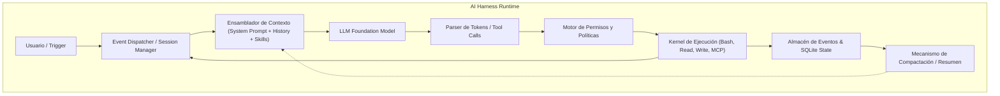

# 01. ¿Qué es un AI Harness? Anatomía y Capas de Ejecución

## 1. Introducción: El Cerebro vs. El Entorno Operativo

En el desarrollo de agentes basados en Modelos de Lenguaje Grande (LLMs), existe una distinción crítica que a menudo se pasa por alto:

$$\text{Capacidad Agéntica} = \text{Foundation Model (Cerebro)} \otimes \text{AI Harness (Arnés de Ejecución)}$$

Un **Foundation Model** (por ejemplo, Claude 3.7 / 4.5, GPT-5, DeepSeek-V4, Qwen3.6) es esencialmente un procesador de texto probabilístico sin estado (*stateless*). Recibe una secuencia de tokens y predice la distribución de probabilidad del siguiente token. Por sí solo, **no tiene memoria persistente, no puede ejecutar comandos en la terminal, no puede corregir sus propios errores en tiempo real ni puede interactuar de forma segura con el sistema de archivos**.

El **AI Harness (Arnés de IA)** es el sistema de software de ingeniería que envuelve, controla, retroalimenta y ejecuta al modelo dentro de un bucle cerrado (*closed-loop environment*).

---

## 2. Definición Formal de un Harness

Un **Harness** es la infraestructura runtime que:
1. **Mantiene y proyecta el estado**: Transforma el historial de eventos inmutables en una vista contextual optimizada para la ventana de contexto del LLM.
2. **Orquesta herramientas y capacidades**: Expone llamadas a funciones (APIs, herramientas de terminal, MCPs, skills) y valida sus esquemas y permisos.
3. **Controla el bucle de ejecución (Loop de Acción)**: Determina cuándo continuar el razonamiento, cuándo pausar para esperar una respuesta del usuario y cuándo detenerse.
4. **Gestiona la seguridad y los límites**: Aplica políticas de permisos, previene ejecuciones destructivas y acota el consumo de tokens y pasos máximos.
5. **Gestiona la recuperación de errores**: Detecta llamadas a herramientas fallidas, desbordamiento de contexto (*context overflow*) o bucles infinitos y aplica estrategias de compactación, reintento o desvío.

---

## 3. Componentes Fundamentales de un AI Harness Moderno

Cualquier arnés de producción (como **OpenCode**, **Claude Code**, **Codex**, **Hermes** o **Antigravity**) se estructura en cinco subsistemas críticos:

### A. Almacén de Estado e Historial Inmutable (*Event Sourcing*)
En lugar de guardar un array mutable de mensajes de chat, los arneses avanzados utilizan una arquitectura basada en eventos (*Event Sourcing*). Cada interacción (un mensaje del usuario, una respuesta de texto del asistente, una intención de llamada a herramienta, el resultado devuelto por la herramienta, un error del compilador) es un evento atómico inmutable indexado en una base de datos local (típicamente **SQLite**).

### B. Ensamblador de Contexto y Gestión de Ventana
Dado que las ventanas de contexto tienen límites físicos (y el costo en latencia/dólares crece de forma cuadrática o lineal con la longitud), el arnés decide dinámicamente:
- Qué mensajes previos se conservan íntegros.
- Qué salidas de herramientas se truncan (por ejemplo, si un `grep` devuelve 50.000 líneas, el arnés las guarda en un archivo de almacenamiento y solo inyecta las primeras 100 líneas con un puntero).
- Cuándo disparar un proceso de **compactación / resumen semántico**.

### C. Registro y Enrutamiento de Herramientas (*Tool Registry & MCP*)
El arnés actúa como puente entre la definición JSON-Schema que el LLM entiende y la ejecución nativa en el sistema operativo:
- **Herramientas nativas**: File read/write/edit, PTY/Bash execution, ripgrep, globbing.
- **Model Context Protocol (MCP)**: Conectores estandarizados cliente-servidor a bases de datos, APIs de terceros, navegadores headless, etc.
- **Skills**: Instrucciones y guías de procedimiento cargadas bajo demanda (*progressive disclosure*).

### D. Motor de Políticas y Permisos (*Permission & Safety Layer*)
Un agente autónomo no debe borrar accidentalmente el disco o filtrar credenciales. El arnés implementa un sistema de control de acceso:
- Permisos por granularidad: sólo lectura, lectura/escritura en subcarpetas específicas, o aprobación explícita requerida para comandos de shell riesgosos (`rm -rf`, `git push --force`, accesos a la red).

### E. Concurrencia y Sincronización Reactiva
El arnés gestiona la comunicación asíncrona: mientras una herramienta de larga duración corre en segundo plano (un build de compilación o un servidor de pruebas), el arnés no bloquea el hilo principal; escucha flujos de eventos (*event streams*) y reactiva al modelo cuando hay novedades.

---

## 4. Tabla Comparativa: LLM Aislado vs. LLM en Harness

| Dimensión | LLM Aislado (API directa / Chat Web) | LLM dentro de un AI Harness |
| :--- | :--- | :--- |
| **Persistencia** | Sesión volátil en memoria. Al reiniciar se pierde todo. | Persistencia durable en base de datos (SQLite/JSONL) con recuperación ante caídas. |
| **Interacción con el Sistema** | Nula (solo texto de salida). | Ejecución nativa de comandos, lectura/escritura de archivos y llamadas API. |
| **Manejo de Errores** | Si falla un comando, el usuario debe copiar y pegar el error manualmente. | El arnés captura el stderr, analiza el código de salida y retroalimenta al modelo automáticamente. |
| **Capacidad de Contexto** | Fija; al llegar al límite de tokens falla con error 400. | Compactación dinámica, descarte inteligente de payloads pesados y ventanas móviles. |
| **Autonomía** | Turno a turno (1 prompt = 1 respuesta). | Multi-paso autónomo (el modelo razona, actúa, evalúa resultados y continúa hasta completar la meta). |

---

## 5. El Techo del Harness Tradicional: La Necesidad de Evolución

Los arneses de primera generación (AOT - *Ahead of Time*) están codificados de forma estática: el programador del arnés definió un único loop (casi siempre ReAct) con un único prompt de sistema y un conjunto fijo de herramientas. 

Sin embargo, **una tarea de investigación profunda requiere una topología de ejecución completamente diferente a la de un refactor de código o una navegación web**. Este descubrimiento es el que ha dado origen a los **Harneses Just-In-Time (JIT)** y a sistemas de memoria estructurada como **WikiSkill**, temas que exploraremos en profundidad en los siguientes módulos.
