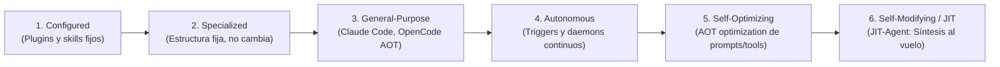

# 02. Taxonomías del Harness: ETCLOVG, Formal H=(E,T,C,S,L,V) y Madurez de Gerl

## 1. ¿Por qué se necesitan Taxonomías de Arneses?

Sin una taxonomía rigurosa, cada arnés de IA parece un desarrollo aislado e incomparable. Con taxonomías formales, es posible:
- Identificar patrones arquitectónicos reutilizables.
- Auditar qué capa del sistema es responsable de un fallo de ejecución.
- Diseñar arneses modulares donde cada componente sea reemplazable.

A continuación se presentan los **tres marcos taxonómicos de referencia (SOTA 2026)**:
1. **ETCLOVG** (*Picrew et al., TMLR 2026*): La taxonomía de 7 capas basada en el análisis de 170+ proyectos open-source.
2. **Marco Formal $H = (E, T, C, S, L, V)$** (*Meng et al., arXiv:2605.29682*): Semántica de sistemas de transición etiquetados.
3. **Escala de Madurez de Gerl (6 Categorías)** (*gerl.dev, 2026*): Clasificación según qué componentes pueden evolucionar después del despliegue.

---

## 2. Marco 1: ETCLOVG (7 Capas de Ingeniería) — *Picrew et al., TMLR 2026*

ETCLOVG divide el arnés en dos planos: **Plano de Ejecución** ($E, T, C, L$) y **Plano de Control y Confianza** ($O, V, G$).

```
┌──────────────────────────────────────────────────────────────┐
│  G  Governance  (permisos, políticas, hardening, HITL)       │  ◄── Control Plane
│  V  Verification (evals, validadores sintácticos, scoring)   │
│  O  Observability (trazas tipadas, costes, métricas)         │
├──────────────────────────────────────────────────────────────┤
│  L  Lifecycle / Orchestration (máquina de estados, loops)    │  ◄── Pilares
│  C  Context  (compaction, ventanas, retrieval, skills)       │      Estructurales
│  T  Tooling  (MCP, esquemas JSON, routing de tools)          │
│  E  Execution (sandbox, sistema de archivos, PTY terminal)   │
└──────────────────────────────────────────────────────────────┘
```

### Tabla Descriptiva de las 7 Capas

| Capa | Pregunta Arquitectónica | Implementación Típica | Vulnerabilidad o Fallo Común |
| :--- | :--- | :--- | :--- |
| **E — Execution** | ¿Dónde y cómo corre el código? | Sandboxes, PTY, Docker, Landlock, FS nativo | 15%–35% de escapes o corrupción sin aislamiento. |
| **T — Tooling** | ¿Cómo se descubren e invocan capacidades? | ToolRegistry, MCP servers, OpenAPI | Menú gigante (>20 tools) $\to$ Errores de selección. |
| **C — Context** | ¿Qué información ve el modelo y cuándo? | Context Epochs, Compaction, Lazy loading | Inyección plana masiva degrada la atención. |
| **L — Lifecycle** | ¿Cómo progresa el bucle de ejecución? | State Machine, Turn loops, Event dispatchers | Sin persistencia de estado no hay recuperación tras caídas. |
| **O — Observability** | ¿Qué métricas y trazas se auditan? | Event Sourcing, OpenTelemetry, JSONL | Depuración a ciegas si no hay eventos atómicos. |
| **V — Verification** | ¿Cómo sabemos si la solución es correcta? | Tests unitarios, Linters, LLM-as-Judge | Depender únicamente de jueces LLM da falsos positivos. |
| **G — Governance** | ¿Qué acciones están terminantemente prohibidas? | Políticas de permisos (Allow/Ask/Deny), HITL | Sin gobernanza hay riesgo de tool hijacking o borrado de datos. |

### Diagnóstico Rápido de Fallos usando ETCLOVG
Cuando un agente comete un error, el diagnóstico debe seguir este orden secuencial:
1. **$E$**: ¿El entorno de ejecución bloqueó un comando legítimo o permitió una acción destructiva?
2. **$T$**: ¿El modelo vio demasiadas herramientas irrelevantes en su catálogo?
3. **$C$**: ¿El contexto crítico fue truncado o compactado antes de tiempo?
4. **$L$**: ¿El bucle se detuvo prematuramente por límite de pasos?
5. **$O$**: ¿Existe una traza detallada en el almacén de eventos para reproducir el bug?
6. **$V$**: ¿La suite de pruebas detectó la regresión?
7. **$G$**: ¿Se requería confirmación humana para esta acción de riesgo?

---

## 3. Marco 2: Formal $H = (E, T, C, S, L, V)$ — *Meng et al., arXiv:2605.29682*

Define un arnés formalmente como una tupla de 6 operadores matemáticos que garantizan propiedades de **Seguridad (Safety - lo que nunca debe ocurrir)** y **Progreso (Liveness - la tarea eventualmente termina)**:

$$H = (E, T, C, S, L, V)$$

- **$E$ (Execution Loop)**: El motor formal de ciclo cerrado $\text{Observe} \to \text{Think} \to \text{Act} \to \text{Recover}$.
- **$T$ (Tool Registry)**: Mapeo de signaturas tipadas $\mathcal{U} \to \mathcal{O}$.
- **$C$ (Context Manager)**: Función de proyección de memoria $\mathcal{V} = C(\boldsymbol{\xi}_{<t})$.
- **$S$ (State Store)**: Almacén transaccional que asegura consistencia ante fallos (*Crash Recovery*).
- **$L$ (Lifecycle Hooks)**: Funciones de intercepción antes y después de cada llamada a herramienta.
- **$V$ (Evaluation Interface)**: Medición objetiva de recompensas y distancias a la meta.

---

## 4. Marco 3: Escala de Madurez de Gerl (6 Categorías)

Clasifica a los arneses según su **capacidad de adaptación y evolución posterior al despliegue**:



| Categoría | Nombre | Qué puede modificarse | Qué permanece rígido | Ejemplo Real |
| :--- | :--- | :--- | :--- | :--- |
| **1** | **Configured** | Archivos de configuración y plugins. | El bucle de ejecución y las políticas. | Plugins de trabajo de Anthropic. |
| **2** | **Specialized** | Nada (diseño cerrado para un nicho). | Todas las fases y herramientas. | Stripe Minions (1 tarea fija + 3M tests). |
| **3** | **General-Purpose** | Contexto y archivos del usuario. | El arnés base y el loop ReAct. | Claude Code, OpenCode v2 (AOT). |
| **4** | **Autonomous** | Eventos del entorno en segundo plano. | Taxonomía de triggers. | Daemons KAIROS, OpenClaw. |
| **5** | **Self-Optimizing** | Prompts y selección de herramientas (AOT). | La estructura del código del arnés. | DSPy, MemEvolve, EvoSkill. |
| **6** | **Self-Modifying / JIT** | **Todo el arnés se sintetiza al vuelo ($\mathbf{M},\mathbf{P},\mathbf{A},\mathbf{F}$)**. | Solo el protocolo meta $\boldsymbol{\Pi}$. | **JIT-Agent (arXiv:2608.25593)**. |
