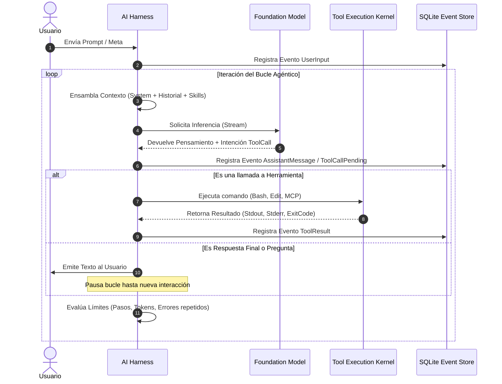
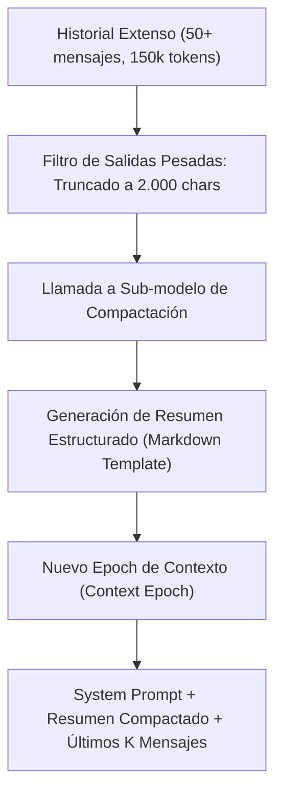

# 03. Ciclo de Vida, Estado y Compactación de Contexto

## 1. El Bucle de Ejecución del Harness (Execution Loop)

Un agente dentro de un arnés opera bajo un ciclo continuo de percepción, deliberación y acción. A diferencia de un simple chatbot que finaliza tras generar una respuesta, el arnés implementa un bucle iterativo que continúa hasta que se cumple una condición de parada.



---

## 2. Tipos de Estado en el Harness

Un arnés robusto mantiene dos niveles de estado claramente diferenciados:

1. **Estado Inmutable ($\boldsymbol{\xi}_{<t}$)**: El registro cronológico completo de todo lo ocurrido (mensajes de usuario, llamadas a herramientas exactas, salidas completas, errores y marcas de tiempo). Este registro nunca se borra ni se modifica; se almacena de forma persistente.
2. **Estado Proyectado / Mutable ($\mathbf{s}_t$)**: La vista reducida y sintetizada que se envía activamente al LLM en el turno actual $t$. Incluye:
   - Archivos abiertos y buffers de edición.
   - Lista de tareas pendientes (*Todo List* / *Plan de trabajo*).
   - Variables de entorno y directorio de trabajo activo ($CWD$).
   - Resumen estructurado de iteraciones pasadas.

---

## 3. El Problema del Desbordamiento de Contexto (*Context Overflow*)

A medida que un agente programa, compila, corre pruebas e inspecciona archivos de código, el tamaño del historial crece exponencialmente:
- Un solo `git diff` o salida de prueba unitaria puede contener decenas de miles de caracteres.
- Al cabo de 10–15 iteraciones, la ventana de contexto del LLM (por ejemplo, 128k o 200k tokens) se llena.
- **Consecuencias de no gestionar el contexto**:
  - *Context Rot / Degradation*: El modelo empieza a "olvidar" las instrucciones iniciales o comete errores de atención.
  - *Cost Spikes*: El coste por turno se vuelve prohibitivo porque se reenvían 150k tokens en cada pequeña llamada.
  - *Hard Failure*: La API del proveedor rechaza la petición con un error HTTP 400 (`context_length_exceeded`).

---

## 4. Técnicas de Compactación en Harneses de Producción

Para resolver esto, los arneses de élite (incluyendo la arquitectura de **OpenCode** y **Claude Code**) utilizan una técnica llamada **Context Compaction (Compactación de Contexto)**.

### Estrategia de Epochs y Resumen Estructurado

Cuando el número de tokens acumulados supera un umbral de seguridad (por ejemplo, `MaxTokens - Buffer`), el arnés ejecuta un paso de compactación:



### Plantilla Canónica de Compactación
El sub-modelo no genera un resumen en prosa libre (que perdería datos críticos), sino que llena una plantilla estructurada estricta:

```markdown
## Objective
- [Una o dos frases concisas describiendo la meta exacta del usuario]

## Important Details
- [Restricciones, decisiones de diseño tomadas y por qué, dependencias técnicas]

## Work State
### Completed
- [Tareas terminadas, archivos ya creados o modificados con rutas exactas]
### Active
- [Tarea actual en desarrollo e investigación en curso]
### Blocked
- [Errores pendientes, comandos fallidos o bloqueos]

## Next Move
1. [Siguiente acción inmediata y concreta]
2. [Paso subsiguiente planeado]

## Relevant Files
- [ruta/al/archivo.ts: qué contiene y por qué importa]
```

### Reglas Críticas de la Compactación
1. **Preservar identificadores literales**: Nombres de variables, rutas absolutas de archivos, códigos de error y firmas de funciones jamás deben parafrasearse.
2. **Buffer de mensajes recientes**: Se preservan intactos los últimos $N$ mensajes (típicamente los últimos 3 a 5 turnos) para mantener la fluidez conversacional inmediata.
3. **Persistencia del histórico completo**: La base de datos local conserva los eventos originales para auditoría o des-compactación (*revert / rollback*).

---

## 5. Prevención de Bucles Infinitos y Throttling

Un peligro común en agentes autónomos es el bucle de reintento ciego (por ejemplo, un agente intentando editar un archivo con un patrón inexistente 10 veces seguidas).

El arnés implementa defensas a nivel de kernel:
- **Detección de llamadas idénticas consecutivas**: Si una herramienta se invoca con los mismos parámetros exactos y falla dos veces, el arnés intercepta la ejecución e inyecta una advertencia de sistema: *"Has ejecutado esta acción sin cambios y ha fallado repetidamente. Detente, reflexiona y prueba una estrategia alternativa."*
- **Límite de pasos por turno (*Max Steps Guard*)**: Un tope configurable (por ejemplo, 25 pasos) tras el cual el arnés fuerza una pausa y solicita confirmación o feedback al usuario.
