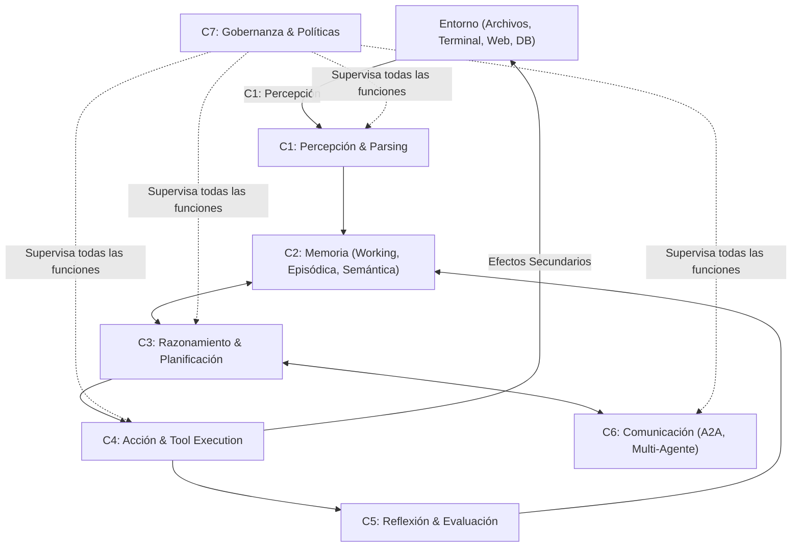

# 01. Anatomía del Agente Cognitivo: Las 7 Funciones ($C_1 - C_7$)

## 1. El Agente como Sistema Cognitivo

Un agente de IA no es simplemente un script que llama a una API; es una **arquitectura cognitiva computacional** que emula las capacidades de percepción, memoria, deliberación, acción y aprendizaje de un agente inteligente.

De acuerdo con la literatura moderna (*arXiv:2605.13850*), cualquier agente autónomo puede descomponerse en **7 funciones cognitivas fundamentales ($C_1$ a $C_7$)**:

---

## 2. Las 7 Funciones Cognitivas en Detalle

### $C_1$: Percepción y Procesamiento Sensorial (*Perception*)
- **Responsabilidad**: Ingerir, normalizar y transformar las señales del entorno en representaciones comprensibles para el modelo.
- **Entradas**: Textos del usuario, salidas de consola (`stdout`/`stderr`), volcados de red, imágenes de UI, contenido de archivos y respuestas HTTP.
- **Mecanismos**: Filtrado de ruido ANSI, truncado inteligente de payloads gigantescos y tokenización estructurada.

### $C_2$: Gestión de Memoria (*Memory System*)
Un agente avanzado implementa una jerarquía de memoria triple:
1. **Memoria de Trabajo (*Working Memory*)**: La ventana de contexto activa inmediata (turnos recientes y variables en scope).
2. **Memoria Episódica (*Episodic Memory*)**: Registro histórico de acciones previas, intentos fallidos y reflexiones pasadas dentro de la sesión.
3. **Memoria Semántica / Procedimental (*Semantic & Skill Memory*)**: Conocimiento cristalizado en skills (`SKILL.md`), manuales de arquitectura y wikis persistentes que trascienden las sesiones individuales.

### $C_3$: Razonamiento y Planificación (*Reasoning & Planning*)
- **Responsabilidad**: Traducir un objetivo de alto nivel en un grafo ejecutable de intenciones y submetas.
- **Estrategias**: Árboles de decisión (MCTS), descomposición paso a paso (Chain-of-Thought), planificación en grafo (DAG) o deliberación reflexiva.

### $C_4$: Acción y Ejecución de Herramientas (*Action & Tooling*)
- **Responsabilidad**: Transformar intenciones simbólicas en llamadas a funciones con efectos deterministas en el mundo exterior.
- **Componentes**: Invocación de herramientas de shell, operaciones de sistema de archivos, llamadas a endpoints MCP y compilación de código.

### $C_5$: Reflexión y Auto-Corrección (*Reflection & Meta-Cognition*)
- **Responsabilidad**: Inspeccionar los resultados de $C_4$, comparar el estado actual con el objetivo deseado, identificar discrepancias y extraer lecciones de error antes de continuar.
- **Mecanismos**: Ejecución de suites de pruebas automáticas, linters estáticos y auto-crítica verbal (*Reflexion loop*).

### $C_6$: Comunicación e Interacción (*Communication & A2A Protocol*)
- **Responsabilidad**: Coordinar el intercambio de información con el usuario humano y con otros agentes de la red.
- **Protocolos**: Formato de mensajes agente-a-agente (A2A), contratos de delegación a subagentes y generación de interfaces interactivas para el usuario.

### $C_7$: Gobernanza y Políticas de Seguridad (*Governance & Alignment*)
- **Responsabilidad**: Garantizar que el agente opere dentro de los límites éticos, legales y operacionales permitidos.
- **Mecanismos**: Listas de control de acceso a comandos (Allow/Ask/Deny), presupuestos máximos de gasto de tokens y barreras *Human-in-the-Loop* (HITL).

---

## 3. Matriz de Cobertura Cognitiva por Tipo de Arquitectura

| Arquitectura | $C_1$ Percepción | $C_2$ Memoria | $C_3$ Razonamiento | $C_4$ Acción | $C_5$ Reflexión | $C_6$ Comunicación | $C_7$ Gobernanza |
| :--- | :--- | :--- | :--- | :--- | :--- | :--- | :--- |
| **Chatbot Básico** | Básica | Nula | Directo | Nula | Nula | Usuario único | Nivel prompt |
| **ReAct Vanilla** | Básica | Lineal | Reactivo | Simple | Reactiva | Usuario único | Débil |
| **OpenCode v2 (AOT)** | Avanzada | Compactada | Todo-list | Completa | Basada en tests | Subagentes | Políticas allow/ask/deny |
| **JIT-Harness + WikiSkill** | **Adaptativa** | **3 Capas (Wiki)** | **Dinámica (DAG/JIT)**| **Scoped ($\mathbf{F}$)** | **Evolutiva (Evo-GDPO)**| **Multi-Topología** | **Gating formal** |
