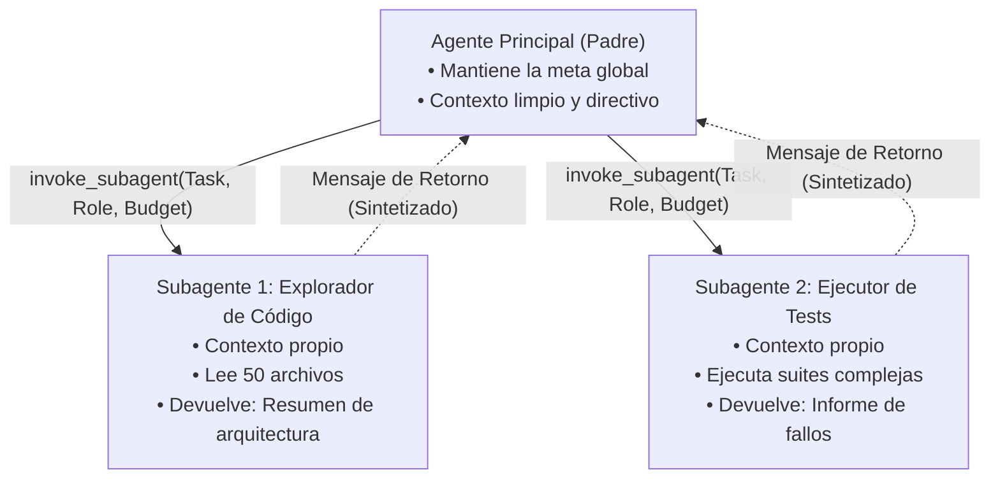
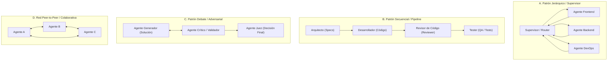
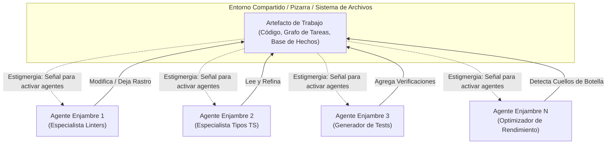
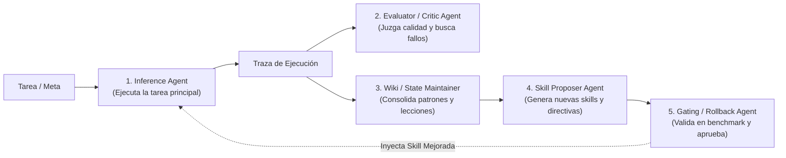

# 02. Tipología y Métodos de Razonamiento en Agentes Individuales

## 1. Clasificación Fundamental: Reactivos vs. Deliberativos vs. Híbridos

Los agentes individuales se clasifican según el grado de deliberación y memoria interna que aplican antes de interactuar con el entorno:

```mermaid
graph TD
    subgraph "1. Agente Reactivo Simple"
        Per1["Percepción"] --> Rules["Reglas Condición-Acción (If-This-Then-That)"]
        Rules --> Act1["Acción Inmediata (Sin memoria)"]
    end

    subgraph "2. Agente Deliberativo (BDI)"
        Per2["Percepción"] --> Beliefs["Beliefs (Creencias / Estado del Mundo)"]
        Beliefs --> Desires["Desires (Metas y Objetivos)"]
        Desires --> Intentions["Intentions (Planes Comprometidos)"]
        Intentions --> Act2["Acción Secuencial"]
    end

    subgraph "3. Agente Híbrido Moderno (LLM-based)"
        Per3["Percepción"] --> FastReAct["Capa Reactiva Rápida (Tools locales)"]
        Per3 --> SlowPlan["Capa Deliberativa Profunda (LATS / DAG Planner)"]
        SlowPlan -. Supervisa .-> FastReAct
    end
```

---

## 2. Los 7 Tipos de Agentes Individuales en la Práctica

| Tipo de Agente | Mecanismo de Control | Ventajas | Limitaciones |
| :--- | :--- | :--- | :--- |
| **1. Reactivo Puro** | Turno a turno sin plan previo. | Ultrarrápido, mínima latencia. | Incapaz de tareas de más de 3 pasos. |
| **2. BDI (Belief-Desire-Intention)** | Mantiene creencias sobre el código y deseos (metas). | Coherencia en tareas de largo plazo. | Coste de cómputo para actualizar creencias. |
| **3. ReAct (Reason + Act)** | Intercala pensamiento verbal y llamada a herramienta. | Estándar de la industria, interactivo. | Visión de corto plazo (miopía). |
| **4. Plan-and-Solve** | Planifica la lista completa de subtareas antes de ejecutar. | Estructurado, evita divagaciones. | Rígido si una premisa inicial falla. |
| **5. Reflexion Agent** | Ciclo con memoria verbal de errores pasados. | Aprende durante la sesión sin reentrenar. | Alto consumo de tokens por reintentos. |
| **6. Tree-Search (LATS / MCTS)**| Explora múltiples ramas y hace backtracking. | Máxima tasa de éxito en problemas duros. | Exponencial en tiempo y tokens. |
| **7. Code-as-an-Agent / Coding Agent** | Opera directamente mediante diffs, LSP y compiladores. | Especializado en ingeniería de software. | Requiere un arnés con terminal real. |

---

## 3. Desglose de los Métodos de Razonamiento SOTA

### A. ReAct (Reasoning + Acting) — *Yao et al., 2022*
$$\text{Input} \to \text{Thought}_1 \to \text{Action}_1 \to \text{Observation}_1 \to \dots \to \text{Thought}_k \to \text{Finish}(\text{Answer})$$
El agente razona en lenguaje natural sobre la observación recibida antes de emitir la siguiente acción.

### B. Reflexion (Refuerzo Verbal sin Gradientes) — *Shinn et al., 2023*
Cuando una ejecución falla (ej. los tests de Jest fallan):
1. Un componente evaluador analiza el *stderr*.
2. El agente reflexiona: *"El error TypeError ocurrió porque pasé un objeto en lugar de un string en `auth.ts`"*.
3. Esa reflexión se inyecta en la memoria del siguiente intento, corrigiendo el código de inmediato.

### C. LATS (Language Agent Tree Search) — *Zhou et al., 2023*
Combina el razonamiento del LLM con búsqueda en árbol Monte Carlo:
- Genera $K$ alternativas en cada bifurcación.
- Simula los pasos futuros con una función de valor heurística.
- Aplica poda y *backtracking* si un camino conduce a una falla irrecuperable.

---

# 02. Subagentes y Delegación Acotada

## 1. ¿Qué es un Subagente?

Un **Subagente** es una instancia secundaria e independiente de un agente, creada por un agente principal (padre) para resolver una subtarea específica y acotada, que se ejecuta en su propio contexto aislado y devuelve un resultado sintetizado al padre.

---

## 2. ¿Por qué no usar un único agente para todo? (El Problema de la Contaminación de Contexto)

Si un agente individual realiza una búsqueda exhaustiva que lee 30 archivos grandes, el historial se inunda con miles de líneas de código fuente no esenciales:
1. **Pérdida de foco (*Attention Drift*)**: El modelo se distrae con detalles irrelevantes y pierde el hilo de la solicitud original.
2. **Desperdicio de Tokens y Coste**: En cada paso posterior, se reenvían al LLM las 30 lecturas de archivos.
3. **Imposibilidad de Paralelismo**: Un solo hilo debe leer secuencialmente archivo por archivo.

**Solución con Subagentes**: El subagente procesa los 30 archivos en su contexto desechable (*ephemeral context*), extrae los 3 puntos clave y se los entrega al padre en un solo párrafo. Al finalizar, el contexto masivo del subagente se destruye, manteniendo el contexto del padre ultra-limpio y enfocado.

---

## 3. Dimensiones de Diseño de los Subagentes

Al invocar o diseñar subagentes, un arnés avanzado parametriza cuatro aspectos fundamentales:

### A. Aislamiento de Contexto (*Context Isolation*)
- **Contexto Heredado (*Inherit*)**: El subagente recibe un extracto del historial del padre.
- **Contexto Limpio (*Clean Slate*)**: El subagente solo recibe el prompt de la tarea específica. Esto maximiza la neutralidad y evita sesgos.

### B. Herencia y Filtrado de Herramientas (*Tool Scoping*)
No todos los subagentes necesitan acceso a la terminal completa:
- **Subagente de Investigación (*Research Subagent*)**: Equipado únicamente con `grep_search`, `view_file`, `web_search` y `read_url`. No tiene permisos de escritura ni ejecución de comandos de shell destructivos.
- **Subagente de Edición (*Write Subagent*)**: Equipado con `replace_file_content` y `write_to_file`.

### C. Modo de Workspace (*Filesystem Isolation*)
- **`inherit`**: Comparte el mismo directorio de trabajo que el padre.
- **`branch` / `share`**: Se crea una rama o *worktree* aislado de Git para el subagente. El subagente puede experimentar, romper el código y ejecutar pruebas. Si tiene éxito, se hace merge; si falla, se descarta la rama sin alterar el código del usuario.

### D. Presupuesto de Pasos y Tokens (*Bounded Budget*)
Para evitar subagentes descontrolados que consuman recursos infinitos:
- Se asigna un límite estricto (ej. máximo 8 pasos o 15.000 tokens). Si el subagente no concluye en ese rango, el arnés fuerza el retorno con el estado parcial alcanzado.

---

## 4. Modelos de Comunicación con Subagentes

1. **Sincrónico / Bloqueante**: El padre se pausa por completo hasta que el subagente finaliza y retorna la respuesta.
2. **Asincrónico / Reactivo (Wakeup Notification)**: El padre lanza 3 subagentes concurrentes y continúa trabajando o se suspende. El arnés reactiva al padre automáticamente mediante mensajes de eventos a medida que cada subagente completa su labor (*Event-driven wakeup*).

---

# 03. Multiagentes y Patrones de Orquestación

## 1. ¿Qué es un Sistema Multiagente (MAS)?

Un **Sistema Multiagente (Multi-Agent System)** es una red colaborativa de agentes autónomos especializados que interactúan entre sí mediante protocolos definidos para resolver problemas que exceden la capacidad, memoria o perspectiva de un solo agente.

A diferencia de la relación padre-hijo simple (subagentes), en un sistema multiagente existen roles diferenciados, dinámicas de comunicación complejas y patrones topológicos de flujo de trabajo.

---

## 2. Topologías de Orquestación Multiagente

---

## 3. Análisis Detallado de los Patrones

### A. Supervisor / Router Jerárquico
- **Funcionamiento**: Un agente central actúa como director de orquesta. Recibe la petición del usuario, evalúa qué agente especializado es el más idóneo y le transfiere el control. Cuando el especialista responde, el supervisor decide el siguiente paso o entrega el resultado final.
- **Frameworks de referencia**: LangGraph Supervisor, AutoGen GroupChat Manager, CrewAI Hierarchical Process.
- **Cuándo usarlo**: Tareas multifacéticas con fronteras de dominio claras (ej. una consulta que requiere consultar base de datos SQL + redactar un correo + generar un gráfico).

### B. Pipeline Secuencial por Etapas
- **Funcionamiento**: La salida estructurada del Agente $A$ se convierte en la entrada del Agente $B$. Cada agente refina, transforma o valida el artefacto.
- **Ejemplo en Desarrollo de Software**:
  1. `SpecWriter`: Analiza el requerimiento y genera `requirements.json`.
  2. `Coder`: Lee `requirements.json` y escribe el código fuente.
  3. `SecurityAuditor`: Analiza el código buscando vulnerabilidades (SQLi, XSS).
  4. `TestEngineer`: Escribe y ejecuta la suite de pruebas unitarias.
- **Cuándo usarlo**: Procesos de negocio formales y flujos de integración continua.

### C. Debate Adversarial y Co-Refinamiento
- **Funcionamiento**: Dos agentes con objetivos o perspectivas contrapuestas debaten sobre una propuesta para eliminar alucinaciones y sesgos.
  - *Agente Propositor*: Propone una hipótesis o diseño de solución.
  - *Agente Escéptico / Red Team*: Busca activamente fallos lógicos, contraejemplos, casos límite (*edge cases*) y vulnerabilidades.
  - *Agente Juez / Árbitro*: Evalúa los argumentos y determina el consenso.
- **Ventaja comprobada**: Reduce la tasa de alucinaciones en tareas de razonamiento crítico en más de un 40%.

### D. Red Peer-to-Peer / Red de Colaboración
- **Funcionamiento**: Los agentes comparten un espacio de trabajo o canal de mensajería común sin una jerarquía rígida. Cualquier agente puede publicar una consulta o responder a la solicitud de otro cuando detecta que posee las herramientas o el conocimiento necesario.

---

## 4. Retos y Desafíos de los Sistemas Multiagente

1. **Tormentas de Mensajes (*Message Storms*)**: Si los protocolos de parada no son estrictos, los agentes pueden entrar en bucles infinitos de felicitaciones o correcciones triviales (*"Gracias", "De nada", "¿Hay algo más?"*).
2. **Multiplicación de Coste**: Cada mensaje cruzado consume tokens en todos los agentes participantes.
3. **Pérdida de Información en la Transferencia**: Resumir en exceso entre etapas de un pipeline puede omitir restricciones técnicas sutiles.

---

# 05. Enjambres de Agentes (Agent Swarms), Estigmergia y Coordinación Descentralizada

## 1. ¿Qué es un Enjambre de Agentes (Agent Swarm)?

Un **Enjambre de Agentes (Agent Swarm)** es una arquitectura de inteligencia colectiva inspirada en los sistemas biológicos (hormigas, abejas, bandadas de aves), donde un gran número de agentes individuales, relativamente simples y autónomos, interactúan entre sí y con su entorno común para que surja una **resolución global compleja (comportamiento emergente)** sin necesidad de un controlador central omnisciente.

---

## 2. Los 6 Paradigmas de Coordinación en Enjambres

### 1. Estigmergia (*Stigmergy*)
- **Concepto**: Coordinación indirecta mediante modificaciones físicas en el entorno compartido (pistas de feromonas en hormigas, marcas en el sistema de archivos en agentes).
- **En Ingeniería de Software**: Un agente no le envía un mensaje a otro; deja un archivo `.todo`, un test fallando en rojo o un marcador de tipo `// @needs-refactor`. Otro agente escanea el entorno, detecta la señal y ejecuta su trabajo de forma natural.

### 2. Protocolo de Mercado y Red de Contratos (*Contract Net Protocol - CNP*)
- **Flujo de 4 Fases**:
  1. **Anuncio de Tarea (*Task Announcement*)**: Un agente descompone un trabajo y publica una licitación en el bus de eventos.
  2. **Oferta (*Bidding*)**: Agentes libres calculan su idoneidad, latencia estimada y coste en tokens, enviando su oferta (*Bid*).
  3. **Adjudicación (*Awarding*)**: El emisor asigna la tarea a la mejor oferta.
  4. **Ejecución y Entrega (*Execution*)**: El ganador devuelve el resultado y cobra su recompensa.

### 3. Protocolo de Chisme (*Gossip Protocol*)
- Comunicación epidémica descentralizada: Cada agente comparte descubrimientos de forma periódica con un subconjunto aleatorio de vecinos ($k$ pares).
- En $O(\log N)$ pasos, el conocimiento se disemina por todo el enjambre de forma tolerante a desconexiones de nodos.

### 4. Modelo de Actores (*Actor Model*)
- Cada agente es un actor independiente con su propio buzón de mensajes inmutable (*mailbox*).
- Los agentes procesan mensajes de forma secuencial y no comparten memoria mutable directa, eliminando condiciones de carrera (*race conditions*).

### 5. Consenso por Quórum (*Quorum-based Consensus*)
- Para decisiones irreversibles (ej. desplegar a producción o borrar una base de datos), el enjambre somete la propuesta a votación. La acción solo se ejecuta si se alcanza una mayoría calificada (ej. 70% de votos positivos).

### 6. Handoffs Ligeros (*Swarm Handoffs*)
- Un agente transfiere el control devolviendo una función de cambio de contexto en lugar de retornar al supervisor, permitiendo una navegación fluida por árboles de decisión.

---

## 3. Comparativa: Mixture-of-Agents (MoA) vs. Enjambre (Swarm)

| Dimensión | Mixture-of-Agents (MoA) | Enjambre de Agentes (Swarm) |
| :--- | :--- | :--- |
| **Topología** | Capas feed-forward sincronizadas ($L_1 \to L_2 \to L_3$). | Descentralizada, dinámica, asíncrona. |
| **Coordinación** | Centralizada por un agregador de capas. | Estigmérgica (mediada por el entorno) o P2P. |
| **Tolerancia a Fallos** | Si una capa falla, el pipeline se bloquea. | Alta resiliencia; si un agente cae, otros toman la tarea. |
| **Escalabilidad** | Limitada por el tamaño de la capa. | Masiva (decenas o cientos de agentes concurrentes). |
| **Ideal Para** | Síntesis y consenso en respuestas de texto ricas. | Refactorización masiva, auditoría distribuida y fuzzing. |

---

# 05. Roles y Perfiles Funcionales de Agentes

## 1. Especialización por Rol en Arquitecturas Agénticas

En lugar de crear agentes genéricos tipo "Asistente de IA", los sistemas modernos de agentes asignan **roles funcionales formales** con contratos de entrada/salida estrictos.

Esta especialización reduce la confusión del modelo, mejora la precisión y optimiza los costes, permitiendo usar modelos más pequeños y rápidos para roles mecánicos y modelos de frontera solo para decisiones de alto nivel.

---

## 2. Los 7 Roles Funcionales Clave

### 1. Inference Agent (Agente de Inferencia / Ejecución)
- **Función**: Es el agente de primera línea que interactúa con la tarea del usuario, escribe código y ejecuta herramientas.
- **Objetivo**: Máxima efectividad en resolver el problema inmediato con la menor sobrecarga de contexto posible.
- **Herramientas típicas**: Bash, Edit, View, WebSearch.

### 2. Evaluator / Critic Agent (Agente Crítico / Auditor)
- **Función**: Evalúa objetivamente el resultado producido por el Inference Agent. No genera la solución; busca defectos, alucinaciones, fallos de seguridad o regresiones de rendimiento.
- **Mecanismo**: Utiliza rúbricas de evaluación, ejecución de linters, cobertura de tests y análisis estático.

### 3. State & Wiki Maintainer Agent (Agente de Mantenimiento de Conocimiento)
- **Función**: Analiza las trazas de ejecución pasadas, extrae lecciones aprendidas, detecta patrones recurrentes de error y actualiza la base de conocimiento estructurada (*Wiki* o memoria semántica).
- **Rol clave en WikiSkill**: Evita que las lecciones queden dispersas en historiales efímeros.

### 4. Skill Proposer Agent (Agente Propositor de Skills)
- **Función**: Lee los patrones consolidados por el Maintainer y sintetiza nuevas **Skills** (archivos `SKILL.md` o scripts auxiliares) que formalizan procedimientos óptimos para tareas futuras.

### 5. Gating & Rollback Agent (Agente de Control de Calidad y Reversión)
- **Función**: Actúa como barrera de seguridad antes de aceptar una nueva skill o modificación de arnés.
- **Mecanismo**: Ejecuta un conjunto de pruebas de regresión (*validation suite*). Si la nueva skill mejora el éxito sin degradar la latencia, la aprueba; si causa errores o degradación, ejecuta un *rollback* inmediato al estado anterior.

### 6. Meta-Agent / Harness Synthesizer (Meta-Agente de Arneses)
- **Función**: Es el núcleo del concepto **JIT-Agent**. No resuelve la tarea del usuario directamente; diseña, ensambla, repara y evoluciona el **arnés operativo** que usará el Inference Agent para esa tarea específica.

### 7. Tool-Synthesizer / Code Interpreter Agent (Agente Sintetizador de Herramientas)
- **Función**: Cuando el agente no cuenta con una herramienta adecuada para resolver un cálculo o transformación de datos, este agente escribe un script en Python/Bash al vuelo, lo ejecuta en un entorno sandbox seguro y devuelve el resultado procesado (*Code-as-a-Tool*).
