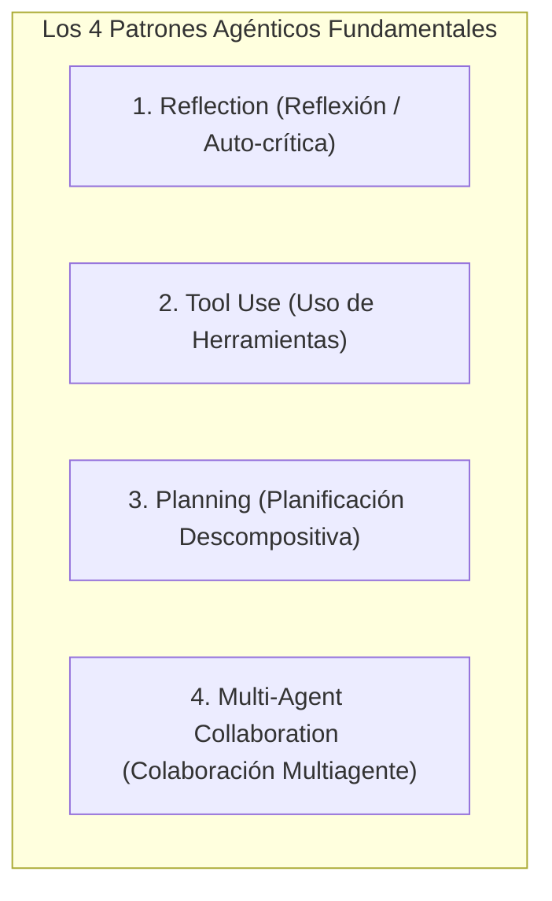

# 01. Los Cuatro Patrones de Diseño Agéntico de Andrew Ng

## 1. La Visión de Andrew Ng sobre los Flujos Agénticos

Andrew Ng (pionero de la IA, fundador de DeepLearning.AI y Coursera) ha demostrado que el paso de **prompts lineales de un solo paso (Zero-shot)** a **flujos de trabajo agénticos iterativos** produce saltos de rendimiento drásticos en modelos de lenguaje existentes, a menudo permitiendo que un modelo más antiguo o ligero supere a modelos de frontera más grandes en tareas complejas.

> *"La capacidad de un sistema no está limitada únicamente por los parámetros del modelo, sino por cómo estructuramos el proceso iterativo de razonamiento, acción y corrección."* — Andrew Ng

---

## 2. Los Cuatro Patrones Explicados en Profundidad

### 1. Reflection (Reflexión / Auto-corrección)
- **Concepto**: En lugar de aceptar la primera respuesta generada por el LLM, el sistema fuerza un ciclo donde el modelo (u otro agente crítico) inspecciona su propia salida, evalúa posibles errores, inconsistencias o falta de estilo, y reescribe la solución basándose en esa crítica.
- **Flujo de Trabajo**:
  1. Generar borrador de código / texto.
  2. Evaluar: *"Revisa este código. ¿Hay fugas de memoria? ¿Se manejan todos los casos de error? ¿Cumple la guía de estilo?"*
  3. Refinar: El modelo genera una versión mejorada $V_2$ incorporando el feedback.
- **Impacto**: Aumenta significativamente la calidad del código y reduce alucinaciones en un 30%–50% sin requerir re-entrenamiento.

---

### 2. Tool Use (Uso de Herramientas Externas)
- **Concepto**: Extiende las capacidades del LLM permitiéndole invocar funciones externas para interactuar con el mundo real, obtener datos actualizados o realizar operaciones deterministas.
- **Tipos de Herramientas**:
  - **Búsqueda e Información**: Web search, consultas a bases de datos SQL/Vectoriales, lectura de APIs REST.
  - **Cómputo y Ejecución**: Intérpretes de Python, shells de Bash, compiladores de código, calculadoras simbólicas.
  - **Interacción con el Entorno**: Editores de archivos, emuladores de navegador (Playwright/Puppeteer), conectores MCP.
- **Impacto**: Elimina la limitación de la fecha de corte del conocimiento (*knowledge cutoff*) y los errores en operaciones aritméticas o de lógica formal.

---

### 3. Planning (Planificación y Descomposición)
- **Concepto**: Ante un objetivo amplio y ambiguo, el agente no salta inmediatamente a la ejecución. Primero descompone la meta en una secuencia de pasos lógicos e independientes (*sub-goals*).
- **Mecanismos Clave**:
  - **Descomposición Jerárquica**: Desglosar una tarea de 10 horas en 15 subtareas de 5 minutos.
  - **Re-planificación Dinámica**: Si durante el paso 3 se descubre que una librería está obsoleta, el agente actualiza los pasos 4 a 15 para adaptarse al nuevo contexto en lugar de seguir ciegamente el plan inicial obsoleto.
- **Impacto**: Permite la resolución de tareas de largo horizonte (*long-horizon tasks*) que antes provocaban que el modelo se perdiera en el camino.

---

### 4. Multi-Agent Collaboration (Colaboración Multiagente)
- **Concepto**: Dividir una tarea compleja entre varios agentes con roles, personalidades, prompts de sistema y conjuntos de herramientas diferenciados.
- **Dinámica**:
  - Un agente asume el rol de *Product Manager*, otro de *Senior Backend Developer*, otro de *Security QA* y otro de *Technical Writer*.
  - Los agentes debaten, se solicitan clarificaciones y se revisan el trabajo mutuamente.
- **Impacto**: La especialización de roles supera a los prompts monolíticos masivos ("sé un experto en todo"), reduciendo la interferencia de contexto y aumentando la robustez global.

---

## 3. Matriz de Combinación de Patrones

En sistemas agénticos avanzados, estos cuatro patrones no se usan de forma aislada, sino combinados sinérgicamente:

| Patrón Primario | Combinado con | Resultado Emergente |
| :--- | :--- | :--- |
| **Planning** | **Tool Use** | El agente crea un plan y utiliza herramientas de búsqueda para validar la viabilidad de cada paso antes de ejecutarlo. |
| **Reflection** | **Multi-Agent** | Un agente especializado en QA audita y critica el código producido por el agente desarrollador en un bucle cerrado. |
| **Tool Use** | **Reflection** | El agente ejecuta pruebas unitarias con su herramienta de Bash y utiliza el *stderr* como señal para auto-reflexionar y corregir el bug. |
| **Los 4 Juntos** | **JIT Harness** | La máxima expresión de autonomía: planificación descompuesta, herramientas asignadas dinámicamente, roles especializados y auto-corrección continua con memoria persistente. |
