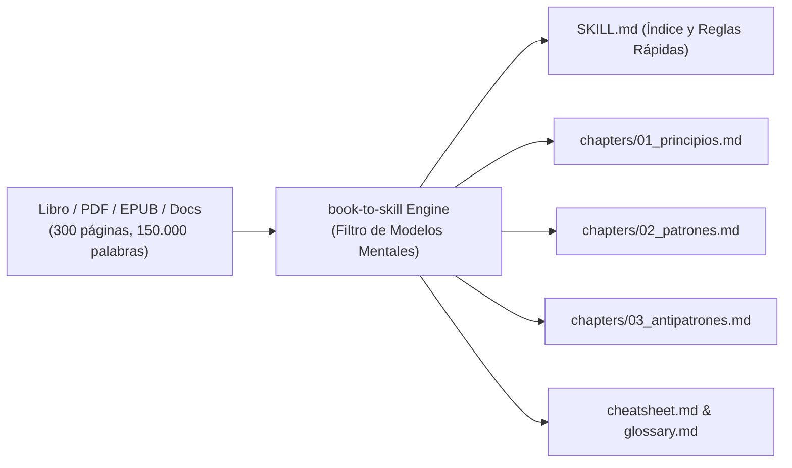
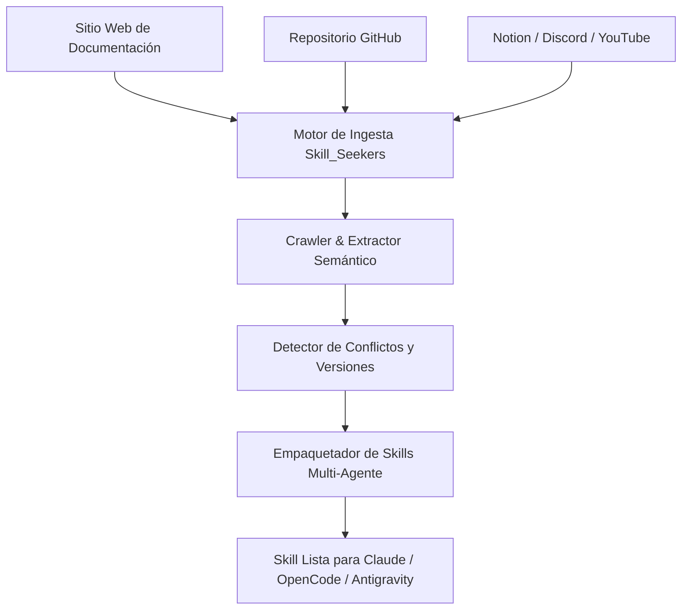

# 01. Conversión de Libros en Skills: `book-to-skill` (virgiliojr94)

## 1. Filosofía: "Extraer Estructura, no Resúmenes"

La mayoría de herramientas tradicionales de ingesta de documentos intentan "resumir" un libro o meterlo todo en una base de datos vectorial (RAG básico). Esto fracasa en agentes de codificación porque:
- Los resúmenes eliminan los nombres exactos de los métodos, las heurísticas precisas y los casos límite.
- El RAG estándar recupera fragmentos aislados sin la estructura del modelo mental del autor.

La herramienta **`book-to-skill`** (creada por `virgiliojr94`, con más de 22k estrellas) propone un paradigma radical:
> **"Un libro técnico no es un informe; es un conjunto de herramientas cristalizadas: modelos mentales, principios de decisión, técnicas paso a paso y anti-patrones."**



---

## 2. Los 5 Elementos Estructurales que Extrae

Cuando `book-to-skill` procesa un libro técnico (por ejemplo, *Clean Code*, *Designing Data-Intensive Applications*, *Refactoring* o *Domain-Driven Design*), descompone el texto en 5 categorías obligatorias:

1. **Named Frameworks (Marcos de Trabajo con Nombre Propio)**:
   - Preserva la formulación exacta del autor (ej. *"The 5 Whys"*, *"Outbox Pattern"*, *"SAGA Choreography"*).
2. **Actionable Principles (Principios Accionables)**:
   - Reglas claras que guían decisiones de diseño (ej. *"Prefiere composición sobre herencia"*, *"Optimiza para lectura, no para escritura"*).
3. **Step-by-Step Techniques (Técnicas Paso a Paso)**:
   - Algoritmos de trabajo y recetas prácticas de refactorización o diseño.
4. **Anti-patterns (Anti-patrones y Errores Comunes)**:
   - Qué NO hacer, por qué falla y cómo remediarlo cuando se detecta.
5. **Voice Calibration (Calibración de la Perspectiva)**:
   - Cómo piensa el autor ante dilemas de compromiso (*trade-offs*).

---

## 3. Arquitectura de Divulgación Progresiva (*Progressive Disclosure / Lazy Loading*)

Uno de los mayores problemas de inyectar conocimiento a un agente es el **desperdicio de tokens**.

`book-to-skill` implementa una arquitectura en capas:
- **Nivel 1 (`SKILL.md`)**: Contiene únicamente el frontmatter YAML (`name`, `description`), los principios directrices y un índice de referencias. Pesa menos de 2.000 tokens. El agente lee este archivo al activarse la skill.
- **Nivel 2 (`chapters/*.md`)**: Archivos detallados por capítulo y tema guardados en el disco.
- **Carga Bajo Demanda (*Lazy Loading*)**: El agente **solo lee el archivo del capítulo cuando la tarea específica lo requiere**, evitando inundar el contexto en tareas irrelevantes.

---

## 4. Instalación e Integración

### Clonación y Configuración
```bash
# Para Claude Code / Agentes globales
git clone https://github.com/virgiliojr94/book-to-skill.git ~/.claude/skills/book-to-skill

# Para Copilot / Cross-agent CLI
git clone https://github.com/virgiliojr94/book-to-skill.git ~/.agents/skills/book-to-skill
```

### Modos de Ejecución
1. **Conversión Completa**:
   ```bash
   /book-to-skill /ruta/a/tu-libro.pdf [nombre-del-skill]
   ```
2. **Modo Análisis Previo (*Analyze Only*)**:
   - Extrae el inventario de principios y modelos mentales para revisión humana sin generar los archivos finales.
3. **Modo Actualización / Fusión (*Update/Fold-in*)**:
   - Incorpora nuevos capítulos o artículos a una skill existente sin sobreescribir el trabajo previo.

---

## 5. Compatibilidad Multi-Agente

El estándar generado por `book-to-skill` es agnóstico del arnés y funciona nativamente en:
- **Claude Code** (`~/.claude/skills/`)
- **GitHub Copilot CLI** (`~/.copilot/skills/`)
- **Amp** (`~/.config/amp/skills/`)
- **OpenCode** (`.opencode/skills/` o carpetas globales)
- **Antigravity** (`.gemini/config/plugins/.../skills/`)


---

# 02. Ingesta de Documentación Viva y Repositorios: `Skill_Seekers` (yusufkaraaslan)

## 1. El Reto de la Documentación Viva y Fuentes Dispares

Mientras que `book-to-skill` está hiper-optimizado para libros y PDFs estáticos, la ingeniería de software cotidiana requiere integrar conocimiento procedente de fuentes dinámicas y heterogéneas:
- Sitios web de documentación técnica (ej. docs de Next.js, FastAPI, Kubernetes).
- Repositorios completos de GitHub (código fuente + issues + PRs explicativas).
- Canales de Slack/Discord con soluciones a bugs y decisiones de arquitectura.
- Transcripciones técnicas de YouTube o páginas de Notion / Confluence.

La herramienta **`Skill_Seekers`** (creada por `yusufkaraaslan`, con más de 13k estrellas) automatiza este pipeline de agregación, unificación y generación de skills.



---

## 2. Características Clave de `Skill_Seekers`

### A. Detección Automática de Conflictos (*Conflict Detection*)
Uno de los mayores peligros al alimentar a un agente con múltiples fuentes es la contradicción (por ejemplo, una documentación desactualizada que usa `v1` de una librería y un post reciente que usa `v2`).
- `Skill_Seekers` compara las marcas de tiempo y las firmas de código de las distintas fuentes.
- Si detecta versiones contradictorias, marca las discrepancias y prioriza la versión canónica más reciente.

### B. Scraping Recursivo Inteligente
- Respeta la jerarquía de la documentación oficial.
- Extrae ejemplos de código, parámetros de funciones, tablas de compatibilidad y tipos TypeScript/Python.

### C. Empaquetado "One-Click" Multi-Agente
Genera automáticamente la estructura de directorios y los metadatos necesarios para los distintos formatos de agentes (Claude Code, OpenCode, AutoGen, CrewAI).

---

## 3. Instalación y Comandos de Uso

### Instalación vía Pip
```bash
pip install skill-seekers
```

### Casos de Uso Comunes

#### 1. Ingesta de un Sitio de Documentación Oficial
```bash
# Ingesta completa de una documentación web para Claude / OpenCode
skill-seekers create https://docs.astro.build/ --agent claude
```

#### 2. Ingesta de un Repositorio GitHub con Ejemplos
```bash
# Convierte un repositorio de GitHub en una skill con ejemplos de código
skill-seekers create https://github.com/effect-ts/effect --type github --agent claude
```

#### 3. Ingesta Multi-Fuente Unificada
```bash
# Agrega documentación web + repositorio + notas en una sola skill cohesionada
skill-seekers aggregate --sources docs.yaml --out ~/.claude/skills/my-framework-skill
```

---

## 4. Comparativa: `book-to-skill` vs. `Skill_Seekers`

| Característica | `book-to-skill` (virgiliojr94) | `Skill_Seekers` (yusufkaraaslan) |
| :--- | :--- | :--- |
| **Fuente Primaria** | Libros técnicos, PDFs, EPUBs, documentos largos. | Sitios web, repositorios GitHub, Notion, YouTube, Slack. |
| **Tipo de Conocimiento** | Modelos mentales profundos, anti-patrones, heurísticas. | Referencias de API, guías de sintaxis, soluciones a bugs vivos. |
| **Estructura de Salida** | `SKILL.md` + capítulos modulares (`lazy-loading`). | Paquetes consolidados de skills con índices rápidos. |
| **Detección de Conflictos**| No (asume la voz unificada del autor). | Sí (resuelve contradicciones entre versiones). |
| **Sinergia Ideal** | Úsalo para asimilar *libros de arquitectura y diseño*. | Úsalo para asimilar *librerías, frameworks y APIs vivas*. |
