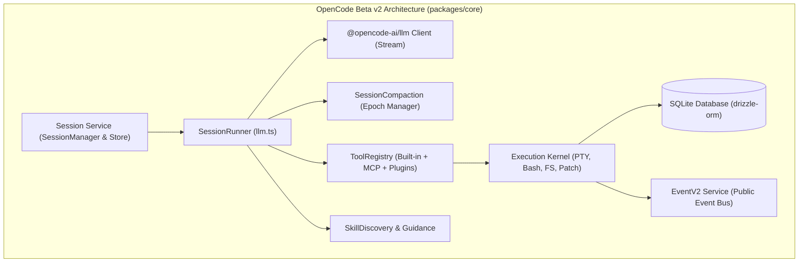
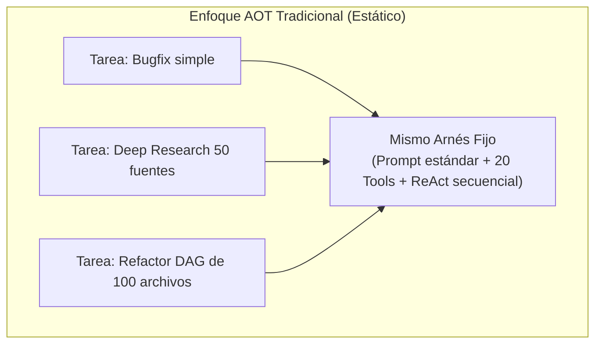

# 01. Anatomía del Harness de OpenCode Beta v2

## 1. Visión General del Runtime de OpenCode

**OpenCode Beta v2** es un arnés de agente de codificación de alto rendimiento construido sobre **TypeScript**, el runtime **Bun** y el framework de programación funcional tipada **Effect-TS** (`effect`).

A diferencia de scripts monolíticos en Python, OpenCode implementa una arquitectura modular de servicios distribuidos en capas con tipado estricto, gestión de concurrencia mediante fibras (*fibers*) y persistencia relacional con **SQLite**.



---

## 2. Los Componentes Principales en el Código Fuente

### A. El Bucle de Inferencia (`packages/core/src/session/runner/llm.ts`)
Es el motor central del arnés. Implementa la orquestación de un turno de ejecución:
1. **Traducción de Mensajes**: Transforma los eventos de la base de datos de la sesión en mensajes canónicos para el proveedor LLM (`toLLMMessages`).
2. **Streaming de Tokens y Eventos**: Consume el flujo `llm.stream(request)` y publica incrementalmente eventos de texto, razonamiento (*thinking*) e intenciones de llamadas a herramientas.
3. **Liquidación Durable de Herramientas (*Tool Settlement*)**:
   - Registra durablemente la intención de llamada antes de ejecutar efectos secundarios en el sistema operativo.
   - Ejecuta la herramienta a través del `ToolRegistry`.
   - Persiste el resultado (éxito o fallo) y reactiva automáticamente el siguiente turno del modelo.
4. **Control de Pasos Máximos (`MAX_STEPS_PROMPT`)**: Previene la divergencia o bucles descontrolados.

---

### B. Sistema de Compactación y Gestión de Épocas (`packages/core/src/session/compaction.ts`)
OpenCode v2 implementa una gestión de memoria avanzada para evitar el desbordamiento de contexto:
- **Buffer de Seguridad**: Mantiene por defecto `DEFAULT_BUFFER = 20_000` tokens de margen.
- **Truncado de Salidas Pesadas**: Salidas de herramientas que superen los `2.000` caracteres son truncadas en el contexto activo (`TOOL_OUTPUT_MAX_CHARS`), guardando el payload completo en `ToolOutputStore`.
- **Plantilla de Resumen Estricta**: Cuando se supera el umbral, un sub-modelo rellena la plantilla de Markdown (`Objective`, `Important Details`, `Work State: Completed/Active/Blocked`, `Next Move`, `Relevant Files`) y crea un nuevo `ContextEpoch`.

---

### C. Registro y Políticas de Herramientas (`packages/core/src/tool/registry.ts`)
Gestiona el catálogo unificado de herramientas disponibles:
- **Herramientas Nativas**: `read`, `write`, `edit`, `apply-patch`, `bash`, `grep`, `glob`, `websearch`, `webfetch`, `question`, `todowrite`.
- **Soporte MCP (Model Context Protocol)**: Conexión dinámica a servidores MCP externos.
- **Motor de Permisos (`packages/core/src/permission/`)**: Aplica políticas de autorización antes de otorgar ejecución a comandos potencialmente destructivos.

---

### D. Descubrimiento y Guía de Skills (`packages/core/src/skill/`)
- `discovery.ts`: Descarga e indexa colecciones de skills desde URLs remotas y repositorios.
- `guidance.ts`: Proyecta dinámicamente las skills pertinentes en el System Prompt del agente para guiar su comportamiento según el proyecto.

---

## 3. Fortalezas de la Arquitectura de OpenCode v2

1. **Robustez mediante Effect-TS**: Manejo tipado de errores sin excepciones no controladas (`try/catch` eliminados), concurrencia estructurada y reintentos exponenciales automáticos ante fallos transitorios de red.
2. **Persistencia Transaccional Completa**: Cada token, razonamiento y llamada a herramienta queda registrado en SQLite, permitiendo pausar, reanudar y auditar sesiones en cualquier momento.
3. **Eficiencia en Terminal y PTY**: Uso de pseudo-terminales reales (`pty.ts`) para soportar procesos interactivos, streaming de stdout y cancelación limpia de procesos hijos.


---

# 02. Comparativa de Arneses 2026: Claude Code vs. Codex vs. DeepSeek Harness vs. OpenCode v2

## 1. La Matriz Maestra de Arneses de Producción 2026

En el panorama actual de la ingeniería agéntica, no existe un "mejor arnés absoluto"; existe el **arnés adecuado para cada restricción operativa y de infraestructura**.

```
┌───────────────────┐    ┌───────────────────┐    ┌───────────────────┐    ┌───────────────────┐
│    Claude Code    │    │       Codex       │    │ DeepSeek Harness  │    │    OpenCode v2    │
│  (Agent-Centric)  │    │(Execution-Centric)│    │ (Runtime-Centric) │    │  (Harness-First)  │
└───────────────────┘    └───────────────────┘    └───────────────────┘    └───────────────────┘
```

| Dimensión | **Claude Code** (Anthropic) | **Codex** (OpenAI) | **DeepSeek Harness** v0.1 | **OpenCode** Beta v2 |
| :--- | :--- | :--- | :--- | :--- |
| **Centro Arquitectónico** | Agente individual potente. | Agent + Execution Sandbox. | Runtime componible ("Everything-is-a-plugin"). | Arnés open-source + TUI local-first. |
| **Pregunta que Optimiza** | ¿Cómo hacer a un agente más capaz? | ¿Cómo actuar con límites y approvals estrictos? | ¿Cómo recomponer dinámicamente el kernel? | ¿Cómo dar un arnés libre, hackeable y local? |
| **Licencia y Madurez** | Propietario / Producción cerrada. | Propietario / Producción cerrada. | MIT / Developer Preview (Cordis kernel). | MIT / Beta (Ecosistema Effect-TS). |
| **Bucle de Control** | Loop ReAct de 1.100 líneas cerrado. | Loop nativo con capas de sandbox/approval. | **Plugins reemplazables** en runtime. | Turn loop tipado con soporte de subagentes. |
| **Soporte de Modelos** | Solo Claude (Anthropic / Bedrock / Vertex).| Solo OpenAI (GPT series). | **Agnóstico total** (OpenAI, Claude, local vLLM).| **Agnóstico total** (Zen, Go, Anthropic, Gemini). |
| **Mecanismo de Extensión**| Skills (`SKILL.md`), Hooks, MCP, Subagents.| Tools, MCP, Apps. | Microkernel Cordis (129 líneas startup). | Skills discovery, Plugins TS, MCP, Agents. |
| **Seguridad y Permisos** | 6 capas de hooks + permisos granulares. | Separación estricta Sandbox ≠ Approval. | Políticas Cordis + Sandboxes OS. | Permisos declarativos `allow / ask / deny`. |
| **Observabilidad** | JSONL + OpenTelemetry. | Telemetría nativa de OpenAI. | Append-only event log + Trajectory view. | Almacén de eventos transaccional en SQLite. |
| **Superficie de Usuario** | Terminal CLI, Desktop, IDE, Slack. | CLI headless + API. | Web UI (puerto 3080) + CLI + Python SDK. | TUI nativa + Desktop + Extensión VS Code. |
| **Caso de Uso Ideal** | Desarrollador que busca un producto pulido listo. | Entornos empresariales con auditoría extrema. | **Plataforma base para investigar arneses.** | Desarrolladores que buscan control total y hackeabilidad. |

---

## 2. Análisis Específico por Arnés

### A. Claude Code (Anthropic) — *Agent-Centric*
- **Puntos Fuertes**: Turn loop ultra-optimizado de 1.100 líneas, 40+ herramientas nativas, sistema de memoria en 3 niveles y subagentes con caché de contexto compartido.
- **Limitaciones**: Cerrado, sin posibilidad de reemplazar el bucle de ejecución central; restringido a la familia Claude.

### B. Codex (OpenAI) — *Execution-Centric*
- **Puntos Fuertes**: Separación formal entre **Sandbox** (*qué tiene permitido tocar el proceso a nivel de sistema operativo*) y **Approval** (*qué acción específica está autorizada en este turno*). Telemetría nativa de alta fidelidad.
- **Limitaciones**: Estrechamente acoplado a la infraestructura de OpenAI; menor flexibilidad para personalizaciones locales.

### C. DeepSeek Harness v0.1 — *Runtime-Centric ("Everything is a Plugin")*
- **Puntos Fuertes**: Microkernel **Cordis** donde todo (modelos, herramientas, almacenamiento, bucles de ejecución y UI) es un plugin intercambiable en caliente.
- **Limitaciones**: Estado experimental en preview; alta fricción de configuración inicial y riesgo de fragmentación de plugins sin estándar unificado.

### D. OpenCode Beta v2 — *Open Harness Local-First*
- **Puntos Fuertes**: Licencia MIT 100% libre, integración nativa con Effect-TS, soporte multi-sesión paralelo sobre el mismo proyecto, descubrimiento automático de skills y TUI ergonómica.
- **Limitaciones**: Ecosistema en fase beta activa; arnés actualmente basado en AOT antes de la incorporación de JIT.

---

## 3. Árbol de Decisión para la Elección de Arnés

```
¿Buscas un producto terminado y pulido sin configurar infraestructura?
  └─► Claude Code

¿Requieres auditoría estricta de seguridad y sandboxing empresarial?
  └─► Codex

¿Tu objetivo es investigar la arquitectura de arneses y crear nuevos runtimes?
  └─► DeepSeek Harness

¿Quieres un arnés local, abierto, programable en TypeScript y listo para extender con JIT?
  └─► OpenCode Beta v2
```

---

## 4. Convergencia Arquitectónica 2026 (Qué rescatar de cada uno)

Para construir el arnés definitivo de siguiente generación:
1. **De Claude Code**: Los hooks de intercepción, el sistema de permisos granulares y el aislamiento de subagentes.
2. **De Codex**: La separación conceptual entre Sandboxing de OS y Aprobación de Acciones.
3. **De DeepSeek Harness**: El microkernel componible y el log append-only.
4. **De OpenCode**: El protocolo de descubrimiento de skills, la persistencia en SQLite y la tipificación estricta con Effect-TS.
5. **De JIT-Agent & WikiSkill**: La síntesis al vuelo $(\mathbf{M}, \mathbf{P}, \mathbf{A}, \mathbf{F})$ y la memoria evolutiva en 3 capas.


---

# 03. Limitaciones del Enfoque Tradicional AOT (Ahead-of-Time) en OpenCode

## 1. El Paradigma AOT: Un Arnés Único Prediseñado

Actualmente, OpenCode Beta v2 (al igual que Claude Code, Codex o Cursor) sigue el paradigma **AOT (Ahead-of-Time)**:
- Los ingenieros humanos diseñaron una arquitectura fija de antemano: un único bucle ReAct con un conjunto predeterminado de herramientas, un único System Prompt base y un mecanismo de compactación estándar.
- **La Suposición AOT**: Se asume que este arnés prefabricado será óptimo para *cualquier tarea* que el usuario le asigne en el futuro (desde arreglar un typo en HTML hasta investigar una base de código de 5 millones de líneas o depurar una fuga de memoria compleja).



---

## 2. Los 4 Cuellos de Botella Principales del Enfoque AOT

### 1. Sobrecarga y Contaminación de Contexto (*Tool Registry Bloat*)
En el enfoque AOT, el arnés inyecta las definiciones completas de JSON-Schema de todas las herramientas (20+ herramientas) en el prompt de sistema de cada turno, consumiendo de 3.000 a 6.000 tokens iniciales en cada llamada:
- Para un bugfix simple de 1 línea, el modelo no necesita herramientas de web search, ni patch complejo, ni question modals.
- Cuantas más herramientas se exponen simultáneamente, mayor es la probabilidad de que el modelo elija una herramienta incorrecta (*tool selection error*).

### 2. Rigidez en la Topología de Control
- Una tarea de **Deep Research** se beneficia de una búsqueda ramificada en paralelo con subagentes y memoria de grafo de hechos.
- Una tarea de **Refactorización Multicapa** requiere un Grafo Acíclico Dirigido (DAG) donde las dependencias se validen antes de escribir.
- En OpenCode AOT, ambas tareas se ven forzadas a ejecutarse a través del mismo bucle lineal ReAct paso a paso, multiplicando el número de turnos necesarios.

### 3. Amnesia Inter-Sesiones y Desperdicio de Experiencia
Aunque OpenCode guarda las sesiones en SQLite, **cada nueva sesión empieza desde cero**:
- Si el agente descubre en la sesión 1 una peculiaridad crítica del entorno (ej. *"este proyecto requiere Node 20 y flags especiales de compilación"*), en la sesión 2 el agente volverá a cometer el mismo error y tendrá que redescubrirlo.
- El arnés AOT no posee un mecanismo de compilación de experiencia como **WikiSkill** para destilar errores en directivas permanentes.

### 4. La Frontera de Coste/Tokens Subóptima
El benchmark del paper *JIT-Agent* (arXiv:2608.25593) evaluó el arnés estándar de OpenCode frente a arneses adaptativos JIT:
- OpenCode consumió un promedio de **1.150k a 1.960k tokens** por tarea en benchmarks de razonamiento, con costes de hasta \$0.38 por caso.
- Un arnés generado Just-In-Time resolvió las mismas tareas con **212k a 400k tokens** (una reducción de hasta el **70% en coste**) y con mayor tasa de éxito.

---

## 3. Conclusión: El Camino hacia JIT-Harness

Para que OpenCode alcance su máximo potencial, no basta con conectar modelos más potentes o añadir más líneas de código al arnés. Es necesario transformar el propio arnés en un **sistema adaptativo generado Just-in-Time (JIT)** y respaldado por una **memoria evolutiva persistente**.
