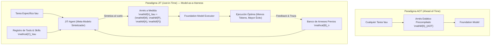

# 01. El Paradigma Just-In-Time (JIT) Harness y Model-as-a-Harness

## 1. El Cambio de Paradigma: De AOT a JIT

Tradicionalmente, la comunidad de IA se ha dividido en dos frentes de optimización:
1. **Model Scaling**: Entrenar modelos cada vez más grandes con más parámetros y datos (GPT-4 $\to$ GPT-5, Claude 3 $\to$ Claude 4.5).
2. **Harness Engineering (AOT)**: Programar manualmente arneses fijos cada vez más elaborados en TypeScript o Python.

El paper fundacional **"JIT-Agent: Scaling Harness Intelligence via Just-in-Time Harness Evolution"** (arXiv:2608.25593v1) introduce un tercer eje fundamental: **Harness Intelligence**.

> **Tesis Central**: *"La inteligencia agéntica no es una propiedad exclusiva de los pesos del modelo, sino del par Modelo–Arnés $(\pi_\psi, \mathbf{h})$. La estructura del arnés óptimo depende no solo del dominio, sino de la instancia específica del problema."*

---

## 2. Formalización Matemática: La 4-Tupla del Arnés $\mathbf{h} = (\mathbf{M}, \mathbf{P}, \mathbf{A}, \mathbf{F})$

El marco teórico de JIT formaliza cualquier arnés agéntico como un artefacto ejecutable generado por máquina regido por un protocolo estricto $\boldsymbol{\Pi}$ compuesto por cuatro módulos interoperables:

$$\mathbf{h} = (\mathbf{M}, \mathbf{P}, \mathbf{A}, \mathbf{F}) \in \mathfrak{M} \times \mathfrak{P} \times \mathfrak{A} \times \mathfrak{F}$$

El orden de dependencia funcional y temporal en cada paso $t$ es:

$$\mathbf{M} \longrightarrow \mathbf{P} \longrightarrow \mathbf{F} \longrightarrow \mathbf{A}$$

### Desglose de los 4 Módulos:

1. **Módulo de Memoria ($\mathbf{M} \in \mathfrak{M}$)**:
   - Construye la **vista activa** $\mathbf{v}_t \in \mathcal{V}$ a partir del historial inmutable de eventos $\boldsymbol{\xi}_{<t}$ y el estado actual $\mathbf{s}_t$.
   - Decide si aplicar historial completo ($\mathbf{M}_{\text{full}}$), compresión estructurada ($\mathbf{M}_{\text{compact}}$), grafo de hechos ($\mathbf{M}_{\text{fact-graph}}$) o aislamiento por subtareas ($\mathbf{M}_{\text{subproblem}}$).
   $$\mathbf{v}_t = \mathbf{M}(\boldsymbol{\xi}_{<t}, \mathbf{s}_t)$$

2. **Módulo de Planificación ($\mathbf{P} \in \mathfrak{P}$)**:
   - Convierte la vista de memoria en una **directiva local inmediata** $\mathbf{d}_t \in \mathcal{D}_{\text{dir}}$.
   - Puede ser nulo ($\mathbf{P}_\emptyset$, como en ReAct puro), basado en lista de tareas ($\mathbf{P}_{\text{todo}}$), descomposición dinámica ($\mathbf{P}_{\text{decomp}}$) o grafo de dependencias DAG ($\mathbf{P}_{\text{dag}}$).
   $$\mathbf{d}_t = \mathbf{P}(\mathbf{v}_t)$$

3. **Módulo de Orquestación de Capacidades ($\mathbf{F} \in \mathfrak{F}$)**:
   - Filtra y selecciona el subconjunto óptimo de herramientas y skills $\mathcal{U}_t \subseteq \mathcal{C}_\tau$ que se expondrán al modelo en este paso exacto, evitando la contaminación del registro completo.
   $$\mathcal{U}_t = \mathbf{F}(\mathbf{v}_t, \mathbf{d}_t, \mathcal{C}_\tau)$$

4. **Módulo de Acción y Control ($\mathbf{A} \in \mathfrak{A}$)**:
   - Consume el contexto ensamblado $(\mathbf{v}_t, \mathbf{d}_t, \mathcal{U}_t)$, actualiza el estado interno del controlador $\mathbf{s}_{t+1}$ y emite la acción ejecutable $e_t$ (que puede ser una llamada a herramienta $u_t \in \mathcal{U}$ o la salida final $y \in \mathcal{Y}$).
   $$(e_t, \mathbf{s}_{t+1}) = \mathbf{A}(\mathbf{v}_t, \mathbf{d}_t, \mathcal{U}_t, \mathbf{s}_t)$$

---

## 3. Representación de Arneses Existentes en Coordenadas $(\mathbf{M}, \mathbf{P}, \mathbf{A}, \mathbf{F})$

Esta formalización unifica todos los arneses de la industria en un mismo espacio de diseño:

- **ReAct Canónico**:
  $$\mathbf{h}_{\text{ReAct}} = (\mathbf{M}_{\text{full}},\, \mathbf{P}_{\emptyset},\, \mathbf{A}_{\text{react}},\, \mathbf{F}_{\text{all}})$$

- **OpenCode / Codex Actual**:
  $$\mathbf{h}_{\text{OpenCode}} = (\mathbf{M}_{\text{compact}},\, \mathbf{P}_{\text{todo}},\, \mathbf{A}_{\text{react}},\, \mathbf{F}_{\text{all}})$$

- **Agentes Recursivos (ROMA / AOrchestra / RLM)**:
  $$\mathbf{h}_{\text{rec}} = (\mathbf{M}_{\text{subproblem}},\, \mathbf{P}_{\text{decomp}},\, \mathbf{A}_{\text{rec}},\, \mathbf{F}_{\text{route}})$$

- **Arnés JIT Especializado para Deep Research (ej. *Trapdoor*)**:
  $$\mathbf{h}_{\text{research}} = (\mathbf{M}_{\text{FactGraph}},\, \mathbf{P}_{\text{DynamicDecomp}},\, \mathbf{A}_{\text{RecursiveDelegate}},\, \mathbf{F}_{\text{ResearchOnly}})$$

- **Arnés JIT Especializado para Refactorización de Código (ej. *Palimpsest*)**:
  $$\mathbf{h}_{\text{refactor}} = (\mathbf{M}_{\text{GraphArtifact}},\, \mathbf{P}_{\text{DAGPrerequisites}},\, \mathbf{A}_{\text{BoundedWidthDAG}},\, \mathbf{F}_{\text{ScopedEditValidate}})$$

---

## 4. El Concepto "Model-as-a-Harness"

En lugar de que un ingeniero humano escriba a mano el código del arnés para cada nuevo problema, **un modelo de lenguaje especializado en arquitectura agéntica (JIT-Agent) genera el código ejecutable del arnés en milisegundos**.

Esto permite que un modelo ligero de ejecución (como DeepSeek-V4-Flash o Qwen3.6-Flash) opere dentro de una estructura perfecta para la tarea, logrando resultados superiores a modelos gigantescos atrapados en arneses genéricos.

---

# 02. Análisis Detallado del Paper JIT-Agent (arXiv:2608.25593v1)

## 1. Ficha Técnica del Paper

- **Título**: *JIT-Agent: Scaling Harness Intelligence via Just-in-Time Harness Evolution*
- **Autores**: Guibin Zhang, Leo Lu, Fangzhou Xie, Kang Zhu, Junhao Wang, Zhifei Xie, Zhaochen Yu, Zihang Liu, Zhongxiang Sun, Qiankun Li, Yue Liao, Heng Chang, Xiaobin Hu, Qibing Ren, Wangchunshu Zhou, Shuicheng Yan.
- **Identificador arXiv**: `arXiv:2608.25593v1` (Publicado en Agosto 2026).
- **Recursos**:
  - Repositorio: [github.com/bingreeky/JIT](https://github.com/bingreeky/JIT)
  - Modelos en Hugging Face: [huggingface.co/JIT-Agent/jit-27b](https://huggingface.co/JIT-Agent/jit-27b)
  - Sitio oficial: [bingreeky.github.io/JIT-site](https://bingreeky.github.io/JIT-site)

---

## 2. Los Tres Grandes Desafíos del Diseño de Arneses

El entrenamiento de un meta-modelo generador de arneses enfrenta tres barreras críticas:
1. **Adaptabilidad (*Adaptivity*)**: ¿Cómo mapear una tarea en lenguaje natural a la combinación óptima de módulos de memoria, planificación, acción y herramientas?
2. **Confiabilidad (*Reliability*)**: Los programas generados por LLMs pueden contener errores sintácticos, llamadas a APIs inexistentes o excepciones en tiempo de ejecución. ¿Cómo garantizar que el arnés sea 100% ejecutable?
3. **Evolucionabilidad (*Evolvability*)**: ¿Cómo aprender de los fallos y éxitos pasados para que los arneses futuros superen continuamente el estado del arte?

---

## 3. HarnessFactory: El Banco Semilla de 13 Arneses

Para proporcionar una base de entrenamiento estandarizada bajo el protocolo $\boldsymbol{\Pi}$, los autores crearon **HarnessFactory**, reimplementando 13 arneses representativos de la literatura:

| # | Arnés Semilla | Estrategia de Memoria ($\mathbf{M}$) | Estrategia de Planificación ($\mathbf{P}$) | Estrategia de Acción ($\mathbf{A}$) | Orquestación de Tools ($\mathbf{F}$) |
| :--- | :--- | :--- | :--- | :--- | :--- |
| 1 | **ReAct** | $\mathbf{M}_{\text{full}}$ | $\mathbf{P}_{\emptyset}$ | Bucle ReAct básico | Registro completo |
| 2 | **Plan-and-Execute** | $\mathbf{M}_{\text{step-history}}$ | Plan estático inicial | Ejecución secuencial | Por paso de plan |
| 3 | **ReSum** | Resumen recursivo | $\mathbf{P}_{\emptyset}$ | ReAct con buffer | Registro completo |
| 4 | **Flash-Searcher** | Grafo de evidencias | Búsqueda paralela | Branching search | Tools de búsqueda |
| 5 | **GAM (Agentic Memory)** | Memoria por tópicos | Heurística reactiva | ReAct guiado | Filtrado semántico |
| 6 | **MemoBrain** | Memoria reflexiva | Metas jerárquicas | Bucle evaluador | Registro completo |
| 7 | **AggAgent** | Memoria agregada | Multi-submeta | Co-ejecución | Asignación dinámica |
| 8 | **OAgent** | Memoria de objetos | Plan guiado por estado | Transiciones de estado | Tools de entorno |
| 9 | **AgentFold** | Context Folding | Descomposición en árbol | Fold-and-unfold | Scoped tools |
| 10 | **HiAgent** | Memoria jerárquica | Planificador global/local | Master-Worker loop | Jerárquico |
| 11 | **DeepAgent** | Memoria de profundidad | Exploración profunda | Backtracking loop | Scoped tools |
| 12 | **ROMA** | Aislamiento por subproblema | Descomposición recursiva | Delegación recursiva | Enrutado por subagente |
| 13 | **AOrchestra** | Pizarra compartida | Coordinación multi-nodo | Swarm / P2P | Enrutamiento dinámico |

---

## 4. El Pipeline de Entrenamiento en 3 Etapas

```mermaid
graph TD
    subgraph "Stage I: Customizing Harness (Adaptability)"
        T["Tarea \tau + Protocolo \boldsymbol{\Pi} + Seed Scaffolds"] --> Teacher["Teacher Model"]
        Teacher --> SFT["Supervised Fine-Tuning (\mathcal{L}_I^{gen})"]
        SFT --> DPO["Preference Learning (\mathcal{L}_I^{pref}):\nRecompensa alta + menor latencia/coste"]
    end

    subgraph "Stage II: Repairing Harness (Reliability)"
        Failed["Arnés Fallido \tilde{\mathbf{h}}^{(0)} + Diagnóstico de Error \mathbf{g}^{(0)}"] --> TeacherRepair["Teacher Repair Trajectory"]
        TeacherRepair --> Patch["Parche Correctivo \Delta^{\star}"]
        Patch --> Valid["Arnés Ejecutable en \le 2 pasos"]
        Valid --> SFTRepair["Entrenamiento de Reparación Rápida (\mathcal{L}_{II})"]
    end

    subgraph "Stage III: Learning to Evolve (Evolvability: Evo-GDPO)"
        Group["Muestreo de Grupo de Arneses \{ \mathbf{h}_1 .. \mathbf{h}_G \}"] --> Bench["Ejecución frente a Incumbent \mathbf{b}"]
        Bench --> EvoReward["Cálculo de Ventaja Desacoplada (Reward, Latencia, Coste)"]
        EvoReward --> PPO["Actualización PPO con Evo-GDPO"]
        PPO --> ArchiveUpdate["Actualización Conservadora del Banco \mathcal{B}_n"]
    end
```

### Stage I: Customización Condicionada por Tarea
Aprende a mapear la tarea y el contexto de referencia a un arnés válido bajo el protocolo $\boldsymbol{\Pi}$ combinando SFT y optimización de preferencias multi-objetivo (Recompensa $\uparrow$, Latencia $\downarrow$, Coste monetario $\downarrow$).

### Stage II: Trayectorias de Reparación Acotada
En lugar de descartar los arneses que fallan en validación estática o runtime, convierte los errores del compilador y las excepciones en datos de supervisión. JIT-Agent aprende a aplicar parches correctivos $\Delta^{\star}$ en máximo 2 pasos para recuperar la ejecutabilidad completa.

### Stage III: Evo-GDPO (Evolutionary Group-Decoupled Policy Optimization)
Optimización por refuerzo donde el modelo es premiado no solo por resolver la tarea, sino por **superar la frontera de eficiencia del mejor arnés histórico (incumbent)** registrado en el archivo $\mathcal{B}_n$.

---

## 5. Modos de Inferencia: Static vs. Streaming

- **Static JIT**: Genera $N$ arneses candidatos en paralelo al inicio de la tarea, selecciona el mejor mediante un validador interno y ejecuta ese arnés. No actualiza el archivo persistente tras finalizar.
- **Streaming JIT**: Diseñado para flujos continuos de trabajo en producción. Recupera arneses previos de $\mathcal{B}_n$, sintetiza el arnés de la tarea $n$, lo ejecuta y, si el arnés supera la frontera de eficiencia sin degradar la precisión, **lo incorpora al banco permanente de arneses para acelerar las tareas futuras**.

---

## 6. Resultados Experimentales y Fronteras de Pareto

### A. Resultados Frente a Modelos de Frontera (Tabla 3 del Paper)

| Modelo + Arnés | DeepSearchQA (F1) | xBench-DS (Acc) | AgentIF (Score) | PinchBench (Avg) | DeepPlanning (Shop/Travel) |
| :--- | :--- | :--- | :--- | :--- | :--- |
| **GPT-5.6** (Vanilla) | 76.0 | 81.0 | 68.0 | 84.2 | 83.7 / **84.9** |
| **Gemini 3.5 Flash** (Vanilla) | 88.0 | 85.0 | 64.0 | 74.2 | 76.2 / 50.3 |
| **DeepSeek-V4-Flash** (Vanilla) | 76.2 | 70.1 | 58.4 | 81.7 | 59.1 / 54.8 |
| **JIT-Agent + DeepSeek-V4-Flash** | **85.1** (+8.9) | **82.0** (+11.9) | **63.8** (+5.4) | **92.9** (+11.2) | **83.9** (+24.8) / **61.3** |
| **GLM-5.2** (Vanilla) | 89.2 | 76.0 | 63.0 | 87.0 | 78.2 / 62.8 |
| **JIT-Agent + GLM-5.2** | **93.9** (👑 #1) | **88.0** (👑 #1) | **69.9** (👑 #1) | **93.3** (👑 #1) | **83.4** / **83.0** (+20.2) |

> **Hallazgo Clave**: `DeepSeek-V4-Flash` (un modelo hiper-ligero y económico) equipado con JIT-Agent **supera a GPT-5.6 en DeepSearchQA (+9.1) y PinchBench (+8.7)**.

### B. Comparativa de Eficiencia Controlando el Modelo (DeepSeek-V4-Flash)

| Arnés Evaluado | DeepSearchQA (Perf / Tokens / Cost) | xBench-DS (Perf / Tokens / Cost) | AgentIF (Perf / Tokens / Cost) |
| :--- | :--- | :--- | :--- |
| **Claude Code** | 79.6 / 625k / \$0.088 | 75.0 / 559k / \$0.079 | **66.9** / 808k / \$0.114 |
| **Codex** | 77.8 / 760k / \$0.107 | 70.0 / 680k / \$0.096 | 58.5 / 870k / \$0.123 |
| **OpenCode** | 75.9 / 1.832k / \$0.258 | 65.0 / 1.157k / \$0.159 | 48.1 / 950k / \$0.135 |
| **NanoBot** | 80.4 / 924k / \$0.131 | 78.0 / 527k / \$0.075 | 53.1 / 1.034k / \$0.147 |
| **JIT-Agent** | **85.1 / 400k / \$0.066** | **82.0 / 212k / \$0.039** | 63.8 / **476k / \$0.097** |

> **Conclusión de Eficiencia**: JIT-Agent reduce el coste monetario en un promedio del **36% al 54%** y disminuye el uso de tokens drásticamente, demostrando que **la precisión se gana mediante una orquestación quirúrgica, no quemando tokens en trayectorias largas**.
