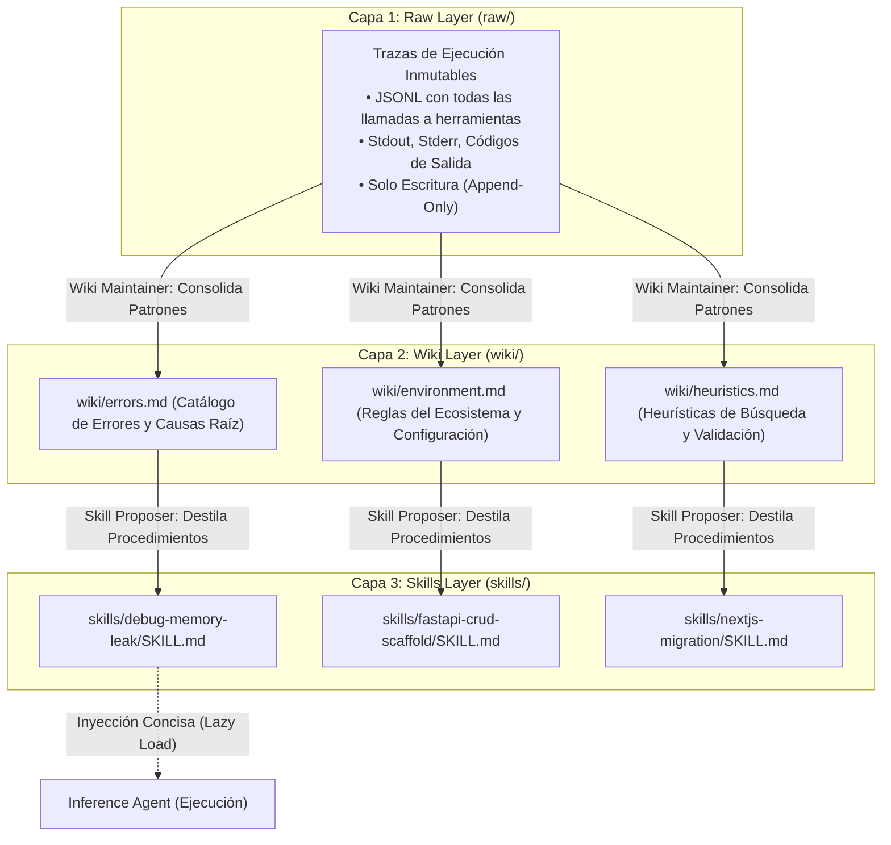

# 01. Análisis Detallado del Paper WikiSkill (arXiv:2608.27454v1)

## 1. Ficha Técnica del Paper

- **Título**: *WikiSkill: Compiling Agent Experience into Persistent Knowledge for Skill Evolution*
- **Identificador arXiv**: `arXiv:2608.27454v1` (Publicado en Agosto 2026).
- **Tesis Central**: *"Los agentes actuales intentan evolucionar sus habilidades modificando directamente sus prompts o definiciones de herramientas a partir de trazas dispersas. WikiSkill demuestra que la verdadera evolución de skills requiere compilar la experiencia continua en una base de conocimiento persistente y estructurada (un Wiki), separando el conocimiento declarativo de las skills procedimentales ejecutables."*

---

## 2. La Arquitectura de Conocimiento en Tres Capas

WikiSkill organiza el espacio de trabajo del agente en tres capas físicas desacopladas dentro del sistema de archivos:

### Capa 1: Raw Layer (`raw/`)
Almacena las trazas completas e inmutables de cada sesión o intento. Los agentes de inferencia nunca leen directamente esta capa durante una tarea de usuario para evitar la sobrecarga de tokens.

### Capa 2: Wiki Layer (`wiki/`)
Mantiene un conjunto de documentos Markdown interconectados que compilan patrones abstractos aprendidos a lo largo de decenas de sesiones:
- Qué librerías entran en conflicto.
- Qué parámetros de línea de comandos fallan en determinados sistemas operativos.
- Qué supuestos arquitectónicos resultaron falsos.

### Capa 3: Skills Layer (`skills/`)
Contiene las **Skills ejecutables y concisas** (siguiendo el estándar `SKILL.md`). Cada skill contiene instrucciones de alta densidad de información, pasos de acción y reglas de decisión listas para ser cargadas bajo demanda.

---

## 3. Dinámica de Agentes Evolutivos y Orquestación

WikiSkill introduce un ecosistema de agentes con roles diferenciados:

1. **Inference Agent**: Resuelve la tarea del usuario utilizando las skills disponibles. Al terminar, emite su traza completa a la capa `raw/`.
2. **Wiki Maintainer Agent**:
   - Se ejecuta periódicamente en segundo plano (*offline* o entre sesiones).
   - Analiza las trazas acumuladas en `raw/`.
   - Si detecta un nuevo patrón de fallo o una solución exitosa a un problema difícil, actualiza o crea artículos en `wiki/`.
3. **Wiki-Informed Skill Proposer Agent**:
   - Lee el conocimiento consolidado en `wiki/` y propone modificaciones o nuevas skills en `skills/`.
4. **Gating & Rollback System**:
   - Evalúa las skills propuestas frente a un conjunto de tareas de validación.
   - Solo acepta la skill si aumenta la tasa de éxito sin inflar la longitud del contexto. Si empeora el rendimiento, aplica un *rollback* git automático.

---

## 4. El Hallazgo Crucial: Por qué NO dar acceso directo al Wiki al Inference Agent

Uno de los experimentos más reveladores del paper comparó dos configuraciones:
1. **Configuración Directa**: Darle al Inference Agent acceso directo de lectura a todos los archivos de `wiki/`.
2. **Configuración WikiSkill (Compilación en Skills)**: Dejar el Wiki como almacén intermedio y hacer que el *Skill Proposer* destile el Wiki en skills concisas de formato estándar (`SKILL.md`).

> **Resultado del Estudio**: La configuración directa **degradó el rendimiento final del agente**.
> **Razón**: El Wiki completo satura la atención del modelo con cientos de datos contextuales que no aplican a la tarea inmediata. La destilación en Skills compactas mantiene la pureza y foco de la ventana de contexto.

---

## 5. Transferencia Cross-Model y Complementariedad con el Escalado

1. **Transferencia entre Familias de Modelos**:
   - Las skills evolucionadas por un modelo potente (ej. Claude 3.7 / GPT-5) pueden ser transferidas directamente a modelos ligeros (ej. Qwen 27B / DeepSeek-V4-Flash).
   - **Resultado**: Los modelos ligeros que usan skills generadas por modelos más fuertes **superan a los modelos ligeros que intentan auto-evolucionar sus propias skills**, e incluso superan a modelos grandes que no tienen skills.
2. **Evolución Continua Sin Modificar Pesos**:
   - Permite que un equipo mantenga un agente que se vuelve "más sabio" cada semana simplemente acumulando experiencia en el repositorio Git de la empresa, sin gastar millones en fine-tuning continuo.
