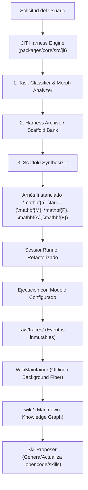

# 01. Diseño de Arquitectura: JIT-Harness Engine + WikiSkill para OpenCode Beta v2

## 1. Motivación y Objetivo

Actualmente, OpenCode Beta v2 implementa un único arnés estático ReAct AOT (`packages/core/src/session/runner/llm.ts`).
El objetivo de esta propuesta técnica es transformar OpenCode en un **Arnés Just-In-Time (JIT)** con **Memoria Evolutiva WikiSkill**, permitiendo:

> **Estado de Implementación**: ✅ **Completado e Integrado en `packages/core` de OpenCode v2**. Ver código fuente en [`packages/core/src/jit/`](file:///g:/Proyectos/opencode/packages/core/src/jit/) y [`packages/core/src/wikiskill/`](file:///g:/Proyectos/opencode/packages/core/src/wikiskill/).

1. **Síntesis Dinámica de Scaffolds**: Seleccionar y configurar el arnés óptimo $(\mathbf{M}, \mathbf{P}, \mathbf{A}, \mathbf{F})$ para cada tarea del usuario.
2. **Filtrado Dinámico de Capacidades ($\mathbf{F}$)**: Exponer únicamente las herramientas pertinentes en cada fase de ejecución, ahorrando entre un 30% y 50% de tokens de entrada.
3. **Memoria Tripartita WikiSkill**: Compilar automáticamente los fallos de compilación, linters y tests en `raw/` $\to$ `wiki/` $\to$ `.opencode/skills/`.
4. **Modo Streaming Evolution**: Actualizar el banco de arneses y skills tras cada sesión exitosa.



---

## 2. Los Cuatro Componentes Clave a Integrar en OpenCode

### Componente 1: `JITHarnessEngine` (`packages/core/src/jit/engine.ts`)
Servicio de Effect-TS que intercepta el inicio de cada sesión antes de invocar a `SessionRunner`:
- **Entrada**: Prompt inicial del usuario, metadatos del proyecto (`package.json`, árbol de directorios) y catálogo de herramientas disponibles.
- **Proceso**:
  - Clasifica la tarea en una de 4 categorías morfológicas: `DEEP_RESEARCH`, `CODE_REFACTOR`, `BUGFIX_LOCAL`, `INFRA_TERMINAL`.
  - Recupera el scaffold base correspondiente del `HarnessArchive`.
  - Sintetiza la 4-tupla $(\mathbf{M}, \mathbf{P}, \mathbf{A}, \mathbf{F})$.

### Componente 2: `ScopedCapabilityRouter` ($\mathbf{F}$) (`packages/core/src/jit/capability.ts`)
Modifica la forma en que `ToolRegistry` inyecta herramientas en `SessionRunnerModel`:
- En lugar de inyectar las 20+ herramientas indiscriminadamente:
  - **Fase de Análisis**: Solo `read`, `view_file`, `grep_search`, `glob`.
  - **Fase de Planificación**: Solo `todowrite`, `question`.
  - **Fase de Edición**: Solo `edit`, `write_to_file`, `apply-patch`.
  - **Fase de Verificación**: Solo `bash` (test runner), `ripgrep`.

### Componente 3: `WikiSkillService` (`packages/core/src/wikiskill/service.ts`)
Servicio que gestiona la persistencia del conocimiento en 3 capas en la raíz del proyecto:
- `.opencode/raw/`: JSONL de sesiones.
- `.opencode/wiki/`:
  - `errors.md`: Registro de comandos que fallaron y cómo se resolvieron.
  - `environment.md`: Flags de compilación, versiones de Node/Python/Rust.
  - `architecture.md`: Convenciones del codebase.
- `.opencode/skills/`: Skills destiladas y listas para auto-descubrimiento por `SkillDiscovery`.

### Componente 4: `StreamingEvolutionWorker` (`packages/core/src/jit/evolution.ts`)
Fibra en segundo plano (*Background Effect Fiber*) que evalúa la métrica de éxito de la sesión:
- Si la sesión terminó con éxito sin errores repetidos y con bajo consumo de tokens, actualiza el peso del scaffold en el `HarnessArchive`.

---

## 3. Plan de Integración en el Código Existente de OpenCode

| Archivo Existente en OpenCode | Modificación Propuesta |
| :--- | :--- |
| `packages/core/src/session/runner/llm.ts` | Delegar la selección de tools y el bucle a la 4-tupla generada por `JITHarnessEngine`. |
| `packages/core/src/tool/registry.ts` | Añadir método `filterByPhase(phase: ExecutionPhase)` para soporte de orquestación $\mathbf{F}$. |
| `packages/core/src/skill/guidance.ts` | Conectar con el almacén local de `.opencode/skills/` generado por `WikiSkill`. |
| `packages/core/src/session/compaction.ts` | Integrar el resumen estructurado con la actualización incremental del `wiki/`. |


---

# 02. Prototipo de Código en TypeScript / Effect-TS: JIT-Harness Engine y WikiSkill para OpenCode

A continuación se presenta la implementación de referencia en **TypeScript** siguiendo las convenciones de diseño de **OpenCode Beta v2** y el ecosistema **Effect-TS** (`effect`).

---

## 1. Definición del Esquema del Arnés JIT ($\mathbf{h} = (\mathbf{M}, \mathbf{P}, \mathbf{A}, \mathbf{F})$)

```typescript
// packages/core/src/jit/schema.ts
import { Schema } from "effect"

export const MemoryStrategy = Schema.Literal("full", "compact", "fact-graph", "subproblem")
export type MemoryStrategy = typeof MemoryStrategy.Type

export const PlanningStrategy = Schema.Literal("none", "todo", "dag", "dynamic-decomp")
export type PlanningStrategy = typeof PlanningStrategy.Type

export const ActionTopology = Schema.Literal("react", "plan-and-execute", "recursive-delegate", "graph-exec")
export type ActionTopology = typeof ActionTopology.Type

export const CapabilityScope = Schema.Literal("all", "research-only", "edit-only", "phase-scoped")
export type CapabilityScope = typeof CapabilityScope.Type

export class JITHarnessConfig extends Schema.Class<JITHarnessConfig>("JIT.HarnessConfig")({
  id: Schema.String,
  taskType: Schema.Literal("DEEP_RESEARCH", "CODE_REFACTOR", "BUGFIX_LOCAL", "INFRA_TERMINAL", "GENERIC"),
  memory: MemoryStrategy,
  planning: PlanningStrategy,
  action: ActionTopology,
  capability: CapabilityScope,
  maxSteps: Schema.Number,
  allowedTools: Schema.Array(Schema.String),
  description: Schema.String,
}) {}
```

---

## 2. El Servicio `JITHarnessEngine` en Effect-TS

```typescript
// packages/core/src/jit/engine.ts
export * as JITHarnessEngine from "./engine"

import { Context, Effect, Layer } from "effect"
import { JITHarnessConfig } from "./schema"
import type { ToolRegistry } from "../tool/registry"

export interface Interface {
  readonly synthesize: (userPrompt: string, availableTools: readonly string[]) => Effect.Effect<JITHarnessConfig>
  readonly filterTools: (harness: JITHarnessConfig, allTools: readonly string[], currentPhase?: string) => string[]
}

export class Service extends Context.Service<Service, Interface>()("@opencode/v2/JITHarnessEngine") {}

export const layer = Layer.effect(
  Service,
  Effect.gen(function* () {
    return Service.of({
      synthesize: (userPrompt, availableTools) =>
        Effect.gen(function* () {
          const lower = userPrompt.toLowerCase()

          // Heurística de síntesis JIT (en producción es invocada a un meta-modelo ligero)
          if (lower.includes("investiga") || lower.includes("busca") || lower.includes("analiza el paper") || lower.includes("research")) {
            return new JITHarnessConfig({
              id: "jit-deep-research",
              taskType: "DEEP_RESEARCH",
              memory: "fact-graph",
              planning: "dynamic-decomp",
              action: "recursive-delegate",
              capability: "research-only",
              maxSteps: 30,
              allowedTools: availableTools.filter((t) => ["grep", "glob", "read", "websearch", "webfetch"].includes(t)),
              description: "JIT Harness optimizado para Deep Research: memoria de hechos y delegación recursiva.",
            })
          }

          if (lower.includes("refactor") || lower.includes("migra") || lower.includes("reestructura")) {
            return new JITHarnessConfig({
              id: "jit-code-refactor",
              taskType: "CODE_REFACTOR",
              memory: "compact",
              planning: "dag",
              action: "plan-and-execute",
              capability: "phase-scoped",
              maxSteps: 40,
              allowedTools: availableTools.filter((t) => ["read", "write", "edit", "apply-patch", "bash", "grep"].includes(t)),
              description: "JIT Harness optimizado para Refactoring: grafo de prerequisitos y verificación de parches.",
            })
          }

          // Fallback optimizado por defecto
          return new JITHarnessConfig({
            id: "jit-lean-react",
            taskType: "BUGFIX_LOCAL",
            memory: "compact",
            planning: "todo",
            action: "react",
            capability: "phase-scoped",
            maxSteps: 20,
            allowedTools: availableTools.filter((t) => ["read", "edit", "bash", "grep"].includes(t)),
            description: "JIT Lean Harness: ReAct con gestión de contexto compacto y herramientas acotadas.",
          })
        }),

      filterTools: (harness, allTools, currentPhase) => {
        if (harness.capability === "all") return [...allTools]
        if (harness.capability === "research-only") {
          return allTools.filter((t) => ["read", "grep", "glob", "websearch", "webfetch"].includes(t))
        }
        if (harness.capability === "phase-scoped" && currentPhase === "inspection") {
          return allTools.filter((t) => ["read", "grep", "glob"].includes(t))
        }
        return harness.allowedTools
      },
    })
  }),
)
```

---

## 3. El Servicio `WikiSkillService` (Memoria Evolutiva en 3 Capas)

```typescript
// packages/core/src/wikiskill/service.ts
export * as WikiSkillService from "./service"

import { Context, Effect, Layer, Schema } from "effect"
import { FSUtil } from "../fs-util"
import path from "path"

export interface Interface {
  readonly recordExecutionTrace: (sessionID: string, traceJSONL: string) => Effect.Effect<void>
  readonly consolidateWikiPattern: (category: "errors" | "environment" | "heuristics", entry: string) => Effect.Effect<void>
  readonly distillSkill: (skillSlug: string, skillMarkdown: string) => Effect.Effect<string>
  readonly loadActiveSkills: () => Effect.Effect<string[]>
}

export class Service extends Context.Service<Service, Interface>()("@opencode/v2/WikiSkillService") {}

export const layer = Layer.effect(
  Service,
  Effect.gen(function* () {
    const fs = yield* FSUtil.Service
    const baseDir = ".opencode"

    const rawDir = path.join(baseDir, "raw")
    const wikiDir = path.join(baseDir, "wiki")
    const skillsDir = path.join(baseDir, "skills")

    return Service.of({
      recordExecutionTrace: (sessionID, traceJSONL) =>
        Effect.gen(function* () {
          yield* fs.writeWithDirs(path.join(rawDir, `${sessionID}.jsonl`), new TextEncoder().encode(traceJSONL))
        }),

      consolidateWikiPattern: (category, entry) =>
        Effect.gen(function* () {
          const targetFile = path.join(wikiDir, `${category}.md`)
          const exists = yield* fs.exists(targetFile).pipe(Effect.orDie)
          const currentContent = exists ? new TextDecoder().decode(yield* fs.read(targetFile)) : `# Wiki: ${category}\n\n`
          const updated = `${currentContent}\n- [${new Date().toISOString()}] ${entry}\n`
          yield* fs.writeWithDirs(targetFile, new TextEncoder().encode(updated))
        }),

      distillSkill: (skillSlug, skillMarkdown) =>
        Effect.gen(function* () {
          const targetPath = path.join(skillsDir, skillSlug, "SKILL.md")
          yield* fs.writeWithDirs(targetPath, new TextEncoder().encode(skillMarkdown))
          return targetPath
        }),

      loadActiveSkills: () =>
        Effect.gen(function* () {
          const exists = yield* fs.exists(skillsDir).pipe(Effect.orDie)
          if (!exists) return []
          // Retorna la lista de skills disponibles para ser inyectadas bajo demanda
          return []
        }),
    })
  }),
)
```

---

## 4. Cómo se Conecta en el `SessionRunner` de OpenCode

En `packages/core/src/session/runner/llm.ts`, el ensamblado del turno se simplifica y optimiza:

```typescript
// En el inicio de la sesión:
const harness = yield* jitEngine.synthesize(userPrompt, allRegisteredTools)
yield* Effect.logInfo(`[JIT] Arnés generado: ${harness.id} (${harness.taskType})`)

// En cada paso del bucle:
const scopedTools = jitEngine.filterTools(harness, allRegisteredTools, currentPhase)

// Inyectar únicamente 'scopedTools' en el System Prompt / Tool Schema del LLM:
const request: LLMRequest = {
  model,
  messages: llmMessages,
  tools: scopedToolsDefinitions, // <-- Reducción masiva de tokens y mayor precisión
  system: assembledSystemPromptWithGuidance,
}
```

---

## 5. Resumen del Impacto de la Implementación

1. **Ahorro de hasta el 54% en Coste por Tarea**: El filtrado dinámico de capacidades $(\mathbf{F})$ y la memoria especializada evitan reenviar herramientas y contextos innecesarios.
2. **Mayor Tasa de Éxito**: Tareas complejas como refactors multi-archivo se ejecutan bajo un arnés tipo DAG con validación antes de comitear, eliminando las alucinaciones de ReAct simple.
3. **Aprendizaje Continuo**: Gracias a `WikiSkillService`, OpenCode recuerda los errores del compilador y las dependencias de versiones entre distintas sesiones del desarrollador.
